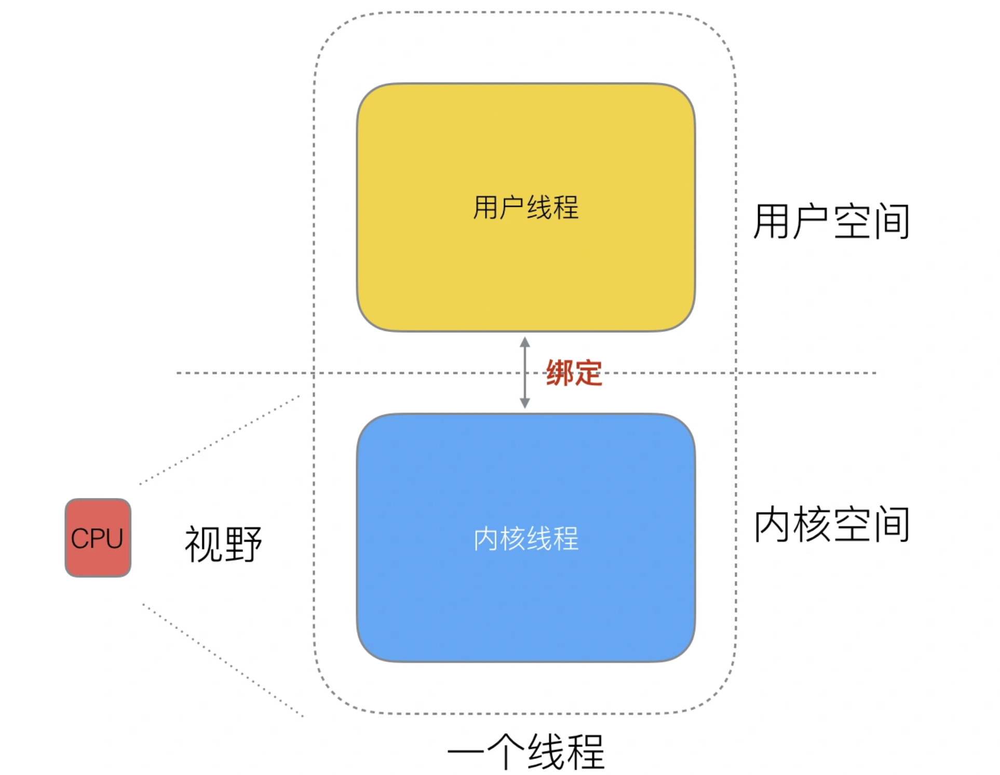
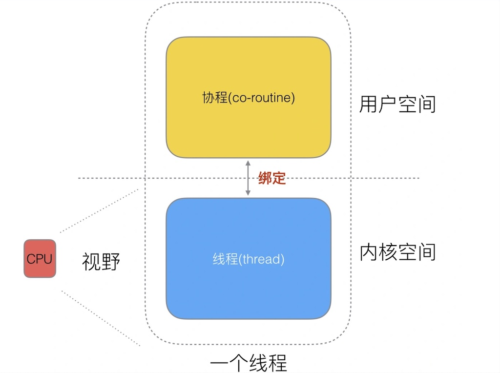
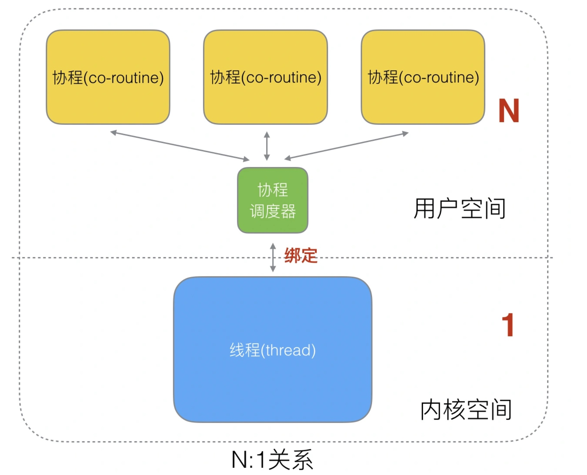
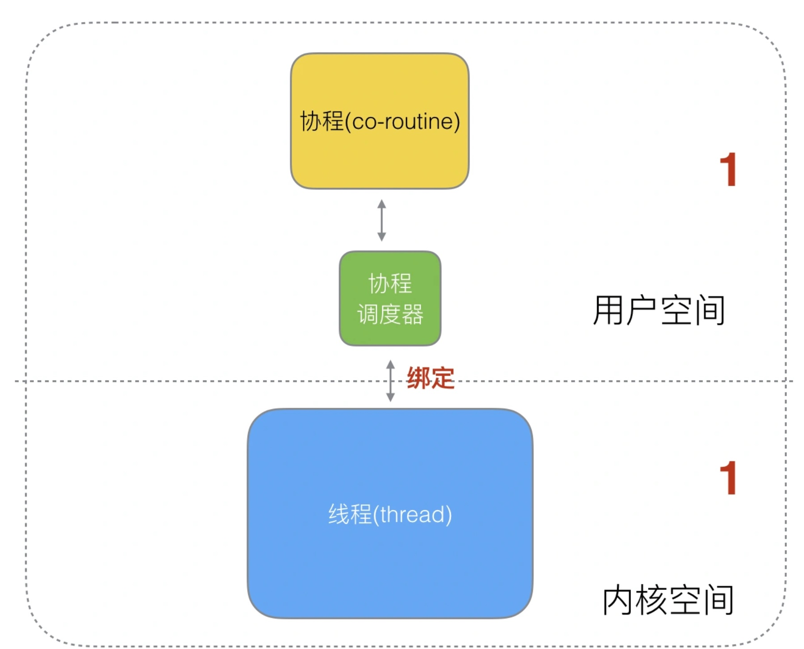
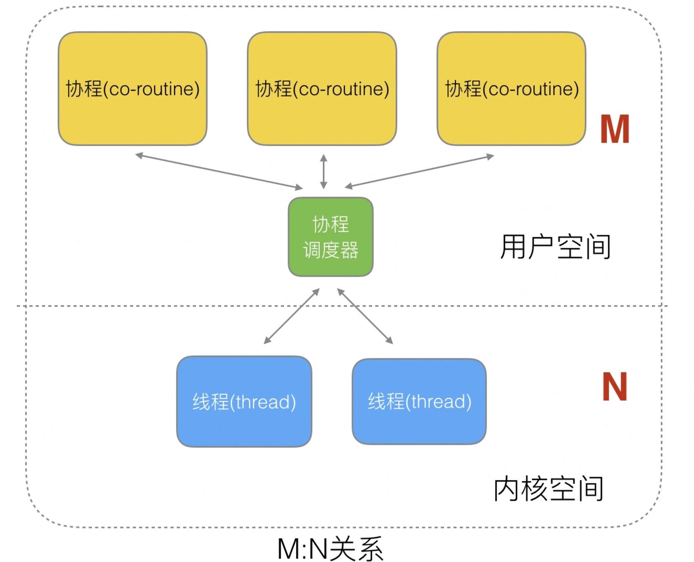

# GPM<2> 协程的实现

## 协程的实现

#### 协程

前面我们说过利用协程具有轻量/上下文切换成本低等特点，那么他是如何在计算机中体现的? 到底协程是在那里被承载的?

线程分为**用户态线程**与**内核态线程**，一个用户态线程必须绑定一个内核态线程，但CPU并不知道用户态线程的存在，也就是说CPU没法管到用户空间的事。既然CPU管不到用户空间的事，那用户空间就成了“三不管”地带了，那就决定在用户空间搞点事情。

这样内核线程依然叫“线程”，用户线程就叫“协程”。

既然一个协程能绑定到一个线程上，那为什么不能将多个协程绑定到一个或多个线程上呢？下面分析三种协程与线程的绑定关系。

#### N:1模式

N个协程绑定在一个线程上，优点是协程的切换都在用户态，不用陷入内核态，切换迅速且切换的成本低。但其也有很明显的缺点。

* 因为N个协程都绑定到一个线程上了，即使是多核的计算也没有办法实现并行，**浪费了计算机的性能**。
* 一旦某个协程阻塞，本线程下的其他协程都无法执行，**没有了并发能力**。
    

#### 1:1模式

解决了N:1模式没有并发能力的不足，但每次切换协程都要切换线程，**成本太高**，**失去了协程存在的意义。**

#### N:M模式

N:M模式是结合了N:1模式与1:N模式，克服了以上两种模式的缺点。但实现起来比较复杂。

#### 协作式的调度

线程的调度是**抢占式**的，由CPU调度。而协程的调度是**协作式**的，只有一个协程让出CPU后才能执行下一个协程。

#### Golang的协程goroutine

Golang语言的并发实现式基于goroutine的。goroutine来自协程的概念，其让一组goroutine绑定在一个线程上，当其中某个goroutine发生阻塞，其他goroutine也可被runtime调用，转移到其他可运行的线程上。goroutine**非常轻量**（通常只占几k内存），且**调度灵活**，这是Golang能实现高并发的原因。

