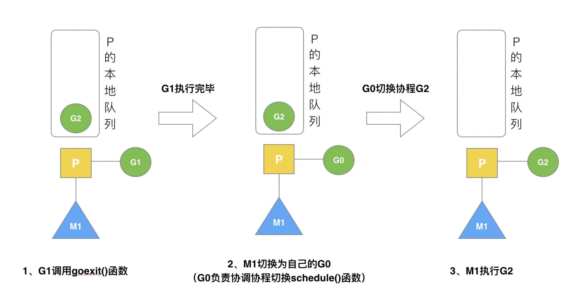
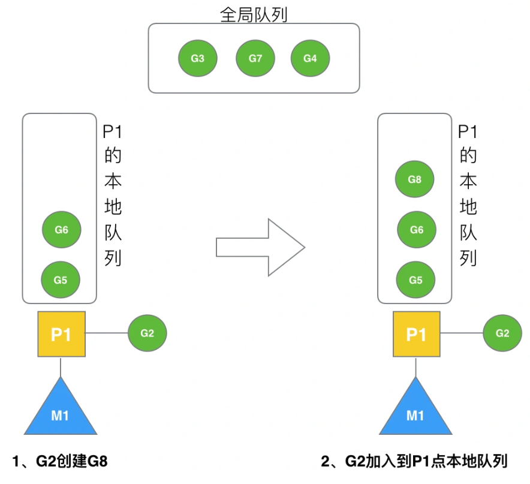
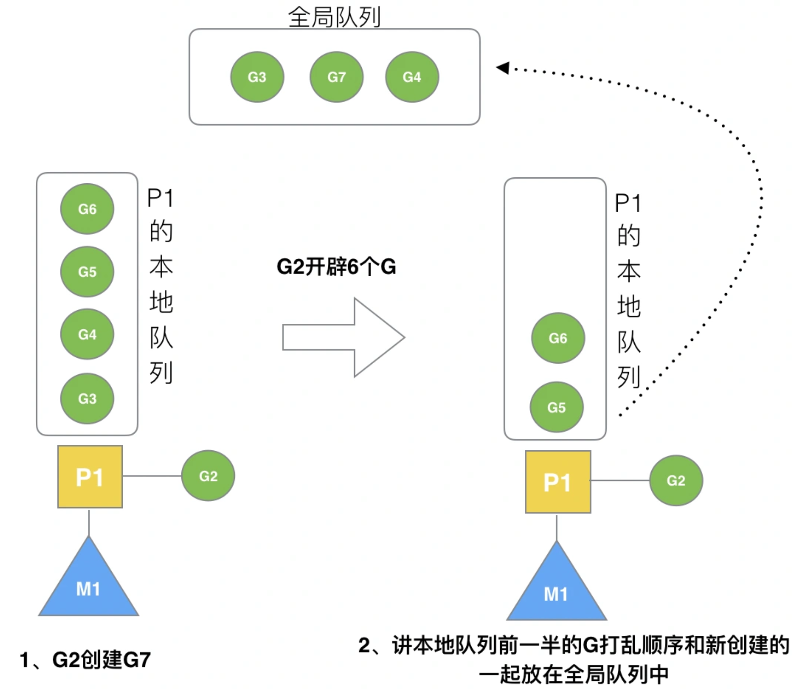
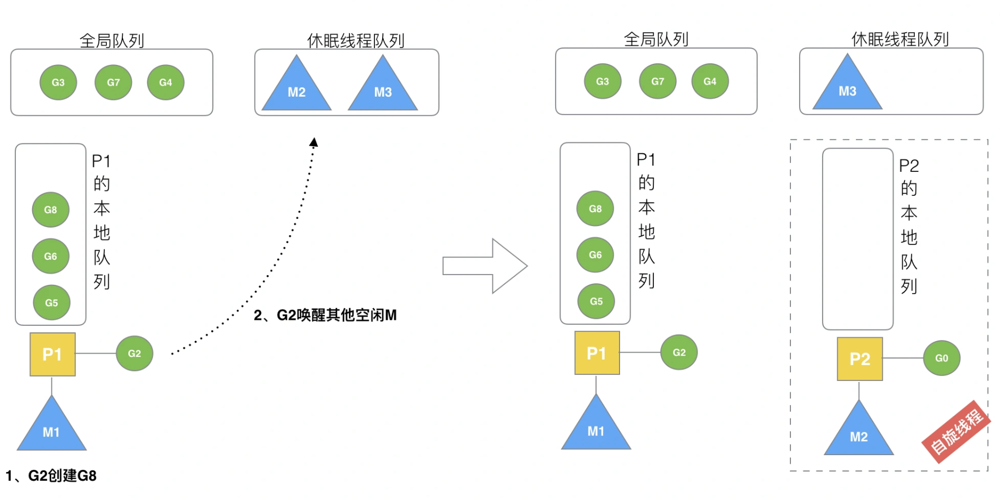
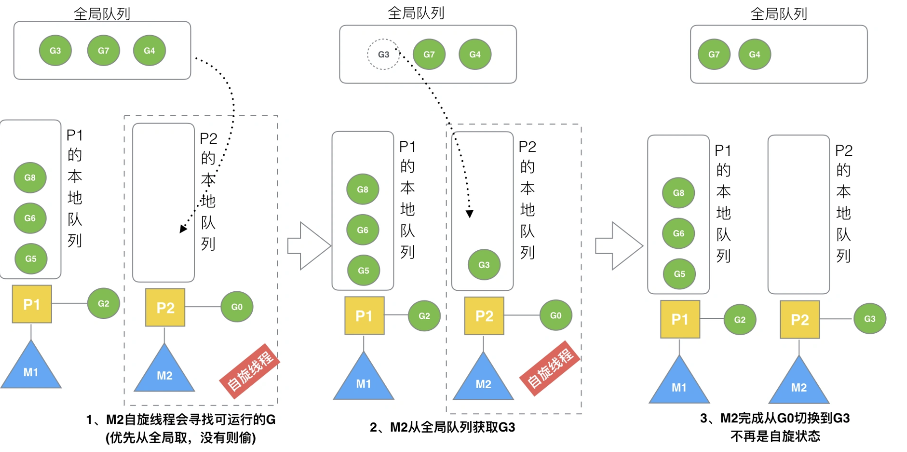
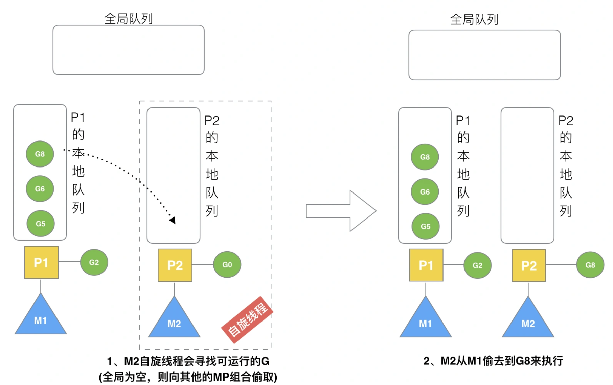
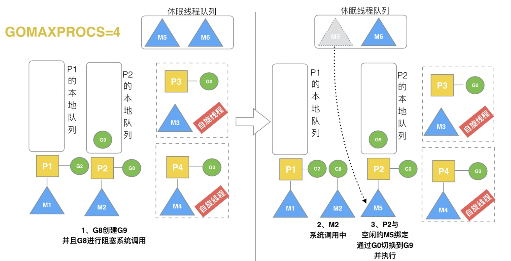

# GPM<4>场景分析

## 场景分析

#### 场景一: 创建/执行G

当某个G1创建一个新的G2时：

1.运行一个G

2.当本地队列未满，则直接加入本地队列\(满足局部性\)

3.如果本地队列已满，则将P1本地队列中的 前一半\(G3/G4\)\+G7顺序打乱，一同放到全局队列中去。

#### 场景二: 唤醒正在休眠的M

当创建一个G时，会尝试唤醒M的休眠队列，假定G2唤醒了M2，M2绑定了P2，此时P2本地队列里没有G，M2此时为**自旋线程**（没有G可以运行，不断地寻找可运行的G）。自**旋线程的存在是为了通过短期的自旋来防止线程被销毁。但过多的自旋线程会白白浪费CPU，所以结合两种情况，系统中最多存在GOMAXPROCS个自旋线程。**

#### 场景三: 被唤醒的M从全局队列取G

在场景二中被唤醒的M会从全局队列取出n个G来运行，n的计算法则：n = min\(len\(GQ\)/GOMAXPROCS \+ 1, len\(GQ/2\)\)，至少从全局队列取1个G，但每次不要从全局队列移动太多的G到P本地队列，这是**从全局队列到P本地队列的负载均衡**。

#### 场景四: M从其他P的本地队列偷取G

在场景三的中，如果此时全局队列已经没有G（可能全局队列的G已经全部被运行完），则应当从其他本地队列获取G（**working stealing 机制**）。每次偷取都会偷取其他P本地队列的**一半G**过来。

#### 场景五: G发生系统调用

当G8发生syscall/阻塞，那么将会解除P2与M2的绑定关系，P2会在休眠的线程队列中寻找另一个可用的M5，并且与其绑定，然后这个新的PM组合会继续运行本地队列里G\(如果本地队列还有G的话，这个场景下P2的本地队列还有P9\)。当阻塞的G8从阻塞中恢复成非阻塞时，M2会优先找与其原先配对的P进行绑定，如果P已经与其他M绑定，那么M会从空闲的P队列中找另外的P与其绑定，如果空闲P队列也没有，那么M将会加入到空闲的M队列中，G则会被移到全局G队列中。M休眠队列里的M并不是永远休眠的，当其长时间没有被唤醒，休眠的M会被GC回收销毁。（**handoff 机制**）

#### 总结

Go调度器很轻量也很简单，足以撑起goroutine的调度工作，并且让Go具有了原生（强大）并发的能力。**Go调度本质是把大量的goroutine分配到少量线程上去执行，并利用多核并行，实现更强大的并发。**

