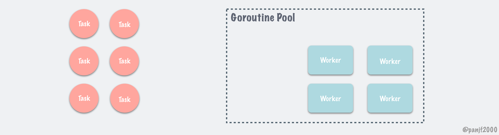

# ants

------

## 1. 简介

ants 是一个高性能的协程池，实现了对大规模 goroutine 的调度管理、goroutine 复用，允许使用者在开发并发程序的时候限制协程数量，复用资源，达到更高效执行任务的效果。其具体特点如下：

- 自动调度海量的 goroutines，复用 goroutines
- 定期清理过期的 goroutines，进一步节省资源
- 提供了大量有用的接口：任务提交、获取运行中的 goroutine 数量、动态调整 Pool 大小、释放 Pool、重启 Pool
- 优雅处理 panic，防止程序崩溃
- 资源复用，极大节省内存使用量；在大规模批量并发任务场景下比原生 goroutine 并发具有更高的性能
- 非阻塞机制

本文从pool顶层方法开始，到底层workArray的实现，由上至下分析整个ants的工作流程。以下代码分析基于：

```shell
github.com/panjf2000/ants/v2 v2.6.0
```

## 2. 项目结构

```shell
ants                		       root directory
├── interal                    
    ├── spinlock                  自实现的自旋锁
├── ants.go                 		  定义常量、errors显示、默认goroutine池、封装一些方便用户操作查看goroutine池的函数
├── options.go                    goroutine池的相关配置
├── pool.go 											普通pool(不绑定特定函数)的创建以及对pool相关的操作
├── pool_func.go                  创建绑定某个特定函数的pool以及对pool相关的操作
├── worker.go                     goWorker的定义及方法
├── worker_array.go               workerArray的接口和一个能返回实现该接口的函数
├── worker_loop_queue.go 					loopQueue的定义及方法 loopQueue实现了workerArray
├── worker_stack.go               workerStack的定义及方法 workerStack实现了workerArray
```

## 3. 数据结构及实现原理

### 3.1 概念

首先需要明白ants代码两个概念，worker及task（任务）

- worker：worker是一个循环状态的goroutine，当worker接收到task，便开始执行task。
- task：任务，即使用者需要执行的函数。
- pool：用来存放worker的池子。



### 3.2 配置项

在初始化pool的时候，ants的提供了一些配置项，以供使用者配置自己的pool。

```go
type Options struct {
   ExpiryDuration time.Duration //每经过这个时间间隔，pool就会去清理过期的worker
 
   PreAlloc bool //初始化时是否内存预分配
 
   MaxBlockingTasks int //pool.Submit被阻塞的最大goroutine数量，0表示没限制
 
   Nonblocking bool //Pool.Submit 是否阻塞，为false时 MaxBlockingTasks 参数无效
 
   PanicHandler func(interface{}) //worker发生panic时 调用此函数，如果为nil panic会继续向外层抛出
 
   Logger Logger //日志记录器 可自定义，默认官方logger
  
   DisablePurge bool //是否需要定期清理过期的worker 默认需要 
}
```

### 3.3 Pool

pool在ants中定义为不带参数的工作池，其结果定义及方法如下：

```go
//pool.go

type Pool struct {

	capacity int32 //池子的容量 如果是填负数的话代表无限容量

  running int32 //当前正在运行的goroutine数量(可用于工作的goroutine)

	lock sync.Locker //用于并发安全的从worker队列中获取&归还worker

	workers workerArray //一个抽象接口 workerArray决定了如何存储worker ants提供了两种实现 后面再详细介绍

	state int32 //池子的状态 用来判断池子关闭&开启

	cond *sync.Cond //用于等待获取可用worker的条件变量

	workerCache sync.Pool //sync.Pool 用来管理worker对象 提升性能

	waiting int32 //当前阻塞在pool.Submit过程的数量,其受到pool.lock保护

	heartbeatDone int32 //为1表示已经停止清理过期worker,即结束运行 
	stopHeartbeat context.CancelFunc //用于通知 purgePeriodically 结束运行

	options *Options //option 项目
}

//pool中 等待的任务数量
func (p *Pool) Waiting() int {return int(atomic.LoadInt32(&p.waiting))}
//pool容量
func (p *Pool) Cap() int {return int(atomic.LoadInt32(&p.capacity))}
//pool是否已经被关闭
func (p *Pool) IsClosed() bool {return atomic.LoadInt32(&p.state) == CLOSED}
//pool中正在预运行的worker
func (p *Pool) Running() int {return int(atomic.LoadInt32(&p.running))}
//pool中仍然可以创建的worker数量
func (p *Pool) Free() int {
  c := p.Cap()
	if c < 0 {
		return -1
	}
	return c - p.Running()
}


// NewPool 创建一个不带执行函数的pool
func NewPool(size int, options ...Option) (*Pool, error) {
	opts := loadOptions(options...)

	if size <= 0 { 
		size = -1 //无限容量
	}

	if !opts.DisablePurge {
		if expiry := opts.ExpiryDuration; expiry < 0 {
			return nil, ErrInvalidPoolExpiry
		} else if expiry == 0 {
			opts.ExpiryDuration = DefaultCleanIntervalTime
		}
	}

	if opts.Logger == nil {
		opts.Logger = defaultLogger
	}

	p := &Pool{
		capacity: int32(size),
		lock:     internal.NewSpinLock(),
		options:  opts,
	}
  
  //初始化workerCache这个sync.Pool
	p.workerCache.New = func() interface{} {
		return &goWorker{
			pool: p,
			task: make(chan func(), workerChanCap), //如果是单核cpu cap=0 否则 cap=1
		}
	}
  
	if p.options.PreAlloc {
		if size == -1 {
			return nil, ErrInvalidPreAllocSize //如果设置了是无限容量的 没法预分配 直接返回错误
		}
    //预分配模式（此模式意味着worker队列的长度是固定的，后续无法再修改） loopQueuey类型
		p.workers = newWorkerArray(loopQueueType, size) 
	} else {
    //非预分配模式 workerStack类型
		p.workers = newWorkerArray(stackType, 0) 
	}

  //初始化条件变量
	p.cond = sync.NewCond(p.lock)

  //开启一个goroutine定期清除已经过期的worker
	var ctx context.Context
	ctx, p.stopHeartbeat = context.WithCancel(context.Background())
	if !p.options.DisablePurge {
		go p.purgePeriodically(ctx)
	}
	return p, nil
}
```

如果设置了清理模式（默认设置），函数purgePeriodically会定期清理过期的worker。

```go
func (p *Pool) purgePeriodically(ctx context.Context) {
	heartbeat := time.NewTicker(p.options.ExpiryDuration)

	defer func() {
		heartbeat.Stop() 
		atomic.StoreInt32(&p.heartbeatDone, 1) //设置heartbeatDone标志位为1
	}()

	for {
		select {
		case <-heartbeat.C:
		case <-ctx.Done():
			return
		}

		if p.IsClosed() {
			break //池子已经关闭。
		}

    //获取过期的workers
		p.lock.Lock()
		expiredWorkers := p.workers.retrieveExpiry(p.options.ExpiryDuration)
		p.lock.Unlock()

    //通知所有的过期的workers 让其结束运行
    //清理worker的这个操作必须在pool.lock的临界区之外执行，否则会跟pool.Sbumit
    //无法获取worker的时候造成激烈的锁竞争
		for i := range expiredWorkers {
			expiredWorkers[i].task <- nil //通知还在运行的过期worker 停止手上的工作
			expiredWorkers[i] = nil //释放过期worker
		}
    
    //如果所有的worker都被清理了 或者 使用者调用了Tune函数扩大了pool的容量但仍然有pool.Submit
    //被p.cond.Wait()阻塞 此时就可唤醒全部goroutine去抢夺worker
		if p.Running() == 0 || (p.Waiting() > 0 && p.Free() > 0) {
			p.cond.Broadcast()
		}
	}
}
```

函数Submit用于向pool提交一个任务，如果pool是阻塞模式的话这个函数可能阻塞。

```go
func (p *Pool) Submit(task func()) error {
	if p.IsClosed() {
		return ErrPoolClosed
	}
	var w *goWorker
  //取出一个空闲的worker
	if w = p.retrieveWorker(); w == nil {
		return ErrPoolOverload
	}
  //发送任务 
	w.task <- task
	return nil
}

func (p *Pool) retrieveWorker() (w *goWorker) {
	spawnWorker := func() {
		w = p.workerCache.Get().(*goWorker)
		w.run() //worker启动
	}

	p.lock.Lock()

	w = p.workers.detach()  //从workers中取一个
	if w != nil { 
    //从workers中取到直接返回
		p.lock.Unlock()
	} else if capacity := p.Cap(); capacity == -1 || capacity > p.Running() {
		//如果worker中没有 并且容量是无限的 或者 池子未满 就从workerCache中重新Get（有可能重新生成）一个
		p.lock.Unlock()
		spawnWorker()
	} else {
		if p.options.Nonblocking {
			p.lock.Unlock() 
			return //如果是非阻塞模式的话 直接返回nil了
		}
    //如果是阻塞模式 至少要阻塞到获取一个可用的worker
	retry:
    //如果设置了最大阻塞任务数量 并且 当前等待的任务数量已经大于最大阻塞任务数量 直接返回错误
		if p.options.MaxBlockingTasks != 0 && p.Waiting() >= p.options.MaxBlockingTasks {
			p.lock.Unlock()
			return 
		}
		p.addWaiting(1)
    p.cond.Wait() // 阻塞等待获取可用的worker cond.Wait()会释放p.lock 所以waiting的可能有多个
		p.addWaiting(-1)

		if p.IsClosed() {
			p.lock.Unlock()
			return
		}

		var nw int 
    if nw = p.Running(); nw == 0 { //从purgePeriodically中唤醒的(全部worker都因为过期被清理了)
			p.lock.Unlock()
			spawnWorker() //没有处于可运行的worker 直接从workerCache中重新Get一个worker
			return
		}
		if w = p.workers.detach(); w == nil {  //正常从worker队列中取
			if nw < p.Cap() { //如果当前worker数量小于pool容量（说明扩容了）
				p.lock.Unlock()
				spawnWorker() //就从workerCache中重新Get一个worker
				return
			}
			goto retry //否则重试
		}
		p.lock.Unlock()
	}
	return
```

revertWorker用于归还一个worker给pool，并且更新worker回收时间。worker成功返还到pool为true ，否则false。返还的worker可以被重新循环利用，以达到节省资源的目的。

```go
func (p *Pool) revertWorker(worker *goWorker) bool {
  //如果当前运行的worker数量大于pool的容量（表明已满不需要归还） 或者 pool已经被关闭 返回失败
	if capacity := p.Cap(); (capacity > 0 && p.Running() > capacity) || p.IsClosed() {
		p.cond.Broadcast()
		return false
	}
  //更新归还时间
	worker.recycleTime = time.Now()
	p.lock.Lock()

  //需要判断pool是否已经关闭 
  //不判断的话会与Pool.Release存在竞态问题 会导致goroutine泄露
	if p.IsClosed() { //双重检查 防止内存泄漏
		p.lock.Unlock()
		return false
	}

  //将worker归还给workers 如果workers已满 则归还失败
  //归还的时候根据归还时间来排序，越新归还的放到越后面，以方便清理过期worker的时候进行高效的二分查找
	err := p.workers.insert(worker)
	if err != nil {
		p.lock.Unlock()
		return false
	}

	//归还过后 唤醒一个阻塞中的retrieveWorker去获取worker
	p.cond.Signal()
	p.lock.Unlock()
	return true
}
```

Tuen修改了pool的容量。注意：此函数对预定分配模式的pool无效。

```go
func (p *Pool) Tune(size int) {
  //扩容不需要加锁
	capacity := p.Cap()
	if capacity == -1 || size <= 0 || size == capacity || p.options.PreAlloc {
		return
	}
	atomic.StoreInt32(&p.capacity, int32(size))
  //如果发生扩容  那么就根据扩容的大小决定是用 Signal() 还是 Broadcast()
	if size > capacity { 
		if size-capacity == 1 {
			p.cond.Signal()
			return
		}
		p.cond.Broadcast()
	}
}
```

Release关闭pool并且释放workers，而ReleaseTime则会在timeout时间内等待当前仍然在运行的任务执行完，如果没有执行完的话返回错误。

```go
func (p *Pool) Release() {
	if !atomic.CompareAndSwapInt32(&p.state, OPENED, CLOSED) {
		return
	}
	p.lock.Lock()
	p.workers.reset()
	p.lock.Unlock()
  // 可能有某些调用者被阻塞在获取worker上，这里Broadcast()通知他们不再等待
	p.cond.Broadcast()
}

func (p *Pool) ReleaseTimeout(timeout time.Duration) error {
	if p.IsClosed() || p.stopHeartbeat == nil {
		return ErrPoolClosed
	}

	p.stopHeartbeat()
	p.stopHeartbeat = nil
	p.Release()

	endTime := time.Now().Add(timeout)
	for time.Now().Before(endTime) {
		if p.Running() == 0 && (p.options.DisablePurge || atomic.LoadInt32(&p.heartbeatDone) == 1) {
			return nil //所有任务都执行完 
		}
		time.Sleep(10 * time.Millisecond)
	}
	return ErrTimeout
}
```

Reboot重新启动这个pool。

```go
func (p *Pool) Reboot() {
	if atomic.CompareAndSwapInt32(&p.state, CLOSED, OPENED) {
		atomic.StoreInt32(&p.heartbeatDone, 0)
		var ctx context.Context
		ctx, p.stopHeartbeat = context.WithCancel(context.Background())
		if !p.options.DisablePurge {
			go p.purgePeriodically(ctx)
		}
	}
}
```

goWorker是真正的任务执行者，是真正干活的“人”，它会开启一个goroutine并且接受任务(执行函数调用)。

```go
type goWorker struct {
	pool *Pool //所属的pool
	task chan func() //task是需要执行的函数 通过channl来传递任务
	recycleTime time.Time //recycleTime记录了worker被重新放回队列的时间 
}

// goWorker的run方法
func (w *goWorker) run() {
	w.pool.addRunning(1)
	go func() {
		defer func() {
			w.pool.addRunning(-1)
			w.pool.workerCache.Put(w) //重复利用workerCache
      //记录panic日志
			if p := recover(); p != nil {
				if ph := w.pool.options.PanicHandler; ph != nil {
					ph(p)
				} else {
					w.pool.options.Logger.Printf("worker exits from a panic: %v\n", p)
					var buf [4096]byte
					n := runtime.Stack(buf[:], false)
					w.pool.options.Logger.Printf("worker exits from panic: %s\n", string(buf[:n]))
				}
			}
			// Call Signal() here in case there are goroutines waiting for available workers.
			w.pool.cond.Signal()
		}()

    //通过channel接受任务 
		for f := range w.task {
			if f == nil { //如果接收到nil则结束
				return
			}
			f() //执行具体的函数
			//如果无法归还给workers 说明不再需要这个worker，所以结束当前running的worker
			if ok := w.pool.revertWorker(w); !ok {
				return
			}
		}
	}()
}
```

workerArray是worker队列的抽象。pool.New的工厂方法会根据是否预分配模式来决定workArry由谁来实现。简单来说，workerArray就是用来存储goWorker的一种数据结构。

```go
// workArry 是一个抽象接口
type workerArray interface {
	len() int      //worker的数量
	isEmpty() bool //worker数量是否为0
	insert(worker *goWorker) error //将执行完的worker放回
	detach() *goWorker //获取一个worker
	retrieveExpiry(duration time.Duration) []*goWorker //取出所有过期的worker
	reset() //重置
}
```

如果是**非预分配**模式，workerArray由**workerStack**实现。

```go
//类似于栈实现workerArray
type workerStack struct {
	items  []*goWorker //按recycleTime排序
	expiry []*goWorker
}

func newWorkerStack(size int) *workerStack {
	return &workerStack{
		items: make([]*goWorker, 0, size),
	}
}

func (wq *workerStack) len() int {
	return len(wq.items)
}

func (wq *workerStack) isEmpty() bool {
	return len(wq.items) == 0
}

func (wq *workerStack) insert(worker *goWorker) error { 
  //直接放入栈顶
	wq.items = append(wq.items, worker)
	return nil
}

func (wq *workerStack) detach() *goWorker {
  //从栈顶取出
	l := wq.len()
	if l == 0 {
		return nil
	}

	w := wq.items[l-1]
	wq.items[l-1] = nil // avoid memory leaks
	wq.items = wq.items[:l-1]

	return w
}

func (wq *workerStack) retrieveExpiry(duration time.Duration) []*goWorker {
	n := wq.len()
	if n == 0 {
		return nil
	}

	expiryTime := time.Now().Add(-duration)
	index := wq.binarySearch(0, n-1, expiryTime)

	wq.expiry = wq.expiry[:0]
	if index != -1 {
		wq.expiry = append(wq.expiry, wq.items[:index+1]...)
		m := copy(wq.items, wq.items[index+1:])
		for i := m; i < n; i++ {
			wq.items[i] = nil
		}
		wq.items = wq.items[:m]
	}
	return wq.expiry
}

func (wq *workerStack) binarySearch(l, r int, expiryTime time.Time) int {
	var mid int
	for l <= r {
		mid = (l + r) / 2
		if expiryTime.Before(wq.items[mid].recycleTime) {
			r = mid - 1
		} else {
			l = mid + 1
		}
	}
	return r
}

func (wq *workerStack) reset() {
	for i := 0; i < wq.len(); i++ {
		wq.items[i].task <- nil
		wq.items[i] = nil
	}
	wq.items = wq.items[:0]
}

```

如果是**预分配模式**，那么workers的长度是固定的，所以ants这里是用了环形队列来实现workerArray，以减少内存的回收与分配。

```go
type loopQueue struct {
	items  []*goWorker //存放可用的worker 尾部存 头部取
	expiry []*goWorker //过期的worker
	head   int //头指针，每取出一个+1 到达size时重新置为0
	tail   int //尾指针，每存进一个+1 到达size时重新置为0
	size   int //队列大小
	isFull bool //队列是否已满 
}

func newWorkerLoopQueue(size int) *loopQueue {
	return &loopQueue{
		items: make([]*goWorker, size),
		size:  size,
	}
}

func (wq *loopQueue) len() int {
	if wq.size == 0 {
		return 0
	}

  //通过头尾指针及isFull字段来判断是否已满
	if wq.head == wq.tail { 
		if wq.isFull {
			return wq.size
		}
		return 0
	}

	if wq.tail > wq.head {
		return wq.tail - wq.head
	}

	return wq.size - wq.head + wq.tail
}

func (wq *loopQueue) isEmpty() bool {
	return wq.head == wq.tail && !wq.isFull
}

//存入goWorker
func (wq *loopQueue) insert(worker *goWorker) error {
	if wq.size == 0 {
		return errQueueIsReleased
	}

	if wq.isFull {
		return errQueueIsFull
	}
  
  //在尾部存入 tail指针往后移动一位
	wq.items[wq.tail] = worker
	wq.tail++

  //已满 重新将tail置为0
	if wq.tail == wq.size {
		wq.tail = 0
	}
  //当tail == head 时，说明tail从后面追上，这时候队列已满
	if wq.tail == wq.head {
		wq.isFull = true
	}

	return nil
}

//取出goWorker
func (wq *loopQueue) detach() *goWorker {
	if wq.isEmpty() {
		return nil
	}

	w := wq.items[wq.head]
	wq.items[wq.head] = nil // nil方便gc清理 防止内存泄漏
  //从头部取出 head指针往后移动一位
	wq.head++
  //已到达size 将head重新置0
	if wq.head == wq.size {
		wq.head = 0
	}
	wq.isFull = false

	return w
}

func (wq *loopQueue) retrieveExpiry(duration time.Duration) []*goWorker {
	expiryTime := time.Now().Add(-duration)
	index := wq.binarySearch(expiryTime)
	if index == -1 {
		return nil
	}
	wq.expiry = wq.expiry[:0]

  //因为是环形队列 所以有两种情况
	if wq.head <= index {
		wq.expiry = append(wq.expiry, wq.items[wq.head:index+1]...)
		for i := wq.head; i < index+1; i++ {
			wq.items[i] = nil
		}
	} else { //如果index在head前面
		wq.expiry = append(wq.expiry, wq.items[0:index+1]...)
		wq.expiry = append(wq.expiry, wq.items[wq.head:]...)
		for i := 0; i < index+1; i++ {
			wq.items[i] = nil
		}
		for i := wq.head; i < wq.size; i++ {
			wq.items[i] = nil
		}
	}
	head := (index + 1) % wq.size
	wq.head = head
	if len(wq.expiry) > 0 {
		wq.isFull = false
	}

	return wq.expiry
}

func (wq *loopQueue) binarySearch(expiryTime time.Time) int {
	var mid, nlen, basel, tmid int
	nlen = len(wq.items)

	// if no need to remove work, return -1
	if wq.isEmpty() || expiryTime.Before(wq.items[wq.head].recycleTime) {
		return -1
	}

	// example
	// size = 8, head = 7, tail = 4
	// [ 2, 3, 4, 5, nil, nil, nil,  1]  true position
	//   0  1  2  3    4   5     6   7
	//              tail          head
	//
	//   1  2  3  4  nil nil   nil   0   mapped position
	//            r                  l

	// base algorithm is a copy from worker_stack
	// map head and tail to effective left and right
	r := (wq.tail - 1 - wq.head + nlen) % nlen
	basel = wq.head
	l := 0
	for l <= r {
		mid = l + ((r - l) >> 1)
		// calculate true mid position from mapped mid position
		tmid = (mid + basel + nlen) % nlen
		if expiryTime.Before(wq.items[tmid].recycleTime) {
			r = mid - 1
		} else {
			l = mid + 1
		}
	}
	// return true position from mapped position
	return (r + basel + nlen) % nlen
}

//重置
func (wq *loopQueue) reset() {
	if wq.isEmpty() {
		return
	}

Releasing:
	if w := wq.detach(); w != nil {
		w.task <- nil
		goto Releasing
	}
	wq.items = wq.items[:0]
	wq.size = 0
	wq.head = 0
	wq.tail = 0
}
```

### 3.4 PoolWithFunc

PoolWithFunc与Pool类似，但PoolWithFunc在初始化l的时候可以绑定一个任务函数，后面提交任务的时候只需要将参数传递给任务函数即可，省去了每一次提交任务都需要传送一个任务函数的代价，因此其性能优势比起 Pool 更明显。其数据结构与实现原理大都与Pool类似，所以这里只分析它跟Pool不同的地方。

```go
type PoolWithFunc struct {
 
  // 省略与Pool相同的数据结构...

	// worker队列
	workers []*goWorkerWithFunc


	//任务执行函数
	poolFunc func(interface{})

}

//PoolWithFunc的worker 
type goWorkerWithFunc struct {
	// pool who owns this worker.
	pool *PoolWithFunc

	// 提交的参数
	args chan interface{}

	// recycleTime will be updated when putting a worker back into queue.
	recycleTime time.Time
}
```

定期清理worker函数

```go
func (p *PoolWithFunc) purgePeriodically(ctx context.Context) {
 
  //...
	var expiredWorkers []*goWorkerWithFunc
	for {
		select {
      
      //...

    //取出过期的worker
		currentTime := time.Now()
		p.lock.Lock()
		idleWorkers := p.workers
		n := len(idleWorkers)
		var i int
		for i = 0; i < n && currentTime.Sub(idleWorkers[i].recycleTime) > p.options.ExpiryDuration; i++ {
		}
		expiredWorkers = append(expiredWorkers[:0], idleWorkers[:i]...)
		if i > 0 {
			m := copy(idleWorkers, idleWorkers[i:])
			for i = m; i < n; i++ {
				idleWorkers[i] = nil
			}
			p.workers = idleWorkers[:m]
		}
		p.lock.Unlock()

    //...
		}
	}
}
```

Invoke方法与Pool.Submit类似，都是往池子里投放任务，不过Invoke传递的是任务参数而不是任务函数。

```go
func (p *PoolWithFunc) Invoke(args interface{}) error {
	if p.IsClosed() {
		return ErrPoolClosed
	}
	var w *goWorkerWithFunc
	if w = p.retrieveWorker(); w == nil {
		return ErrPoolOverload
	}
	w.args <- args
	return nil
}
```

retrieveWorker方法获取一个可用的worker。

```go
func (p *PoolWithFunc) retrieveWorker() (w *goWorkerWithFunc) {
	//...

	p.lock.Lock()
	idleWorkers := p.workers
	n := len(idleWorkers) - 1
	if n >= 0 {
    //取出最后一个worker
		w = idleWorkers[n]
		idleWorkers[n] = nil
		p.workers = idleWorkers[:n]
		p.lock.Unlock()
	}
  
  //...
}
```

## 4. 整体步骤


