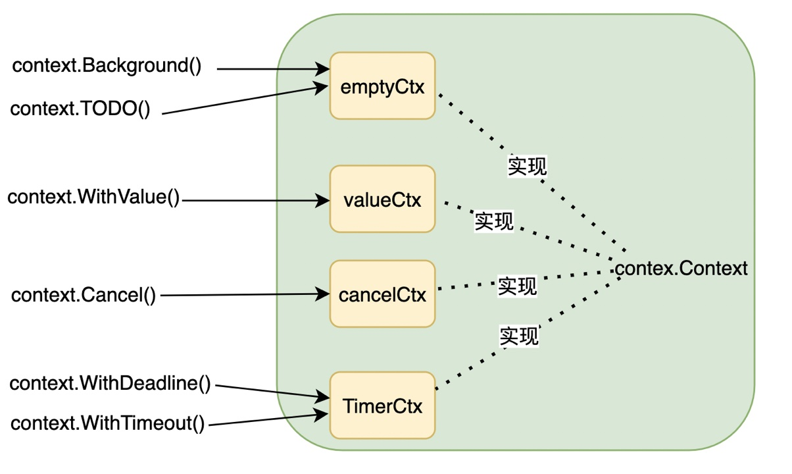

# Golang之context

### Context是什么

Context是Golang中独特的数据结构，可以用来设置截至日期、同步信号、传递请求相关值，**总地来说就是在goroutine构成的树形结构中对信号进行同步以减少计算资源的浪费**。以下内容基于：

```
go version go1.16.2 darwin/amd64
```

### Context的数据结构

Context是一个接口，来看下它的接口定义

```go
type Context interface {

	//Deadline方法是获取设置的截至时间，到了这个截至时间，
	//Context会自动发起取消，第二个返回值ok代表是否有设置
	//截至时间
 	Deadline() (deadline time.Time, ok bool) 

 	//Done方法返回一个只读的chan，当这个chan收到消息时代
 	//表Parent Context已经发起了取消请求，当前goroutine
 	//要开始做清理操作了
	Done() <-chan struct{} 

	//Err返回Context被取消的原因
	Err() error

	//Value方法返回Context绑定的对应的key的值，这个是线程安全的
	Value(key interface{}) interface{}
}
```

context包提供了6种创建Context的方法。每个方法都会返回一种类型的结构体，这些结构体都实现了Context接口。



---

### Context的实现原理

##### emptyCtx

emptyContext是可以从下面看到它其实是一个空实现，即不提供任何功能。

```go
type emptyCtx int

func (*emptyCtx) Deadline() (deadline time.Time, ok bool) {
	return
}

func (*emptyCtx) Done() <-chan struct{} {
	return nil
}

func (*emptyCtx) Err() error {
	return nil
}

func (*emptyCtx) Value(key interface{}) interface{} {
	return nil
}
```

context.Background\(\) 与 context.TODO\(\) 返回的数据结构都是一个emptyCtx类型的常量，在多数情况下，如果当前函数没有上下文作为入参，我们都会使用 context.Backgroundc\(\)或者context.TODO\(\)作为起始的上下文向下传递。

##### valueCtx

context.WithValue\(\)返回valueCtx的context。valueCtx主要用户上下文中的值传递。

```go
func WithValue(parent Context, key, val interface{}) Context {
	if parent == nil {
		panic("cannot create context from nil parent")
	}
	if key == nil {
		panic("nil key")
	}
	if !reflectlite.TypeOf(key).Comparable() { //key必须是可以比较的
		panic("key is not comparable")
	}
	return &valueCtx{parent, key, val}
}

type valueCtx struct {
	Context      //父ctx
	key, val interface{}   //当前ctx的key&val
}

func (c *valueCtx) Value(key interface{}) interface{} {
	if c.key == key {
		return c.val
	}
	return c.Context.Value(key) //当前没有ctx没有知道 继续从父ctx找
}
```

这里valueCtx只实现了Context接口里的Value\(\)方法，并没有显式地实现其他三个跟取消相关的方法（因为valueCtx本身也就只有值传递的功能），而是将这些实现交给父ctx，这里算是一种小tricks。

##### cancelCtx

cancelCtx 是整个context实现中**最重要的部分**。重点分析下cancelCtx的实现及一些通用的方法。

```go
type cancelCtx struct {
	Context                        //父ctx

	mu       sync.Mutex            // 锁 修改下面的三个字段需要上锁
	done     chan struct{}         // 动态创建的channel，将被第一个cancenl()关闭
	children map[canceler]struct{} // children是一个map存储当前节点下的能够被cancel子节点
	err      error                 // err用于存储错误信息 表示任务结束
}

```

cancelCtx本身不是用来传递值的，按理来说cancelCtx的Value方法的应该是直接依赖父ctx来实现，但cancelCtx却显式地实现了Value方法，其原因是需要先判断key是否为cancelCtxKey。这里这个cancelCtxKey是用来判断一个ctx是否为cancelCtx。

```go
func (c *cancelCtx) Value(key interface{}) interface{} {
	if key == &cancelCtxKey {
		return c
	}
	return c.Context.Value(key)
}
```

cancelCtx.Done以懒加载获取一个用于通知的channel，实现如下。

```go
func (c *cancelCtx) Done() <-chan struct{} {
	c.mu.Lock()  //加锁
	if c.done == nil { 
		c.done = make(chan struct{}) //如果c.done为nil就创建 这个done是以懒加载的方式创建的
	}
	d := c.done 
	c.mu.Unlock() //释放锁
	return d
}
```

cancelCtx.Err返回取消的原因。

```go
func (c *cancelCtx) Err() error {
    c.mu.Lock()
    err := c.err
    c.mu.Unlock()
    return err
}
```

**Done与Err方法获取结构体里的字段都是有锁机制保护的，所以context可以说是线程安全的**。上面讲了canceCtx的几种方法，下面来说说如何创建cancelCtx。通过context.WihtCancel方法可以创建一个带cancel方法的cancelCtx。context.WithCancel先初始化一个cancelCtx，**再使用context.propagateCancel来告知父ctx，自己的子ctx里出现了一个cancelCtx，需要在他们自己的children字段里加上当前的cancelCtx，然后返回当前cancelCtx及一个cancel函数，cancel函数可以让使用者随时取消当前的cancelCtx**。

```go
func WithCancel(parent Context) (ctx Context, cancel CancelFunc) {
	if parent == nil {
		panic("cannot create context from nil parent")
	}
	c := newCancelCtx(parent)
	propagateCancel(parent, &c)
	return &c, func() { c.cancel(true, Canceled) }
}
```

先来看cancel函数cancelCtx.cancel，其作用是用来取消当前ctx及其子孙ctx。

```go
func (c *cancelCtx) cancel(removeFromParent bool, err error) {
	if err == nil {
		panic("context: internal error: missing cancel error")
	}
	c.mu.Lock() //🔒加锁
	if c.err != nil {
		c.mu.Unlock()
		return     //如果c.err ！= nil 说明这个context已经被其他goroutine取消了 那么直接返回 也验证了多次调用cancel()是安全的
	}
	c.err = err   //设置c.err
	if c.done == nil {  
		c.done = closedchan  //c.done == nil 说明cancel()的时候还没有调用过ctx.Done() 这时将c.done设置为closedchan 意味着这个ctx已经cancel
	} else {
	    //通知所有的引用这个ctx的任务 这里也是利用了关闭通道来批量通知的机制
		close(c.done)     
	}
	for child := range c.children {
		// NOTE: acquiring the child's lock while holding parent's lock.
		child.cancel(false, err) //cancel掉子ctx
	}
	c.children = nil   //设置childre为nil
	c.mu.Unlock()      //解锁

	if removeFromParent {
		removeChild(c.Context, c) //将当前ctx节点从父节点上移除 
	}
}
```

最后一步是context.removeChild，目的是将当前ctx节点从父节点上移除。

```
func removeChild(parent Context, child canceler) {
	p, ok := parentCancelCtx(parent) //找到父辈中的cancelCtx
	if !ok {       //如果他的父辈中没有cancelCtx 那么后续的操作也没有必要了
		return
	}
	p.mu.Lock()
	if p.children != nil {
		delete(p.children, child)  //如果他的父辈中有cancelCtx 那么将当前这个child从cancelCtx的children列表中去除
	}
	p.mu.Unlock()
}
```

context.parentCancelCtx 这个方法比较重要，很多地方都有用到，功能是找到父辈中非自定义的cancelCtx\(即只找从context包里出来的\)。

```go
func parentCancelCtx(parent Context) (*cancelCtx, bool) {
	done := parent.Done()
	if done == closedchan || done == nil {  //说明父ctx已经被取消 不用找了
		return nil, false
	}
	p, ok := parent.Value(&cancelCtxKey).(*cancelCtx) //通过cancelCtxKey来判断是否为cancelCtx
	if !ok {
		return nil, false
	}
	p.mu.Lock()
	ok = p.done == done //如果是自定义ctx 也会返回false
	p.mu.Unlock()
	if !ok {
		return nil, false //父级的cancelCtx已经结束 也没有必要再去处理他的children
	}
	return p, true
}
```

context.propagateCancel也是一个重要的方法，其作用是告知父辈ctx，自己的子ctx里出现了一个cancelCtx，需要在他们自己的children字段里加上当前的cancelCtx，以形成父子关系。

```go
func propagateCancel(parent Context, child canceler) {
	done := parent.Done()
	if done == nil {      //父辈ctx不会触发cancel 直接返回 例如父ctx是context.BackGround()
		return // parent is never canceled
	}

	select {
	case <-done:
		child.cancel(false, parent.Err())  //当父ctx已经被canceled(继承一个已经cancel的ctx) 那么当前ctx(即child)挂在父ctx下已经没有意义 直接cancel掉child 
		return
	default:
	}

  //找到他的父辈中找到cancelCtx (注意这个p与parent不一定是一个context，parent是直接的父ctx，而p是他祖先中离他最近的一个实现了canceler的ctx)
  if p, ok := parentCancelCtx(parent); ok {  
		p.mu.Lock()
		if p.err != nil {
			//父ctx已经被canceled 那他自己也要直接被cancel
			child.cancel(false, p.err)      
		} else {
			if p.children == nil {
				p.children = make(map[canceler]struct{})
			}
			p.children[child] = struct{}{}  //将当前ctx放到父ctx的children列表里去
		}
		p.mu.Unlock()
	} else {
		atomic.AddInt32(&goroutines, +1)
		//走到这个分支说明父辈是非内部实现的ctx(自定义的ctx但实现了Context接口)，并在自定义的Done()返回了非空的管道
		//此时这个自定义的父ctx没法跟当前ctx关联起来，所以需要另外起一个监测的goroutine，去监测父ctx的取消信号
		go func() {
			select {
			case <-parent.Done():     //如果自定义的父ctx发出取消信号 当前ctx也要被cancel
				child.cancel(false, parent.Err())
			case <-child.Done():      //如果当前ctx被cancel 那么也不再需要监测父ctx的取消信号了 这个goroutine就结束了
			}
		}()
	}
}
```

##### timerCtx

先看看timerCtx的结构定义及一些特有的方法。

```go
type timerCtx struct {
	cancelCtx
	timer *time.Timer // Under cancelCtx.mu.

	deadline time.Time
}
```

可以看出，timerCtx中内嵌了一个cancelCtx，**可见timerCtx取消类相关的功能是依赖cancelCtx来实现的**。context.WithTimeout及context.WithDeadline返回一个timerCtx及取消函数。context.WithTimeout也是基于context.WithDeadline来实现的。

```go
func WithTimeout(parent Context, timeout time.Duration) (Context, CancelFunc) {
	return WithDeadline(parent, time.Now().Add(timeout))
}

func WithDeadline(parent Context, d time.Time) (Context, CancelFunc) {
	if parent == nil {
		panic("cannot create context from nil parent")
	}
	if cur, ok := parent.Deadline(); ok && cur.Before(d) {
		//父ctx的取消时间在当前ctx之前 说明父ctx会在他的deadline的时候把当前ctx取消掉 所以当前ctx的deadline没什么用了 也不再需要起一个定时器去定时cancel他了
		return WithCancel(parent)  //直接返回一个cancelCtx
	}
	c := &timerCtx{
		cancelCtx: newCancelCtx(parent),
		deadline:  d,
	}
  //将自己放到第一个父辈实现了canceler的ctx 的 children里
	propagateCancel(parent, c)
	dur := time.Until(d)
	if dur <= 0 { //当场超时 
		c.cancel(true, DeadlineExceeded)               //当前时间已经过了deadline 
		return c, func() { c.cancel(false, Canceled) } //虽然他本身的超时时间已经过了，但还是有可能被父ctx取消掉 所以不用从父ctx的children里摘除
	}
	c.mu.Lock()
	defer c.mu.Unlock()
	if c.err == nil {
		c.timer = time.AfterFunc(dur, func() { 
			c.cancel(true, DeadlineExceeded)  //启动一个定时器 在deadline的时候cancel	
		})
	}
	return c, func() { c.cancel(true, Canceled) }
}
```

timerCtx的取消函数，当取消函数被调用的时候，把定时器取消掉。

```go
func (c *timerCtx) cancel(removeFromParent bool, err error) {	
	c.cancelCtx.cancel(false, err)
	if removeFromParent {
		// Remove this timerCtx from its parent cancelCtx's children.
		removeChild(c.cancelCtx.Context, c)
	}
	c.mu.Lock()
	if c.timer != nil {
		c.timer.Stop() //手动取消 停止计时器
		c.timer = nil
	}
	c.mu.Unlock()
}
```

### 总结

各个类型的ctx都遵循了**接口隔离原则**这种设计模式，即各种类型的ctx并没有显式地实现接口的各个方法，而是只实现与自己相关的方法。比如，valueCtx只实现了Value方法（这也是它的核心功能），其他的与它本身功能无关的取消类的方法比如（Deadline方法）由它的父ctx实现，这样的设计使得每种类型的ctx只需要关注自己的功能，而无需实现与它功能无关的方法。假设valueCtx也显式地实现Done/Deadline，那么需要递归或者循坏去获取到它的父辈ctx中的cancelCtx或者timerCtx，代码可能如下所示：

```go
func (c *valueCtx) Done() <-chan struct{} {
	for cur := c; cur != nil; cur = cur.Context {
		if cancelc, ok := cur.Value(&cancelCtxKey).(*cancelCtx); ok {
			return cancelc.done
		}
	}
	return nil
}
```

这无疑增加了代码的冗余度及让代码的可读性变差。而context包中这种隐式实现的方法让代码变得边界分明，冗余度低，也符合接口个隔离原则，在日常的编码中我们可以借鉴。

