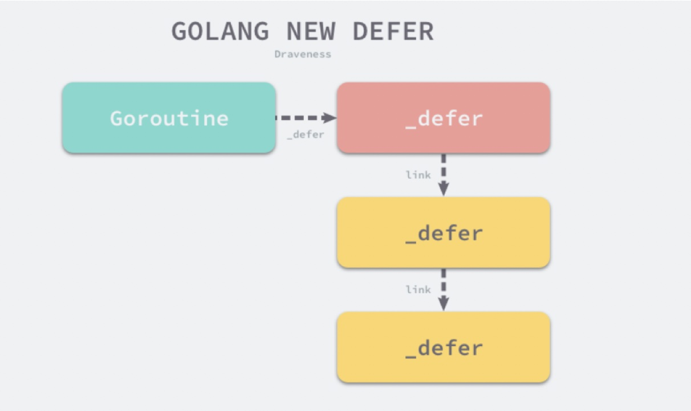

# Golang之defer

### defer

Golang的defer会在函数返回前去执行传入的函数，它会经常被用于关闭文件描述符、关闭数据库连接以及解锁资源。

### 常见使用场景

1.关闭文件

```go
func foo1()  {
	file, err :=  os.OpenFile("your file path", os.O_RDONLY, 0755)
	if err != nil {
		return
	}
	defer file.Close()
	//use file do something
	//...

	return
}
```

2.解锁

```go
func foo2(mu *sync.Mutex)  {
	mu.Lock()
	defer mu.Unlock()
	//do something
	//...

	return
}
```

#### defer数据结构

```go
type _defer struct {
	siz       int32  //参数和结果的内存大小
	sp        uintptr //栈指针
	pc        uintptr //调用方的程序计数器
	fn        *funcval //defer中传入的函数
	_panic    *_panic //触发延迟调用的结构体，可能为空
	link      *_defer //指向下一个defer
}
```

### defer调用链

当goroutine获取到一个defer，就会创建一个runtime.\_defer结构体，然后将runtime.\_defer追加到当前goroutine的defer链表的最前面。



defer 关键字的插入顺序是从后向前的，而 defer 关键字执行是从前向后的，这也是为什么后调用的 defer 会优先执行。

### defer函数入参

defer函数创建新的延迟调用时就会立刻拷贝函数的参数，函数的参数不会等到真正执行时计算。如下面获取函数执行时间的代码，其中foo1是无效的，foo2是有效的。

```go
//无效 无法计算函数执行时间
func foo1()  {
	startedAt := time.Now()
	defer fmt.Println(time.Since(startedAt))
	time.Sleep(time.Second)
}

//有效 可以计算函数执行时间
func foo2()  {
	startedAt := time.Now()
	defer func() {
		fmt.Println(time.Since(startedAt))
	}()
	time.Sleep(time.Second)
}
```

