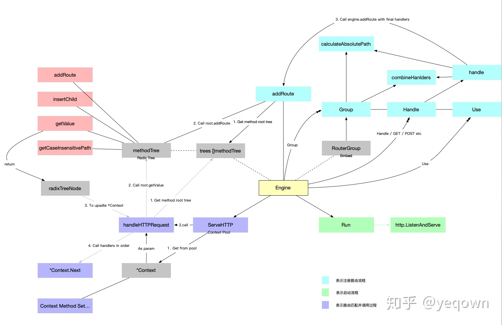

# gin

gin是一个用Go语言编写的web框架。

------

## demo

```go
package main

import "github.com/gin-gonic/gin"

func main() {
    r := gin.Default()
    r.GET("/ping", func(c *gin.Context) {
        c.JSON(200, gin.H{
            "message": "pong",
        })
    })
    r.Run()
}
```

## 流程分析

以下分析基于：

```shell
github.com/gin-gonic/gin v1.5.0
```

### 1. 创建Engin

Engin即引擎，Engin是 Web Server 的基础支持，也是**服务的入口**和**根级的数据结构**。下面是Engin的定义。

```go
// Engine is the framework's instance, it contains the muxer, middleware and configuration settings.
// Create an instance of Engine, by using New() or Default()
type Engine struct {
    // 路由管理
    RouterGroup
		
  	//....省略其他非核心的字段

    // context pool，支持context复用，减少对象创建提高性能。
    pool             sync.Pool

    // []methodTree方法树根节点集合 
    trees            methodTrees 
}
```

### 2. 注册Router

Engin创建完后，就可以注册自己的路由。首先要了解的是gin的路由处理是基于httprouter库来做的。httprouter 是Go语言实现的一个高性能、可扩展的HTTP路由，httprouter是基于**radix tree（基数树）这种数据结构实现的**。

#### *a. <u>前缀树与基数树</u>*

在描述基数树之前，必须先说明前缀树。前缀树又叫 trie tree，可以看作是 radix tree 的前身。trie tree 是一个多叉树，广泛应用于字符串搜索，每个树节点存储一个字符，从根节点到任意一个叶子结点串起来就是一个字符串。radix tree 是优化之后的 trie tree，对空间进一步压缩。下图左侧是字符串 sex,seed,sleep,son 四个字段串的 trie tree 数据结构表示. 可用看到sleep这个字符串需要5个节点表示. 其实e后面只跟一个p, 也就是只有一个子节点, 是完全可以和父节点压缩合并的. 右侧是优化后的数据结构, 节省了空间,同时也提高了查询效率(左边字符串sleep查询需要5步, 右边只需要3步), 这就是 radix tree .

.webp)

#### *b. <u>添加路由</u>*

明白了 radix tree 之后，再来看看gin是如何添加路由的。回到demo里main函数的第二行，这里注册了一个URL为"/ping"的路由，这时我们要将这个路由及处理函数存放到对应的 radix tree 上。

```go
r.GET("/ping", func(c *gin.Context) {...}
```

r.GET调用了group.handle函数  前面gin.Default就是生成一个group。

```go
func (group *RouterGroup) handle(httpMethod, relativePath string, handlers HandlersChain) IRoutes {
  //获取AbsolutePath即完整路径
	absolutePath := group.calculateAbsolutePath(relativePath)
  //将中间件与路由处理函数聚合（其实中间件与路由处理函数都是一个HandlerFunc）
	handlers = group.combineHandlers(handlers)
	group.engine.addRoute(httpMethod, absolutePath, handlers)
	return group.returnObj()
}
```

最后由engine.addRoute真正完成路由注册。

```go
func (engine *Engine) addRoute(method, path string, handlers HandlersChain) {
	//...省略一些非核心代码
  
  //根据这个路由的http method 找到root节点 （在engine.trees中，每一个http method对应一个radix tree）
	root := engine.trees.get(method)
  //如果这个http method 对应的radix tree不存就创建这棵树
	if root == nil {
		root = new(node)
		root.fullPath = "/"
		engine.trees = append(engine.trees, methodTree{method: method, root: root})
	}
  //将path与handlers添加到radix tree中
	root.addRoute(path, handlers)
}
```

### 3. 启动Engin

注册完路由之后，就可以调用Engin的Run方法，启动整个服务。

```go
func (engine *Engine) Run(addr ...string) (err error) {
	//...省略一些非核心代码
	address := resolveAddress(addr)
  err = http.ListenAndServe(address, engine)
	return
}
```

从上面代码可以看出，gin也是使用了标准库的http启动的方法http.ListenAndServe，其第二个参数handler是一个http.Handler类型的接口，http.Handler的接口签名如下所示。

```go
type Handler interface {
	ServeHTTP(ResponseWriter, *Request)
}
```

也就是说，Engin肯定是实现了http.Handler接口，那么Engin肯定有ServeHTTP方法。

```go
func (engine *Engine) ServeHTTP(w http.ResponseWriter, req *http.Request) {
  //从pool中获取一个context对象
	c := engine.pool.Get().(*Context)
  //初始化参数
	c.writermem.reset(w)
	c.Request = req
	c.reset()

  //处理http请求
	engine.handleHTTPRequest(c)

  //归还context对象
	engine.pool.Put(c)
}
```

gin处理具体的http请求如下所示。

```go
func (engine *Engine) handleHTTPRequest(c *Context) {
  //获取http请求方法与路径
	httpMethod := c.Request.Method
	rPath := c.Request.URL.Path
	rPath = cleanPath(rPath)

	t := engine.trees
	for i, tl := 0, len(t); i < tl; i++ {
		if t[i].method != httpMethod {
			continue
		}
    //根据http method 找到对应的radix tree
		root := t[i].root
		//找到在radix tree的节点
		value := root.getValue(rPath, c.Params, unescape)
		if value.handlers != nil {
      //将节点中的handlers赋值给ctx的handlers 方便ctx调用
			c.handlers = value.handlers
			c.Params = value.params
			c.fullPath = value.fullPath
			c.Next() //调用中间件&路由处理函数  
			c.writermem.WriteHeaderNow()
			return
		}
    //... 省略一些非核心的代码
}
```

## 整体流程



注：网图，不一定与本文的gin版本相匹配