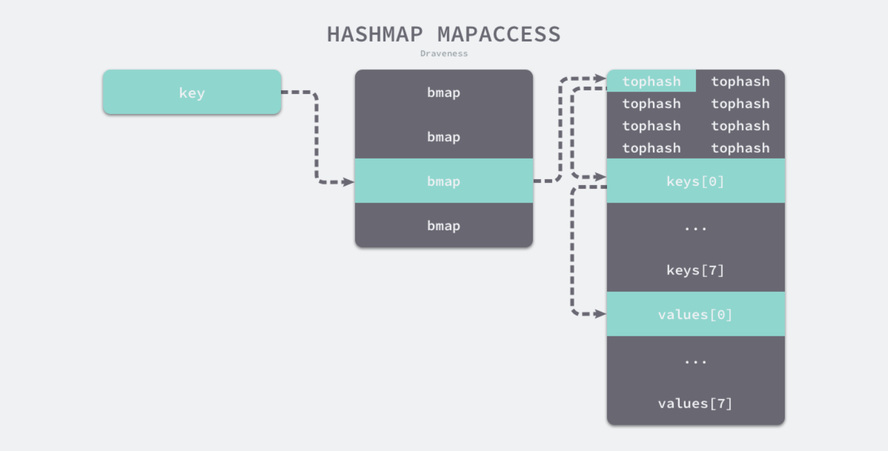
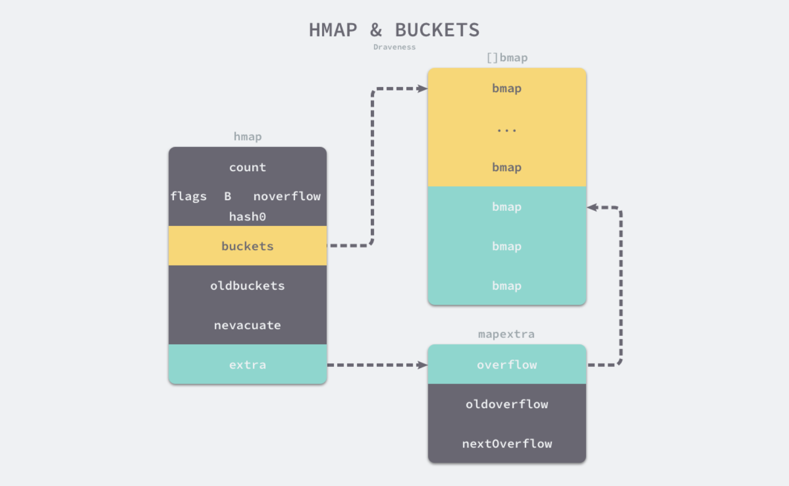
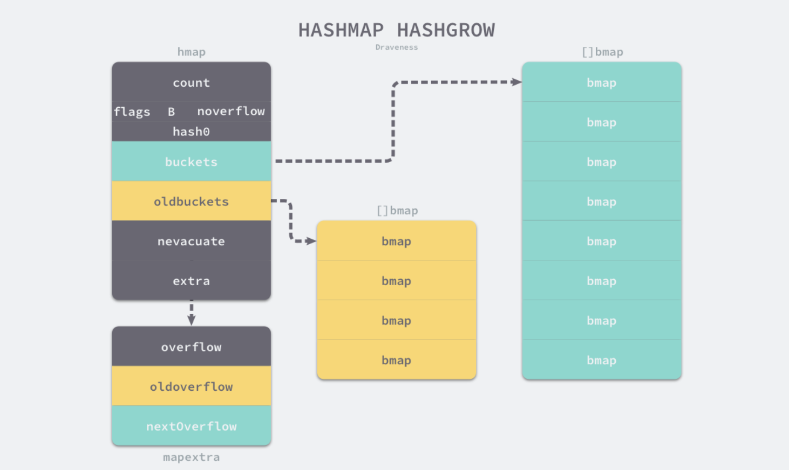
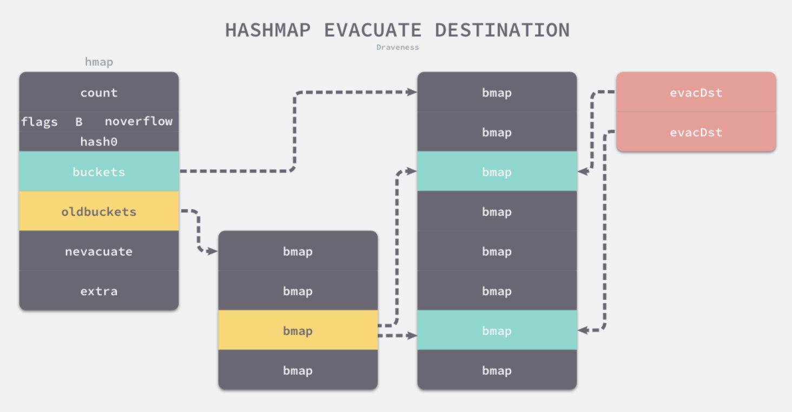

# Golang之map源码分析

### 哈希表

map即哈希表，也称为散列表，是根据关键码值\(key value\)而直接进行访问的数据结构。也就是说，它通过把关键码值映射（哈希函数）到表中一个位置来访问记录，以加快查找的速度。

### 哈希碰撞

哈希函数是整个哈希表的关键。所以为了更好的性能，我们希望在尽可能短的时间内，相同的key经过哈希函数的计算，可以得到相同的索引，不同的key经过哈希函数的计算，可以得到不同的索引，但在实际中往往事与愿违，不同的key小概率会计算出相同的索引，这就是哈希冲突（collision），几乎所有的哈希函数都存在这个问题。常见的解决哈希冲突的方法有：

1. _开放寻址法_：开放寻址法是如果通过哈希函数计算出的key所对应的空间已经被占用了，就从数组尾部再找一个还没被占用的空间将数据存进去。
2. _拉链法_：实现拉链法一般会使用数组加上链表，数组的每个索引位置装的是一个链表，当发生hash冲突时，将新的kv挂在这个链表的尾部。

### 版本

**以下内容基于**：

```
go version go1.16.2 darwin/amd64
```

### map的数据结构

Golang里map由runtime.hmap实现。

```go

type hmap struct {
	count     int    // map的大小，指map中有多少个kv对，也就是len()的值，
	flags     uint8  // 状态标识
	B         uint8  // 哈希表中bucket的数量都2的倍数，这个字段指这个map拥有2^B个bucket(为什么要用2^B来表示而不直接用一个int来记录bucket数量？后面会介绍)
	noverflow uint16 // 溢出桶的个数
	hash0     uint32 // 哈希因子

	buckets    unsafe.Pointer // 指向当前桶数据的指针(所有桶是存放在一段连续的内存内的) 
	oldbuckets unsafe.Pointer // 在扩容之前保存的buckets字段，它的大小是当前buckets的一半
	nevacuate  uintptr        // 迁移的进度

	extra *mapextra   // 记录溢出桶的信息
}

```

hamp里的桶是由runtime.bmap表示的

```go
type bmap struct {
	tophash [bucketCnt]uint8 ////一个长度为8的数组 其中每个index存储的是key的hash值的高8位 如果tophash[0] < minTopHash，则 tophash [0] 表示为迁移进度

	//因为哈希表中可能存储不同类型的键值对，当前泛形也还未大规模使用，所以键值对占据的内存空间只能通在编译的时候进行推导，下面这些字段是经过编译推导后得出的
    keys     [8]keytype     //bucket里的8个key
    values   [8]valuetype   //bucket里的8个value
    pad      uintptr
    overflow uintptr        //下一个溢出桶的指针地址
}

```

在bmap的设计中，存储kv并不是用k/v/k/v/k/v/k/v 的模式，而是 k/k/k/k/v/v/v/v 的形式去存储。这是考虑到k/v/k/v/k/v/k/v模式需要内存对齐来补存空间，会造成内存浪费。如果以k/k/k/k/v/v/v/v的形式存放，能够解决因内存对齐导致的内存浪费的问题。

一个bmap最多只能存储8个kv（即8个槽位），如果发生了哈希冲突，导致某一个桶存储的kv超过了8个，就会发生桶溢出，那么溢出的kv就会放在extra.overflow里。



这里先介绍下槽的几种状态，后面的代码分析中会遇到

```go
const (
	//...

	emptyRest      = 0 // 表示该槽后面的槽都没有key了，并且该槽所在的桶后面的溢出桶也没有数据了
	emptyOne       = 1 // 表示槽位已经被清空
    
    //evacuatedX/evacuatedY表示桶已被迁移
	evacuatedX     = 2 // 表示该桶被迁移到序号低的桶
	evacuatedY     = 3 // 表示该桶被迁移到序号高的桶
	evacuatedEmpty = 4 // 表示操已被迁移，并且该槽对应的桶也已迁移完成
	
   
    minTopHash     = 5 // 表示最小的tophash值了，当一个key计算出来的   tophash比这个还小的话就要加上minTopHash作为最终的tophash，防止tophash跟这些标识位冲突
)
```

hmap.extra用来存放溢出桶的信息。

```go
type mapextra struct {
	overflow    *[]*bmap //当前溢出桶的地址
	oldoverflow *[]*bmap //旧的溢出桶的地址
 

	nextOverflow *bmap //为空闲溢出桶的指针地址
}
```

前面我们说过，hmap.buckets指向一段内存，这段内存里放着一个正常桶数组，而extra.overflow里则指针存放的则是溢出桶数组，这两种桶在内存上是连续的。如图，黄色的为正常桶，绿色的为溢出桶。不过桶溢出只是临时的解决方案，如果有过多的桶溢出，还是会触发哈希扩容。



### map的初始化

构造一个map最终都是调用runtime.makemap

```go

func makemap(t *maptype, hint int, h *hmap) *hmap {
	//hint为元素个数 这里计算哈希占用的内存是否溢出或超出能分配的最大内存
	mem, overflow := math.MulUintptr(uintptr(hint), t.bucket.size)
	if overflow || mem > maxAlloc {
		hint = 0
	}

	if h == nil {
		h = new(hmap)
	}

	//初始化哈希因子
	h.hash0 = fastrand()

	//计算所需要的桶的数量
	B := uint8(0)
	for overLoadFactor(hint, B) {
		B++
	}
	h.B = B

	if h.B != 0 {
		var nextOverflow *bmap
		
		//为hmap.buckets创建保存桶的数组 
		//如果B大于4（即桶的数量大于2^4），那么将会额外为它创建 2^(B-4) 个溢出桶 
		h.buckets, nextOverflow = makeBucketArray(t, h.B, nil)
		if nextOverflow != nil {
			h.extra = new(mapextra)
			h.extra.nextOverflow = nextOverflow
		}
	}

	return h
}

```

### map的访问

map的访问主要是runtime.mapaccess1与runtime.mapaccess2，两个函数分别对应map的获取的两种方式

mapaccess1:

```go
v := m[k] //mapaccess1 直接返回目标值
```

mapaccess2:

```go
v, ok := m[k] //mapaccess2 除了返回目标值外 还会返回勇于判断k是否存在的bool变量
```

mapaccess1与mapaccess2整体流程基本相同，唯一不同点是mapaccess2在获取不到数据的时候会返回多一个ok值表示这个key是否存在，这里就以mapaccess1为例来说明在map里如何根据key来获取value。

```go
func mapaccess1(t *maptype, h *hmap, key unsafe.Pointer) unsafe.Pointer {

	//省略一些前置判断...

	//如果并发读写 抛出异常
	if h.flags&hashWriting != 0 {
		throw("concurrent map read and map write")
	}

	//对key进行hash
	hash := t.hasher(key, uintptr(h.hash0))

	//从hmap.buckets获取key对应的桶的 
	m := bucketMask(h.B)
	b := (*bmap)(add(h.buckets, (hash&m)*uintptr(t.bucketsize)))

	//是否正在扩容阶段
	if c := h.oldbuckets; c != nil {
		if !h.sameSizeGrow() {
			//翻倍扩容的话 buckets数组的长度是原来的两倍
			m >>= 1
		}
		oldb := (*bmap)(add(c, (hash&m)*uintptr(t.bucketsize)))
		if !evacuated(oldb) {
      //若正在扩容，则到老的 bucket 中查找（因为当前桶迁移还未完成，数据仍然在旧的buckt中）
			b = oldb
		}
	}

	//获取hash值的高8位
	top := tophash(hash)
bucketloop:
	for ; b != nil; b = b.overflow(t) {  //先在正常桶里找 找不到就在继续在溢出桶里找
		//根据计算出来的哈希值的高8位 依次与桶里已经存储的tophash的进行比较（快速试错，不会一开始就直接拿key来进行对比）
		for i := uintptr(0); i < bucketCnt; i++ {
			if b.tophash[i] != top {
				if b.tophash[i] == emptyRest { //这个桶后面都没有kv了，直接退出当前桶的遍历
					break bucketloop
				}
				continue
			}

			//取出桶里的key
			k := add(unsafe.Pointer(b), dataOffset+i*uintptr(t.keysize))
			if t.indirectkey() {
				k = *((*unsafe.Pointer)(k))
			}

			//判断桶里的key与所需要找到key是否相等
			if t.key.equal(key, k) {
				//如果相等 取出key对应的value 然后返回
				e := add(unsafe.Pointer(b), dataOffset+bucketCnt*uintptr(t.keysize)+i*uintptr(t.elemsize))
				if t.indirectelem() {
					e = *((*unsafe.Pointer)(e))
				}
				return e
			}
		}
	}

	//找不到 返回类型零值
	return unsafe.Pointer(&zeroVal[0])
}
```

在上面计算key对应的桶的过程中，一般来说，根据map的hash函数计算出key对应的hash值后，需要用这个hash值对hmap.buckets的长度取模（因为哈希值很可能大于bucket数组的长度，所以需要取模来确保hash值能对落到应到buckets上）。不过这里并没有采用 hash值 % buckets_size 方法计算对应的bucket，而是使用 hasn值 & bucketsize\-1 的方法来**快速计算**对应的桶的位置（也许是因为位操作比取模操作快），**但是这种位操作代替取模的前提是，bucket数组长度必须是2的指数**，这里也就解释了为什么不直接用一个int变量来存储bucketsize，而是使用hmap.B，因为bucketsize都是 2 ^ B，**所以可以用位操作来代替取模操作。**

### map的写入

map的写入使用的是runtime.mapassign函数，该函数与runtime.mapaccess1比较类似。

```go
func mapassign(t *maptype, h *hmap, key unsafe.Pointer) unsafe.Pointer {
	
	//省略一些前置判断...

	//不允许并发写
	if h.flags&hashWriting != 0 {
		throw("concurrent map writes")
	}
	
	//通过哈希函数计算key对应的哈希值
	hash := t.hasher(key, uintptr(h.hash0))

	//标记为正在写
	h.flags ^= hashWriting

	//如果hmap.buckets没有初始化 则初始化buckets
	if h.buckets == nil {
		h.buckets = newobject(t.bucket) // newarray(t.bucket, 1)
	}

again:

	bucket := hash & bucketMask(h.B)
    
	//如果当前正在扩容阶段 那么先将扩容完成
	if h.growing() {
		growWork(t, h, bucket)
	}

	//找到桶的位置
	b := (*bmap)(add(h.buckets, bucket*uintptr(t.bucketsize)))
	top := tophash(hash)

	var inserti *uint8
	var insertk unsafe.Pointer
	var elem unsafe.Pointer
bucketloop:
	for {
		for i := uintptr(0); i < bucketCnt; i++ { //遍历桶里的8个槽
			if b.tophash[i] != top {
				//若遍历到的槽的tophash为空
				if isEmpty(b.tophash[i]) && inserti == nil { 
          //则先记录下该位置  如果这个key还没有在这个map中 后面可以直接用这个位置来放置kv键值对（相当于新增kv）
					inserti = &b.tophash[i]
					insertk = add(unsafe.Pointer(b), dataOffset+i*uintptr(t.keysize))
					elem = add(unsafe.Pointer(b), dataOffset+bucketCnt*uintptr(t.keysize)+i*uintptr(t.elemsize))
				}
				
        //该槽后面都没有kv了 没有必要找在这个桶里找了
				if b.tophash[i] == emptyRest {
					break bucketloop
				}
				continue
			}

			//如果槽的tophash与参数key的tophash相等 进一步取出槽对应的key 
			k := add(unsafe.Pointer(b), dataOffset+i*uintptr(t.keysize))
			if t.indirectkey() {
				k = *((*unsafe.Pointer)(k))
			}

			//判断 槽对应的key 与 入参key 是否相等
			if !t.key.equal(key, k) {
				continue
			}

			//相等 则说明map已经存在这个key了 更新key对应的value
			if t.needkeyupdate() {
				typedmemmove(t.key, k, key)
			}
			elem = add(unsafe.Pointer(b), dataOffset+bucketCnt*uintptr(t.keysize)+i*uintptr(t.elemsize))

			//更新完成 直接清除写标志位然后返回
			goto done
		}

		//正常桶里没有 继续在溢出桶里找
		ovf := b.overflow(t)
		if ovf == nil {
			break
		}
		b = ovf
	}

	//到这里说说明当前map不存在这个key
	//如果当前没有正在扩容 再判断下面两个条件：
	//1.装载因子（元素数量/桶的数量） > 6.5
	//2.map使用太多溢出桶了
	//如果满足其中任意一个条件 则进入扩容过程

	if !h.growing() && (overLoadFactor(h.count+1, h.B) || tooManyOverflowBuckets(h.noverflow, h.B)) {
		hashGrow(t, h) //扩容
		goto again // 重新判断
	}

	//不需要扩容 判断在当前桶（正常桶）里是否能有放新的kv的位置 
	if inserti == nil {
		//正常桶里没有位置了 新生成一个溢出桶来存放 将溢出桶的第一个槽的设置为kv插入的位置
		newb := h.newoverflow(t, b)
		inserti = &newb.tophash[0]
		insertk = add(unsafe.Pointer(newb), dataOffset)
		elem = add(insertk, bucketCnt*uintptr(t.keysize))
	}

	// 将kv放入对应插入位置
	if t.indirectkey() {
		kmem := newobject(t.key)
		*(*unsafe.Pointer)(insertk) = kmem
		insertk = kmem
	}
	if t.indirectelem() {
		vmem := newobject(t.elem)
		*(*unsafe.Pointer)(elem) = vmem
	}
	typedmemmove(t.key, insertk, key)
	*inserti = top
	h.count++

	//清除写标志位
done:
	if h.flags&hashWriting == 0 {
		throw("concurrent map writes")
	}
	h.flags &^= hashWriting
	if t.indirectelem() {
		elem = *((*unsafe.Pointer)(elem))
	}
	return elem
}

```

map扩容的条件有两个，分别对应两种扩容方式。

1. **如果装载因子\>6.5** map的扩容策略为将hmap.B加一, 即将整个哈希桶数目扩充为原来的两倍大小, 这种策略属于**增量扩容**。
2. **如果是溢出桶过多**，也会触发扩容。为什么太多溢出桶太，装载因子并没有超过阈值，也会需要扩容？考虑这么一个case, 向 map 中插入大量的元素, 哈希桶将逐渐被填满, 这个过程中也可能创建了一些溢出桶, 但此时装载因子并没有超过设定的阈值, 然后对这些 map 做删除操作, 删除元素之后, map 中的元素数目变少, 使得装载因子降低, 而后又重复上述的过程, 最终使得整体的装载因子不大, 但整个 map 中存在了大量的溢出桶, 因此当溢出桶数目过多时, 即便没有达到装载因子 6.5 的阈值也会触发扩容。这种扩容属于**等量扩容** 。

当满足扩容条件时，就会调用runtime.hashGrow，但runtime.hashGrow只会构造新桶并且修改相关字段，**并不会真正把数据迁移到新桶上**。**只有当map进行插入或者删除操作，才会把数据从旧桶迁移到新桶，迁移的过程是runtime.growWork完成的**。

```go
func hashGrow(t *maptype, h *hmap) {
	
	bigger := uint8(1)
	if !overLoadFactor(h.count+1, h.B) {
		bigger = 0
		h.flags |= sameSizeGrow //如果装载因子不大于6.5 则为增量扩容
	}

	//保存旧桶 并构造新桶
	oldbuckets := h.buckets
	newbuckets, nextOverflow := makeBucketArray(t, h.B+bigger, nil)

	flags := h.flags &^ (iterator | oldIterator)
	if h.flags&iterator != 0 {
		flags |= oldIterator
	}
	
	// 相关参数修改
	h.B += bigger
	h.flags = flags
	h.oldbuckets = oldbuckets
	h.buckets = newbuckets
	h.nevacuate = 0
	h.noverflow = 0

	//将当前溢出桶赋值给旧溢出桶 当前溢出桶更新为nil
	if h.extra != nil && h.extra.overflow != nil {
		if h.extra.oldoverflow != nil {
			throw("oldoverflow is not nil")
		}
		h.extra.oldoverflow = h.extra.overflow
		h.extra.overflow = nil
	}

	//重新赋值nextOverflow
	if nextOverflow != nil {
		if h.extra == nil {
			h.extra = new(mapextra)
		}
		h.extra.nextOverflow = nextOverflow
	}

}
```

下面是触发扩容后的哈希。



**runtime.growWork**负责出处理桶迁移，而其中又调用**runtime.evacuate**来具体迁移某个桶，可以看到一次迁移过程最多搬移**两个桶**，而不是一次性将所有旧桶都迁移到新桶，这样做是为了**避免一次迁移太桶多会造成区间性能抖动**。

```go
func growWork(t *maptype, h *hmap, bucket uintptr) {
	// 当前操作key对应的桶（旧桶），搬迁到新桶数组
	evacuate(t, h, bucket&h.oldbucketmask())

	// evacuate one more oldbucket to make progress on growing
  // 另外再搬迁一个桶
	if h.growing() {
		evacuate(t, h, h.nevacuate)
	}
}
```

**runtime.evacuate**迁移流程如下。

```go
func evacuate(t *maptype, h *hmap, oldbucket uintptr) {
	//找到key对应的旧桶
	b := (*bmap)(add(h.oldbuckets, oldbucket*uintptr(t.bucketsize)))
	// newbit即为旧桶的个数
	newbit := h.noldbuckets()

	if !evacuated(b) {
		// xy 是把老桶迁移到新桶去的位置，x是低位，y是高位
		var xy [2]evacDst
		x := &xy[0]
		// x和老桶的位置相同（例如在老桶数组中位置数是3 那么迁移后在新桶数组中也是3）
		x.b = (*bmap)(add(h.buckets, oldbucket*uintptr(t.bucketsize)))
		// 新桶内k的起始位置
		x.k = add(unsafe.Pointer(x.b), dataOffset)
		// 新桶内v的起始位置
		x.e = add(x.k, bucketCnt*uintptr(t.keysize))

		if !h.sameSizeGrow() {
			//增量扩容 设置y x与y之间隔了oldbuckets的地址（例如有4个桶，本次迁移的是第三个老桶，那么x为3，y为3加上老桶个数4，即为7）
			y := &xy[1]
			y.b = (*bmap)(add(h.buckets, (oldbucket+newbit)*uintptr(t.bucketsize)))
			y.k = add(unsafe.Pointer(y.b), dataOffset)
			y.e = add(y.k, bucketCnt*uintptr(t.keysize))
		}

		for ; b != nil; b = b.overflow(t) { //遍历老桶及其溢出桶
			// 老桶内k/v的起始位置
			k := add(unsafe.Pointer(b), dataOffset)
			e := add(k, bucketCnt*uintptr(t.keysize))
			for i := 0; i < bucketCnt; i, k, e = i+1, add(k, uintptr(t.keysize)), add(e, uintptr(t.elemsize)) { //遍历老桶内的槽
				top := b.tophash[i]
				if isEmpty(top) {
					b.tophash[i] = evacuatedEmpty //槽位置为空，标记为槽已迁移，表示这个桶已经迁移完成了
					continue
				}
				if top < minTopHash {
					throw("bad map state")
				}
				k2 := k
				if t.indirectkey() {
					k2 = *((*unsafe.Pointer)(k2))
				}

				
				var useY uint8
				if !h.sameSizeGrow() {
					//如果是增量扩容 需要判断key是要放在x还是放在y
					hash := t.hasher(k2, uintptr(h.hash0))
					if h.flags&iterator != 0 && !t.reflexivekey() && !t.key.equal(k2, k2) {
						// 如果满足这一条件（具体啥条件不是很能看明白。。。） 直接迁移到y
						useY = top & 1
						top = tophash(hash)
					} else {
						// 根据hash&newbit 来判断当前key是放在x还是y
						if hash&newbit != 0 {
							useY = 1
						}
					}
				}

				if evacuatedX+1 != evacuatedY || evacuatedX^1 != evacuatedY {
					throw("bad evacuatedN")
				}

				// 标记这个槽是被迁移到x还是y
				b.tophash[i] = evacuatedX + useY // evacuatedX + 1 == evacuatedY
				dst := &xy[useY]                 // evacuation destination
 
 				// 新桶的槽位满了，需要给新桶创建溢出桶
				if dst.i == bucketCnt {
					// 迁移目的地修改为溢出桶的信息
					dst.b = h.newoverflow(t, dst.b)
					dst.i = 0
					dst.k = add(unsafe.Pointer(dst.b), dataOffset)
					dst.e = add(dst.k, bucketCnt*uintptr(t.keysize))
				}

				//设置新桶槽位的tophash
				dst.b.tophash[dst.i&(bucketCnt-1)] = top // mask dst.i as an optimization, to avoid a bounds check

				//把老桶的kv复制到新桶
				if t.indirectkey() {
					*(*unsafe.Pointer)(dst.k) = k2 // copy pointer
				} else {
					typedmemmove(t.key, dst.k, k) // copy elem
				}
				if t.indirectelem() {
					*(*unsafe.Pointer)(dst.e) = *(*unsafe.Pointer)(e)
				} else {
					typedmemmove(t.elem, dst.e, e)
				}
				//新桶内迁移的数加一
				dst.i++

				//新桶的kv向前偏移一个单位
				dst.k = add(dst.k, uintptr(t.keysize))
				dst.e = add(dst.e, uintptr(t.elemsize))
			}
		}
		
		// 把老桶释放掉  
		if h.flags&oldIterator == 0 && t.bucket.ptrdata != 0 {
			b := add(h.oldbuckets, oldbucket*uintptr(t.bucketsize))

			// 只清理kv的内存，而不清理8个槽的tophash，这里留着tophash主要是利用啊他们的标记位，已方便后续的其他的桶迁移
			ptr := add(b, dataOffset)
			n := uintptr(t.bucketsize) - dataOffset
			memclrHasPointers(ptr, n)
		}
	}

	//迁移标记
	if oldbucket == h.nevacuate {
		advanceEvacuationMark(h, t, newbit)
	}
}
```

迁移位置示意图。



### map的删除

从map中删除元素使用的是runtime.mapdelete函数簇中的一个，包括 runtime.mapdelete、mapdelete\_faststr、mapdelete\_fast32 和 mapdelete\_fast64，主体流程与key的插入类似，这里挑选runtime.mapdelete来分析一下。

```go
func mapdelete(t *maptype, h *hmap, key unsafe.Pointer) {

	//省略一些前置判断...

	//计算key的哈希值
	hash := t.hasher(key, uintptr(h.hash0))

	h.flags ^= hashWriting

	//得key对应的桶在数组中的位置
	bucket := hash & bucketMask(h.B)

	//如果正常扩容 则先搬迁两个桶
	if h.growing() {
		growWork(t, h, bucket)
	}

	//得到具体的桶
	b := (*bmap)(add(h.buckets, bucket*uintptr(t.bucketsize)))
	bOrig := b //存一下 后面可能会用到
	top := tophash(hash)
search:
	for ; b != nil; b = b.overflow(t) {  //遍历正常桶及溢出桶
		for i := uintptr(0); i < bucketCnt; i++ { //遍历桶的每个槽
			if b.tophash[i] != top { //用哈希值的高8位来快速试错 
				if b.tophash[i] == emptyRest {
					break search
				}
				continue
			}

			//哈希值高8位相等 从槽里取出key 跟 传入的key做对比
			k := add(unsafe.Pointer(b), dataOffset+i*uintptr(t.keysize))
			k2 := k
			if t.indirectkey() {
				k2 = *((*unsafe.Pointer)(k2))
			}
			if !t.key.equal(key, k2) {
				continue
			}
			
			//清除key的操作
			if t.indirectkey() {
				*(*unsafe.Pointer)(k) = nil 
			} else if t.key.ptrdata != 0 {  //如果key含有指针 清除key
				memclrHasPointers(k, t.key.size) 
			}

			//清除value的操作
			e := add(unsafe.Pointer(b), dataOffset+bucketCnt*uintptr(t.keysize)+i*uintptr(t.elemsize))
			if t.indirectelem() {
				*(*unsafe.Pointer)(e) = nil
			} else if t.elem.ptrdata != 0 { //如果value含有指针 清除value
				memclrHasPointers(e, t.elem.size)
			} else {
				memclrNoHeapPointers(e, t.elem.size)
			}

			//这个槽标记为被清除过
			b.tophash[i] = emptyOne

			//下面这一段是去判断要不要将当前的槽标记为emptyRest
			if i == bucketCnt-1 {
				//如果是桶的最后一个槽，那么判断溢出桶的第一个槽位是不是emptyRest，如果是那这个槽也将标记为emptyRest
				if b.overflow(t) != nil && b.overflow(t).tophash[0] != emptyRest {
					goto notLast
				}
			} else {
				//如果不是桶的最后一个槽，判断该桶的下一个槽位是不是emptyRest，如果是那这个槽也将标记为emptyRest
				if b.tophash[i+1] != emptyRest {
					goto notLast
				}
			}

			//到这里时需要标记当前槽为emptyRest 即该槽后面的槽都没有key了，并且该槽所在的桶后面的溢出桶也没有数据了
			//并且一直从后往前查找可以标记为emptyRest的槽
			for {
				b.tophash[i] = emptyRest

				//这段if/else是找当前槽的前一个位置
				if i == 0 { //当前槽位是该桶的第一个槽位 需要找前一个桶的倒数第一个槽位
					if b == bOrig {
						break //当前是正常桶的第一个槽位 没有前一个位置了 
					}
					
					//找该桶的前一个桶 因为正常桶跟溢出桶之间是单链表，所以没法直接通过当前桶找到上一个桶，只能从正常桶bOrig开始从头遍历
					c := b
					for b = bOrig; b.overflow(t) != c; b = b.overflow(t) {
					}
					i = bucketCnt - 1
				} else { //当前槽位不是该桶的第一个槽位 继续往前找上一个槽位
					i--
				}

				//如果前一个位置不是空槽（emptyOne）那标记emptyRest的工作就结束了
				if b.tophash[i] != emptyOne {
					break
				}
			}

		notLast:
			//元素数减少
			h.count--
			//如果map没有kv了 则重置这个map的哈希因子
			if h.count == 0 {
				h.hash0 = fastrand()
			}
			break search
		}
	}

	//清理写标志位
	if h.flags&hashWriting == 0 {
		throw("concurrent map writes")
	}
	h.flags &^= hashWriting
}
```

### map的遍历

如果单纯地遍历map是一件比较简单的事，最外层遍历所有的bucket\(包括oldbuckets\)，中间遍历bucket里的槽\(包括溢出桶\)，即可获取map里的所有的kv对。但实际上map的遍历并不是有序的，Go团队在设计哈希表的遍历时就不想让使用者依赖固定的遍历顺序，所以**引入了随机数保证遍历的随机性**。

在遍历map时，编译器会使用 runtime.mapiterinit 和 runtime.mapiternext 两个运行时函数重写原始的 for\-range 循环。

runtime.mapiterinit会初始化遍历开始的元素。其核心逻辑如下。

```go
runtime.mapiterinit的核心逻辑如下。
func mapiterinit(t *maptype, h *hmap, it *hiter) {

	...

	it.t = t
	it.h = h
	it.B = h.B
	it.buckets = h.buckets

	if t.bucket.ptrdata == 0 {
		h.createOverflow()
		it.overflow = h.extra.overflow
		it.oldoverflow = h.extra.oldoverflow
	}

	// 随机因子
	r := uintptr(fastrand())
	if h.B > 31-bucketCntBits {
		r += uintptr(fastrand()) << 31
	}
	// 根据随机因子计算 起始位置
	it.startBucket = r & bucketMask(h.B)
	it.offset = uint8(r >> h.B & (bucketCnt - 1))

	// iterator state
	it.bucket = it.startBucket

	mapiternext(it)
}
```

runtime.mapiternext负责遍历元素。其中又分为选择桶与遍历桶内元素两个阶段。其核心逻辑如下：

```go
func mapiternext(it *hiter) {
	h := it.h
	t := it.t
	bucket := it.bucket
	b := it.bptr
	i := it.i
	checkBucket := it.checkBucket

next:
	if b == nil {
		if bucket == it.startBucket && it.wrapped {
			it.key = nil
			it.elem = nil
			return
		}

		//如果桶为空 找需要遍历的新桶
		if h.growing() && it.B == h.B {
			oldbucket := bucket & it.h.oldbucketmask()
			b = (*bmap)(add(h.oldbuckets, oldbucket*uintptr(t.bucketsize)))
			if !evacuated(b) {
				checkBucket = bucket
			} else {
				b = (*bmap)(add(it.buckets, bucket*uintptr(t.bucketsize)))
				checkBucket = noCheck
			}
		} else {
			b = (*bmap)(add(it.buckets, bucket*uintptr(t.bucketsize)))
			checkBucket = noCheck
		}
		bucket++
		if bucket == bucketShift(it.B) {
			bucket = 0
			it.wrapped = true
		}
		i = 0
	}

	//剩下的部分就是遍历桶的元素，不过如果哈希表处于扩容期间就会调用 runtime.mapaccessK 获取键值对：
		for ; i < bucketCnt; i++ {
		offi := (i + it.offset) & (bucketCnt - 1)
		k := add(unsafe.Pointer(b), dataOffset+uintptr(offi)*uintptr(t.keysize))
		v := add(unsafe.Pointer(b), dataOffset+bucketCnt*uintptr(t.keysize)+uintptr(offi)*uintptr(t.valuesize))
		if (b.tophash[offi] != evacuatedX && b.tophash[offi] != evacuatedY) ||
			!(t.reflexivekey() || alg.equal(k, k)) {
			it.key = k
			it.value = v
		} else {
			rk, rv := mapaccessK(t, h, k)
			it.key = rk
			it.value = rv
		}
		it.bucket = bucket
		it.i = i + 1
		return
	}
	b = b.overflow(t)
	i = 0
	goto next
}

```

### map的key

只要是**可以比较的类型**，都可以作为map的key。除开 slice，map，functions 这几种类型，其他类型都是 OK 的。

- 不能做key的类型：func、slice、map
- 可以做key的类型：bool、int、string、chan、interface、struct、数组（这些类型的共同特征是支持 `==` 和 `!=` 操作符）

### map可以边遍历边删除吗

如果在同一个协程内边遍历边删除，并不会检测到同时读写，理论上是可以这样做的，但是遍历结果可能不会是相同的了，有可能遍历结果中包含了删除的key，也可能不包含，这取决于key的删除时间是在遍历到key所在的bucket之前还是之后。

### 可以对map的元素取地址吗

不能对map的元素进行取地址的操作，如下代码会编译报错。

```go
package main

import "fmt"

func main() {
	m := make(map[string]int)
	fmt.Println(&m["qcrao"])
}
```

可以通过unsafe.Pointer等获取到key或者value的地址，但一旦map发生扩容，key与value的地址就会改变，之前保存的地址也就失效了。

### 如何比较map是否相等

不能直接使用 map1 == map2 这种情况会直接报错。只能遍历每一个key，比较每个元素是否深度相等。
