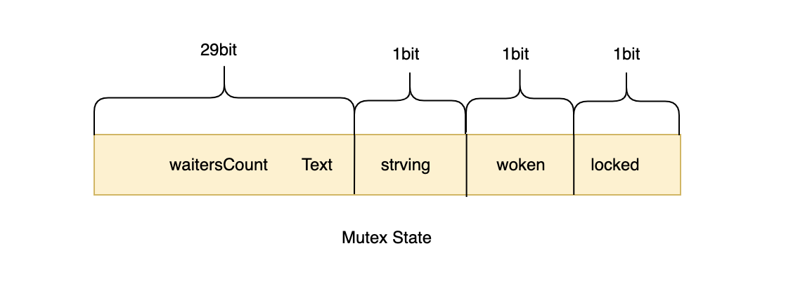

# Golang之mutex

### 互斥锁Mutex

在Golang中用于表示互斥锁的是sync.Lock，其作用是保护临界区，确保任意时间只有一个goroutine能拿到锁。

---

### 正常模式&饥饿模式

为了保证公平性，Golang在v1.9的互斥锁版本中引入了**饥饿模式**与**正常模式**。

1. 如果当前锁正在被持有，抢不到锁就会进入一个等待的队列，当锁被释放后，从这个队列的队头里唤醒一个goroutine（等待者），但是锁不会直接给这个等待者，而是必须与**正在获取锁但还未进入等待队列**的goroutine竞争这把锁，与刚唤醒的等待者相比，这个goroutine正持有CPU，所以获取到锁的概率较大。如果等待者抢锁失败，那么它就会被放回队列头部，如果它超过1ms都还没获取到锁，就从**正常模式**切换为**饥饿模式**。
2. 在饥饿模式下，当锁释放后，锁会直接交给等待队列的第一个等待者，不必再与新来的goroutine竞争，新来的goroutine会直接加到等待队列的队尾。当满足以下两个条件时，**饥饿模式**将切换回**正常模式**。
    （1）当前被唤醒的等待者获得锁后，发现队列只剩它自己一个了，那么**切换回正常模式**。
    （2）当前被唤醒的等待者获得锁后，发现自己的等待时间不超过1ms，那么**切换回正常模式**。

在正常模式下，当前拥有CPU的goroutine比起等待队列里的goroutine**有很大几率获得锁**，**这样可以避免协程上下文的频繁切换**。但这样又会导致等待队列里的goroutine活活“饿死”，所以又必须有饥饿模式，保证等待已久的goroutine能够获取到锁，**以保证公平性**。

---

### sync.Lock

```go
type Mutex struct {
	state int32 //表示锁的状态，有锁定、饥饿、唤醒等状态
	sema  uint32 //表示信号量 用于实现mutex阻塞队列的定位
}

const (
	mutexLocked = 1 << iota //1 state & 1 == 1 表示上锁状态
	mutexWoken	            //2 state & 2 == 1 表示唤醒状态 
	mutexStarving           //4 state & 4 == 1 表示饥饿状态
	mutexWaiterShift = iota //3 state >> 3 获取等待者的数量	

	starvationThresholdNs = 1e6 //进入饥饿状态的阈值
)
```

state字段总共占用32个bit，其中用前三位表示三个状态，后29个bit表示等待的goroutine个数。



* locked: 表示互斥锁的锁定状态。
* woken: 表示从正常模式被唤醒。
* strving: 表示互斥锁进入饥饿状态。
* waiterCount: 表示互斥锁上等待goroutine的个数。

---

### Lock\(\)加锁过程

```go
func (m *Mutex) Lock() {
	// Fast path: grab unlocked mutex.
	if atomic.CompareAndSwapInt32(&m.state, 0, mutexLocked) {
		if race.Enabled {
			race.Acquire(unsafe.Pointer(m))
		}
		return
	}
	// Slow path (outlined so that the fast path can be inlined)
	m.lockSlow()
}
```

通过CAS判断锁的当前状态，如果state的第一个位为0，那么说明此锁没有被占领，可以直接获取到锁。如果当前锁已被占领，则进入lockSlow\(\)阶段。lockSlow\(\)可以分为如下几个阶段：

1. 判断当前Goroutine能否自旋
2. 通过自旋转等待互斥锁的释放
3. 计算互斥锁的最新状态
4. 更新互斥锁的状态并获取锁

```go
func (m *Mutex) lockSlow() {
	var waitStartTime int64
	starving := false
	awoke := false
	iter := 0
	old := m.state
	for {
    //当前不为饥饿状态并 且 runtime_canSpin()返回true 才能进入自旋状态
		if old&(mutexLocked|mutexStarving) == mutexLocked && runtime_canSpin(iter) {
			if !awoke && old&mutexWoken == 0 && old>>mutexWaiterShift != 0 &&
				atomic.CompareAndSwapInt32(&m.state, old, old|mutexWoken) {
				awoke = true
			}
      //runtime_doSpin()自旋函数，会执行30次PAUSE指令，该指令只会占用CPU并消耗CPU时间
			runtime_doSpin()
			iter++
			old = m.state
			continue
		}
```

自旋是一种多线程同步机制，自旋的线程会一直占用CPU，直到达成某个条件。自旋可以防止CPU切换到其他线程上，避免了上下文切换，但线程长期自旋会使长期CPU空转，其他线程的任务没法执行。所以要进入自旋状态需要满足两个条件:

1. state&\(mutexLocked|mutexStarving\)返回true，即锁处于正常模式。
2. runtime\_canSpin\(\)返回true:

* 运行在多 CPU 的机器。
* 当前 Goroutine 为了获取该锁进入自旋的次数小于四次。
* 当前机器上至少存在一个正在运行的处理器 P 并且处理的运行队列为空

```go
        //如果没有进入自旋转状态
		new := old
		// Don't try to acquire starving mutex, new arriving goroutines must queue.
        //如果不是饥饿模式，new标记为上锁状态
		if old&mutexStarving == 0 {
			new |= mutexLocked
		}
        //如果
		if old&(mutexLocked|mutexStarving) != 0 {
			new += 1 << mutexWaiterShift
		}
		// The current goroutine switches mutex to starvation mode.
		// But if the mutex is currently unlocked, don't do the switch.
		// Unlock expects that starving mutex has waiters, which will not
		// be true in this case.
		if starving && old&mutexLocked != 0 {
			new |= mutexStarving
		}
		if awoke {
			// The goroutine has been woken from sleep,
			// so we need to reset the flag in either case.
			if new&mutexWoken == 0 {
				throw("sync: inconsistent mutex state")
			}
			new &^= mutexWoken
		}
```

​		TODO...

