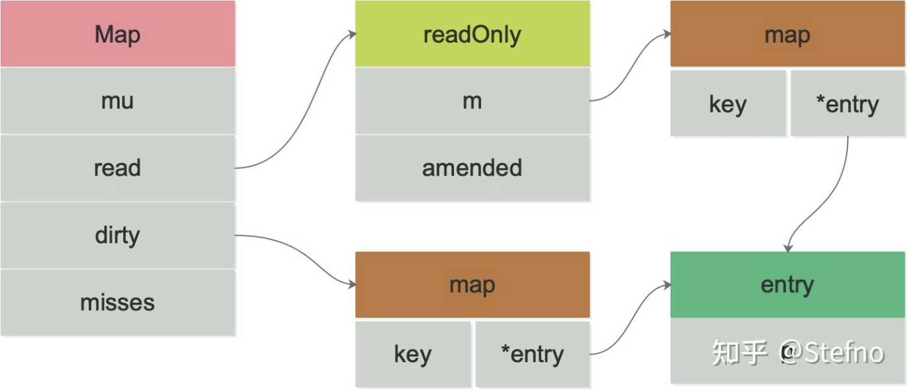

# Golang之sync.Map

## map的并发操作

从前面文章的分析可以看到，原生的map如果并发读写的话，会抛出异常。

```go
	if h.flags&hashWriting != 0 {
		throw("concurrent map read and map write")
	}
```

也就是说原生的map不是并发安全的。如果要实现并发安全，可以在操作map的时候加一把mutex锁。但官方提供了更高效的sync.Map，使其能在并发安全的前提下更加高效地读写。sync.Map使用了**写时复制（即Copy On Write）技术**来实现安全的高并发的map。sync.Map适用于**读多写少**的场景。

---

## sync.Map数据结构

```go
type Map struct {

	mu Mutex //互斥锁 保护dirty字段

	read atomic.Value //只读数据 实际类型为sync.readOnly

	dirty map[interface{}]*entry //写入数据 操作前需先加锁
 
	misses int //每次从read读取失败（read穿透） misses+1
}
```

其中sync.readOnly的数据结构

```go
type readOnly struct {
	m       map[interface{}]*entry
	amended bool //如果dirty里存在m中没有的key 这个值为true
}
```

sync.entry用来存储指向value的指针

```go
type entry struct {
	p unsafe.Pointer // *interface{}
}
```

其中，read与dirty里各自维护着一套key，**key指向的都是同一个entry，也就是说只要修改了这个entry，那么read与dirty都是可见的**。



entry.p有三种状态，分别是：

1. p == nil
2. p == expunged
3. 其他

---

## sync.Map原理

* 通过read与dirty两个字段，将读写操作分离，读的数据只存在只读字段read上，新写入的数据则放到dirty中。
* 读取的时候会先读read，read中没有再查询dirty（去dirty读之前有double check 机制）。
* 读取read不加锁，但操作dirty需要mutex保护。
* misses字段表示read读取失败但是在dirty读到（read被穿透）的次数，当misses达到一定值，需要将dirty升级为read，已减少miss的次数。
* 对于删除的数据通过标记来延迟删除。

## sync.Map操作

### 1.  Load()读取数据

load的大致流程是先在read中搜索，搜不到再去dirty中搜索，但为了提升搜索的效率，其还有其他一些机制：

- 双检查机制，去dirty读之前有double check 机制
- read miss次数达到阈值，为了让直接可以在read中找到key，尽可能不去dirty中找，因为read并发读是安全的，性能很高，而去dirty中找，则需要加锁，耗时就增加了。（调用Load或LoadOrStore函数时，如果在read中没有找到key，则会将miss值原子增加1，当miss值增加到和dirty长度相等时，会将dirty提升为read，以期望减少 "读 miss"。）

```go
func (m *Map) Load(key interface{}) (value interface{}, ok bool) {
  //现在read里面找对应的key
	read, _ := m.read.Load().(readOnly)
	e, ok := read.m[key]
  
  //在read中没找到 并且read于dirty的数据不一致 (dirty中有read中不存在的数据，因为写数据是直接往dirty中写的)
	if !ok && read.amended {
    //dirty map 不是线程安全的 所以需要加锁
		m.mu.Lock()
    //double check 避免在上锁过程中dirty升级为read(如果升级的话read这个时候已经被替换了)
		read, _ = m.read.Load().(readOnly)
		e, ok = read.m[key]
    
    //仍然没有在read中找到这个key
		if !ok && read.amended {
      //从dirty中查找
			e, ok = m.dirty[key]
      
      //不管在dirty中有没有找到 miss次数都要加1 当miss次数达到阈值时会将dirty升级为map 这样做也是为了防止read的命中率过低
			m.missLocked()
		}
		m.mu.Unlock()
	}
  
  //仍然没有找到 返回false
	if !ok {
		return nil, false
	}
  
  //找到key了 返回value
	return e.load()
}

```

### 2.  Store() 新增/修改数据

```go
func (m *Map) Store(key, value interface{}) {
  //如果read存在这个键，并且这个entry没有被标记删除，尝试直接存储。 
  //因为dirty也指向这个entry,所以m.dirty也保持最新的entry。
   read, _ := m.read.Load().(readOnly)
   if e, ok := read.m[key]; ok && e.tryStore(&value) {
      return
   }

   //要到dirty修改数据 需要先上锁
   m.mu.Lock()
   read, _ = m.read.Load().(readOnly)
   if e, ok := read.m[key]; ok { //read中存在这个key
      if e.unexpungeLocked() { //未标记为删除
         m.dirty[key] = e  //dirty中不存在这个key 将这个key放入dirty
      }
      e.storeLocked(&value) //更新entry的值
   } else if e, ok := m.dirty[key]; ok { //dirty中存在这个key
      e.storeLocked(&value) //更新entry的值
   } else { // key在read和dirty中都不存在，则走新增逻辑
      if !read.amended {
         // We're adding the first new key to the dirty map.
         // Make sure it is allocated and mark the read-only map as incomplete.
         m.dirtyLocked()
         m.read.Store(readOnly{m: read.m, amended: true})
      }
      m.dirty[key] = newEntry(value)
   }
   m.mu.Unlock()
}
```

### 3.  Delete() 删除数据 

Todo...

### 4.  Range() 遍历数据

Todo...

## 总结

sync.Map在初始化时会将read中所有未删除的数据复制到dirty，而频繁往map中插入新数据会导致dirty中有大量read中没有的数据，从而导致read的命中率过低，需要频繁调用锁进行操作，并且未命中次数达到len(dirty)后，dirty会被升级为read，再次有新数据插入的时候，又会重复dirty初始化的过程。这一系列流程均会造成较大的开销影响整体性能。所以sync.Map适用于**读多更新多，新增少的场景**

