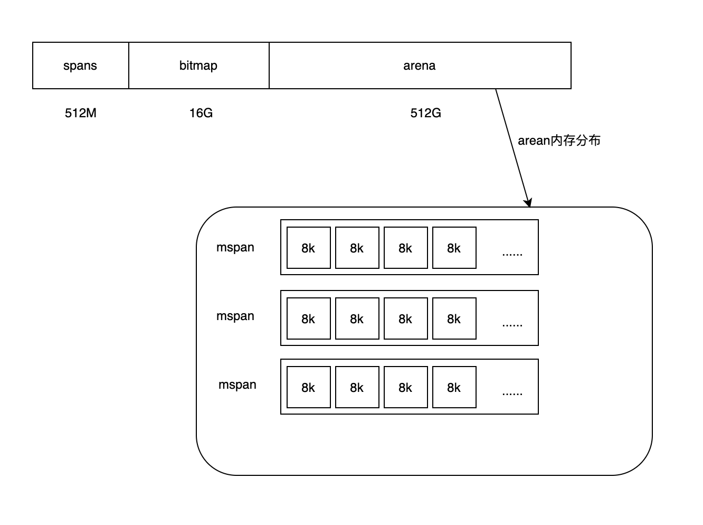
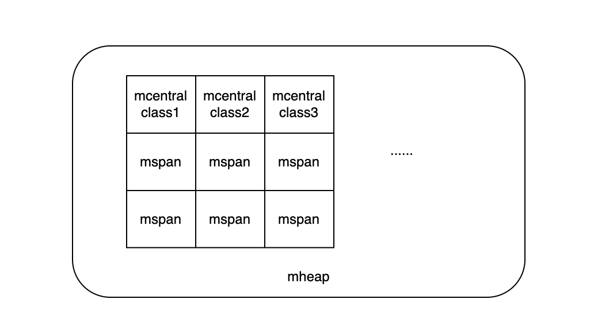
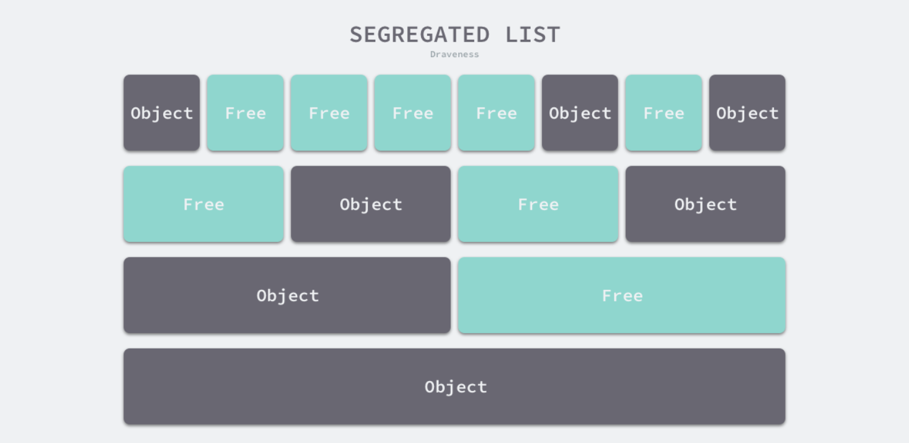

# 九股文笔记-Golang之内存管理

#### 概述

Go的内存分配借鉴了Google的TMalloc，其核心思想是**内存池\+多级对象管理**，**能加快分配速度，降低资源竞争。**

#### 内存分配的方法

* **线性分配法**：只需要在内存中维护一个指针，这个指针指向下一片未使用内存的起始位置，如果程序需要新分配一片内存，只要找到这个指针直接分配内存即可。
    
    这种方法实现虽然简单，但有一个致命的缺点，就是无法利用曾经使用过但后面被释放的内存。
    
* **空闲链表分配法**：会在内部维护一个类似链表的数据结构，当程序需要申请内存时，空闲链表分配器会一次遍历空闲的内存块，找到足够大的内存，然后申请新的资源并修改链表。
    

Go使用的是空闲链表分配法，再配合**隔离适应策略**，将内存分割成多个链表，每个链表中内存块大小相等，申请内存时先找到合适的链表，再在链表中找到合适的内存块。

#### 基础结构

* **内存单元相关**：mspan、arena
* **内存池相关**：mcache、mcentral、mheap

##### 内存单元

首先，在Go程序初始化时，会先将申请到的虚拟内存分为如下几个部分。

arena区域存储的是程序动态分配的堆区内存，它由若干个mspan构成，其中每个mspan又由若干个的页（一页为8k）构成。mspan是一个基本的内存管理单位，mspan记录了这组连续页面的起止地址、页数量、以及类型规格。

mspan有67种类型，每一种都有自己的大小，需要分配内存时，会先根据需要分配的量来决定mspan的类型，例如需要30byte的内存吗，就选择类型3的mspan

|类型|大小     |
|----|---------|
|0   |8字节    |
|2   |16字节   |
|3   |24字节   |
|... |...      |
|66  |32768字节|

上面的示意图中还有bitmap区域，主要用来标记arena中内存的使用信息，GC扫描信息及对象指针信息。总而言之，**spans与arena可以看作是arena的元数据信息**，辅助内存管理。

##### 内存池

**mheap**是一个全局对象，用来管理大于32K对象内存分布。mheap又由若干个mcentral构成。mcentral维护了**各种规格类型的mspan**，因此当有不同类型的分配请求时，不会产生并发竞争，只有申请同类型的mspan时才需要加锁操作。

**mcache**是提供给P的本地内存池，由于各个P都是独立的，每次只有一个G在P上运行，所以分配内存不会产生竞争。mcache上还有微型分配器，当对象度需要的内存小于16B时，会在一个8Byte的mspan（class1）上分配多个对象，以减少内存碎片，更好地利用空间内存。

#### 整体流程

mcache、mcentral、mheap 起到了内存池的作用，会被预分配内存，当有对应大小的对象需要分配时会先到它们这一层请求。如果这一层内存池不够用时，会按照下面的顺序一层一层的往上申请内存：macache \-\> mcentral \-\> mheap \-\> os。其中，mspan是一个基础结构，上述分配过程基本以它为单位。
