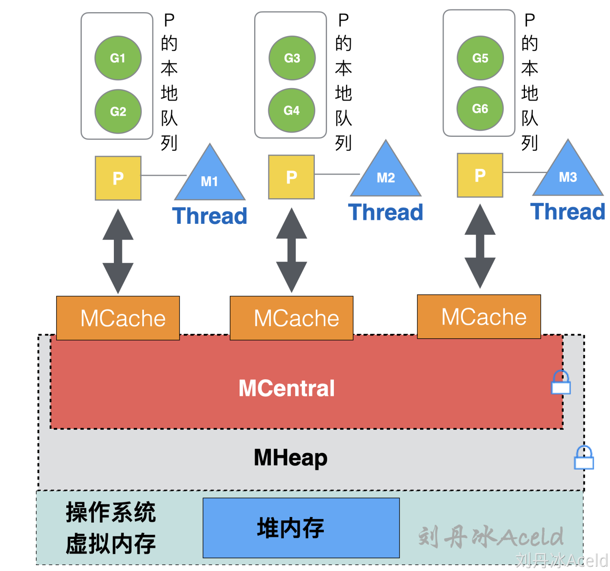

# Golang之内存管理

## 概述

Golang的内存分配借鉴了Google的TMalloc，其核心思想是**内存池\+多级对象管理**，**能加快分配速度，降低资源竞争。**

## Golang内存模型层次结构

## MCache

访问mcache依然不需要加锁而是直接访问，且MCache中依然保存各种大小的Span。MCache是与Golang协程调度模型GPM中的P所绑定，而不是和线程绑定。因为Golang调度的GPM模型，真正可运行的线程M的数量与P的数量一致，即GOMAXPROCS个，所以MCache与P进行绑定更能节省内存空间使用，可以保证每个G使用MCache时**不需要加锁**就可以获取到内存。

## MCentral

当MCache中某个Size Class对应的Span被一次次Object被上层取走后，如果出现当前Size Class的Span空缺情况，MCache则会向MCentral申请对应的Span。Goroutine、MCache、MCentral、MHeap互相交换的内存单位是不同，向Mcentral申请内存是**需要加锁**的。

MCentral与MCache不同的是，每个级别保存的不是一个Span，而是一个Span List链表。MCentral的内部构造如图所示

## MHeap

MHeap的上游是MCentral，MCentral中的Span不够时会向MHeap申请。MHeap的下游是操作系统，MHeap的内存不够时会向操作系统的虚拟内存空间申请。**访问MHeap获取内存依然是需要加锁的**。MHeap是对内存块的管理对象，是通过Page为内存单元进行管理。那么用来详细管理每一系列Page的结构称之为一个HeapArena，它们的逻辑层级关系如图所示。

## 内存分配

Golang将内存管理的对象根据其大小分为三种类型：Tiny对象、小对象、大对象

- Tiny对象：申请的内存小于16byte
- 小对象：申请的内存介于16byte - 32byte
- 大对象：申请的内存大于32byte

### *Tiny对象内存的分配*

Golang内存管理为什么需要一个Tiny这样的16B空间，原因是因为如果协程逻辑层申请的内存空间小于等于8B，那么根据正常的Size Class匹配会匹配到Size Class = 1（对应Span Class = 2或3），所以像 int32、 byte、 bool 以及小字符串等经常使用的Tiny微小对象，也都会使用从Size Class = 1申请的这8B的空间。但是类似bool或者1个字节的byte，也都会各自独享这8B的空间，进而导致有一定的内存空间浪费。

可以看出来这样当大量的使用微小对象可能会对Size Class = 1的Span造成大量的浪费。所以Golang内存管理决定尽量不使用Size Class = 1的Span，而是将申请的Object小于16B的申请统一归类为Tiny对象申请。具体的申请流程如图所示。

### *小对象内存的分配*

分配小对象的标准流程是按照Span Class规格匹配的。

### *大对象内存的分配*

小对象是在MCache中分配的，**而大对象是直接从MHeap中分配**。对于不满足MCache分配范围的对象，均是按照大对象分配流程处理。大对象分配流程是协程逻辑层直接向MHeap申请对象所需要的适当Pages，从而绕过从MCaceh到MCentral的繁琐申请内存流程，大对象的内存分配流程相对比较简单，具体的流程如图所示。

## 总结

Golang的内存模型是基于**分层缓存**机制的，针对不同的内存场景采用不同的独特解决方式，提高局部性逻辑和细微粒度内存的复用率。

