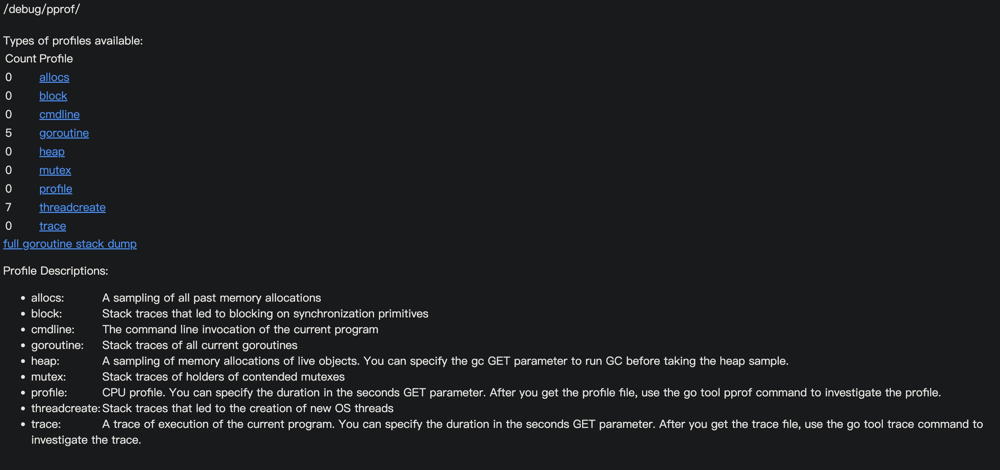
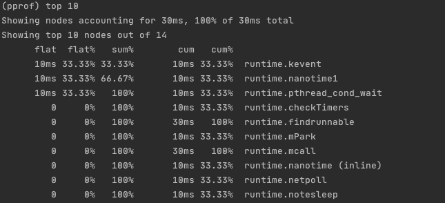
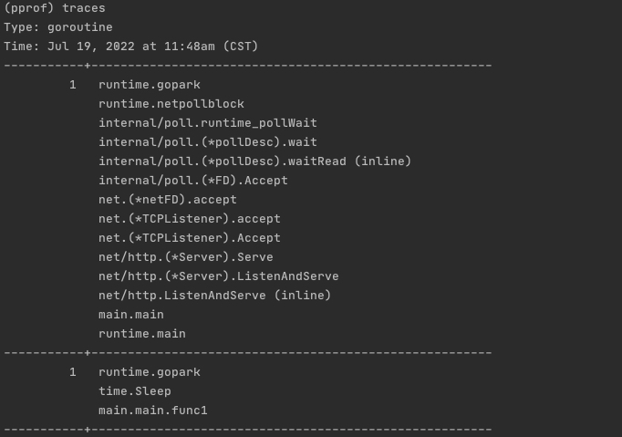
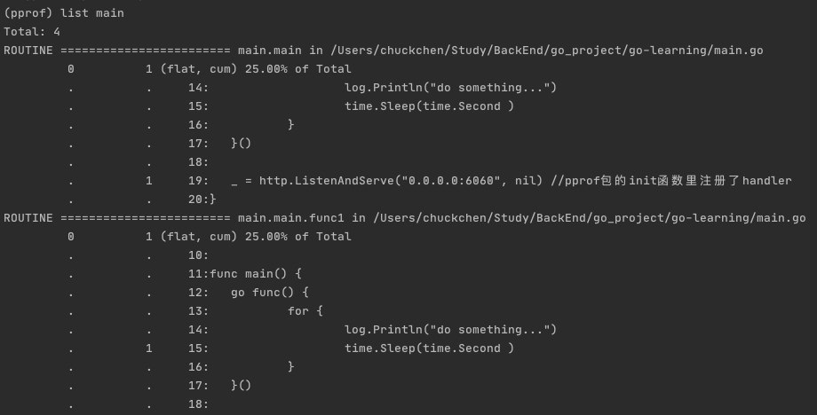
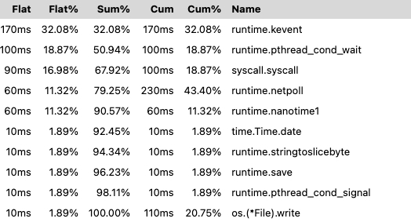
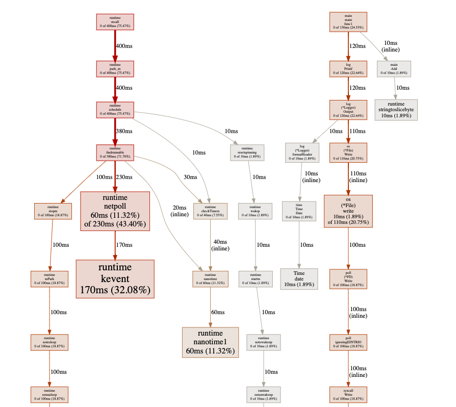
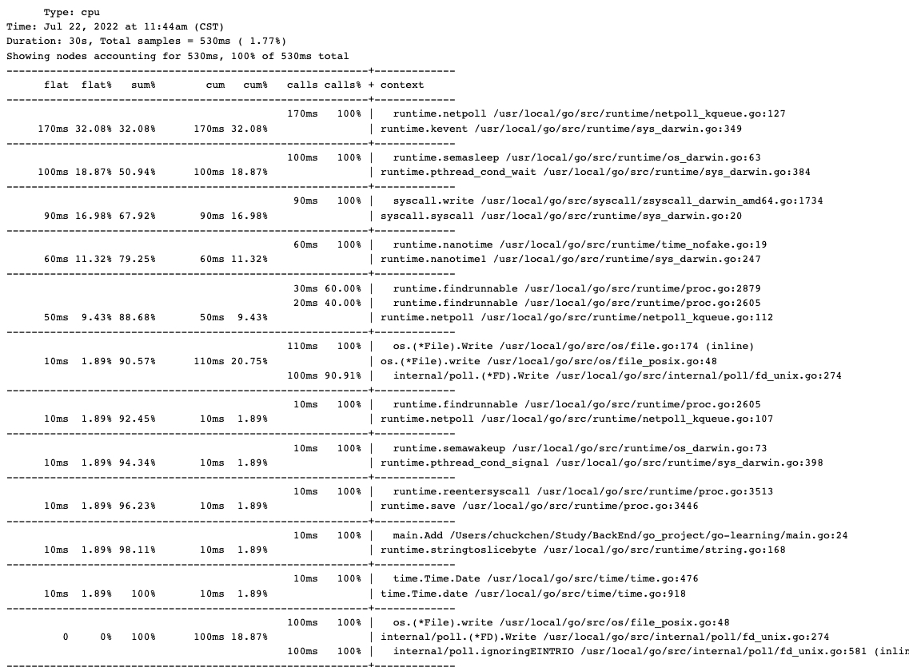
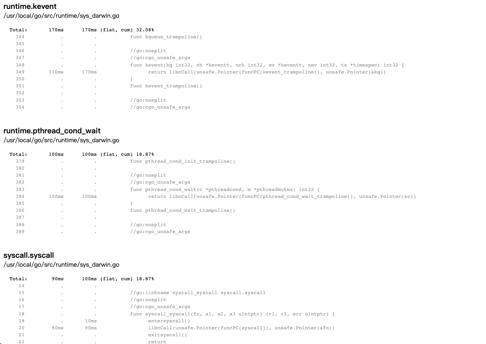
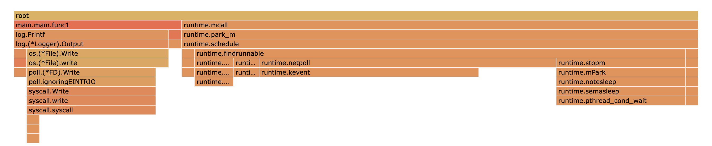

# 系统排查

### 1. 先确定出现问题的进程

先排查是否因为程序服务导致的CPU/内存保障，可以使用top命令来排查。

```
top
```

确定是服务出问题后，可以使用如下命令持续监测服务进程，$pid即为服务进程的pid。

```
top -Hp $pid
```

可以使用top默认根据CPU使用率来排序，可以使用shitft + m 改成使用内存占用率来排序。

### 2. 使用PProf排查程序内部的问题

确定了服务进程的问题后，就可以通过PProf来排查CPU、内存、互斥锁、Goroutines的问题了。下面展示一个demo来简单使用PProf。

```go
import (
	"log"
	"net/http"
	"time"
	_ "net/http/pprof" 
)


func main() {
	go func() {
		for {
			log.Println("do something...")
			time.Sleep(time.Second )
		}
	}()

	_ = http.ListenAndServe("0.0.0.0:6060", nil) //pprof包的init函数里注册了handler 
}
```

#### 使用web界面查看pprof信息

经过上述步骤后，在浏览器打开http://127.0.0.1:6060/debug/pprof/，就能看到pprof界面了。



点击具体的allocs、block、codlin等可以获取对应的具体信息的profile，在url后加上?debug=1参数可以在线查看具体的信息，具体的数据这里就不再阐述，大家可以自己去看详细信息。

#### 使用终端界面查看pprof信息

还有一种方式，直接通过命令行对程序pprof数据的抓取与分析。利用go tool pprof 可以获取一段时间的pprof，然后再利用终端进行交互。采样cpu&内存数据信息。

```shell
go tool pprof http://localhost:6060/debug/pprof/profile\?seconds\=60
```

60s后会进入交互模式，输入命令 top10 查看最消耗资源的10个函数。



采样常驻内存数据信息。

```shell
go tool pprof -inuse_space http://localhost:6060/debug/pprof/heap
```

采样临时内存数据信息。

```shell
go tool pprof -alloc_objects http://localhost:6060/debug/pprof/heap
```

采样Goroutine数据信息。

```shell
go tool pprof http://localhost:6060/debug/pprof/goroutine   
```

在查看Goroutine信息时可以使用traces命令，打印出所有的调用堆栈，可以很方便地查看调用链路。



也可以使用list命令来具体查看指定的代码情况。(list是模糊匹配)



#### 使用可视化界面查看pprof信息

前面使用web界面查看pprof信息虽然可以在web界面查看pprof的信息，但里面全都是文字信息，我们还可以用另一种方法来查看程序运行信息。

1.首先先获取一个profile，这里以cpu profile为例。

```shell
wget http://127.0.0.1:6060/debug/pprof/profile   
```

2.使用如下命令在指定的端口号运行一个pprof分析站点

```shell
go tool pprof -http=:6001 profile 
```

3.打开http://localhost:6001/ui/

view这个下拉选项里可以查看这个profile支持的展示方式。

*Top展示cpu占用率排在前面的函数*



*Graph展示整体流程图，框越大，线越粗，代表cpu占用率越大*



*Peek展示了文件位置信息，调用上下文信息。*



*Source增加了具体函数的源码分析与追踪。*



*Flame Graph 是火焰图，颜色越深代表cpu占用率越大，此外点击函数方块还可以进行更加深入的分析。*



其他类型的profile分析与上述过程同理，大家可以自己试试。
