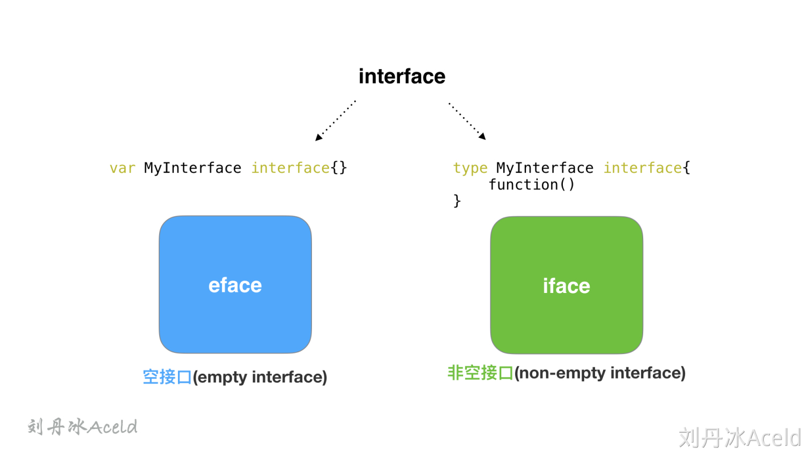

# Golang之interface

## 接口

接口（interface）是一组仅包含方法名、参数、返回值的**未具体实现的方法的集合**。接口只定义规范而不去实现，细节由具体的对象来实现。Golang中**接口是一种抽象的类型**。

## 实现

Golang中interface通常分为两大类，一种是空接口，这种接口不带任何方法。

```go
type a interface{}
```

另一种是非空接口，这种接口带有方法

```go
type duck interface {
	quack()
}
```

这两种类型的接口底层分别对应两个不同的结构，空接口对应runtime.eface，非空接口对应runtime.iface



eface的定义如下

```go
type eface struct {
	_type *_type  //记录类型信息（_type是GO语言中所有类型的公共描述，Go语言几乎所有的数据结构都可以抽象成 _type，是所有类型的公共描述，type负责决定data应该如何解释和操作）
	data  unsafe.Pointer //指向数据的指针
}
```

iface的定义如下

```go
type iface struct {
	tab  *itab //
	data unsafe.Pointer //指向数据的指针
}
```

itab是最重要的结构，每一个 `itab` 都占 32 字节的空间。itab里面包含了interface的一些关键信息，比如method的具体实现。

```go
type itab struct {
  inter  *interfacetype   // 接口自身的元信息
  _type  *_type           // 类型信息 与 eface中的type相同
  link   *itab
  bad    int32
  hash   int32            // _type.hash的拷贝，用于快速判断目标类型与接口中的类型是否一致。
  fun    [1]uintptr       // 函数指针，指向具体类型所实现的方法 一个动态大小的数组，虽然声明时是固定大小为1，但在使用时会直接通过fun指针获取其中的数据，并且不会检查数组的边界，所以该数组中保存的元素数量是不确定的
}
```

