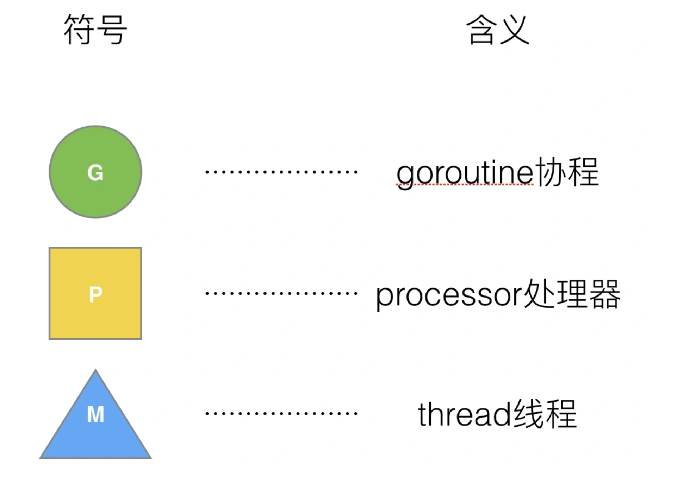
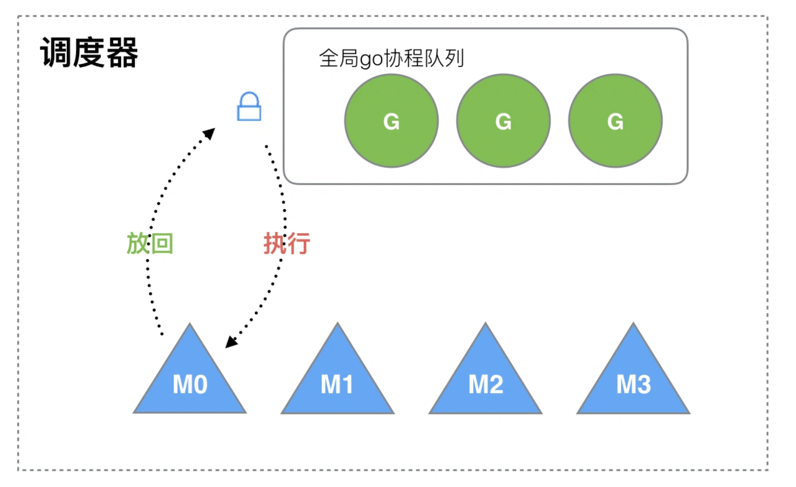
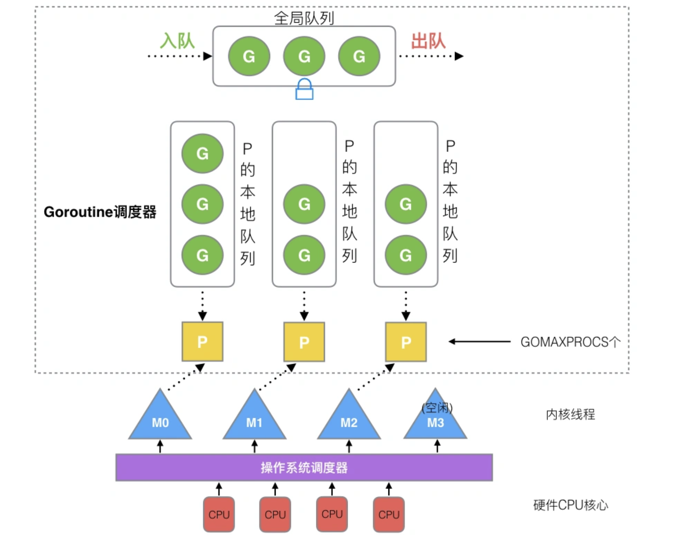
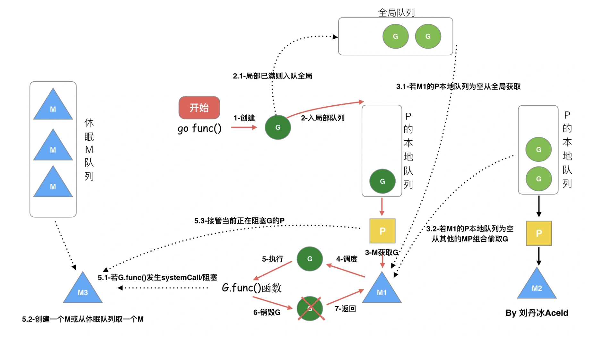

# 九股文笔记-GPM<3> 调度设计

#### GPM

**G:** Goroutine，Goroutine这个概念来自协程，一个Goroutine必须必须绑定到P上才能被CPU执行。Goroutine非常轻量，创建一个Goroutine只需要几kb的内存资源\(实际上这个内存资源是动态的，如果有需要runtime会为goroutine自动分配资源\)。

**P:** Processer, 即为G和M的调度对象，用来调度G和M之间的关联关系，其数量可通过GOMAXPROCS\(\)来设置，默认为CPU核心数。

**M:** Machine, OS 内核线程抽象，代表着真正执行计算的资源，在绑定有效的 P 后，执行P调度出来的G。M的数量由runtime决定\(默认最大1000\)。M 并不保留 G 状态，这是 G 可以跨 M 调度的基础。

Go调度器的是由这GPM构成的。

#### 调度器初期设计

调度器初期的设计是并没有P，仅有G与M，造成了如下弊端。

1.如每次M调度G都需要获G全局队列的锁，造成了激烈的锁竞争。

2.无法实现G的局部性（即从当M1执行G1时，G1创建出来的G1'无法保证任然被M1执行）

3.频繁地M切换导致系统开销加大

#### 调度器进阶设计

基于旧的调度器的弊端，Go设计了一个全新的调度器。再新的调度器中，加入了P。M是G运行的实体，P负责把G分配到M上进行执行，M才是真真正正的“干活者”。

1.全局队列：存放等待执行的G。

2.本地队列：存放等待运行的G，队列最多只能放256个G。当某个G创建一个新的G'时，会优先放入当前P的本地队列中 。如果本地队列已满，则将本地队列的一半G放到全局队列中。

#### M0与G0

M0：进程启动后编号为0的主线程，他负责初始化和执行第一个G，启动完成后便与其他G一样了。

G0：每启动一个M，都会创建一个G0，G0不承载任何可执行函数。在P准备切换G之前，会先切换到G0，它是两个G之前转换的桥梁。

#### go func\(\)调度流程

#### 调度器的核心策略

调度器的核心策略是**复用线程**，**避免频繁的创建、销毁线程，而是对线程的复用**。接下来通过各种场景来体现调度器是如何**复用线程**的。

%23%23%23%23%20GPM%0A\*\*G%3A\*\*%20%3Cu%3EGoroutine%3C%2Fu%3E%EF%BC%8CGoroutine%E8%BF%99%E4%B8%AA%E6%A6%82%E5%BF%B5%E6%9D%A5%E8%87%AA%E5%8D%8F%E7%A8%8B%EF%BC%8C%E4%B8%80%E4%B8%AAGoroutine%E5%BF%85%E9%A1%BB%E5%BF%85%E9%A1%BB%E7%BB%91%E5%AE%9A%E5%88%B0P%E4%B8%8A%E6%89%8D%E8%83%BD%E8%A2%ABCPU%E6%89%A7%E8%A1%8C%E3%80%82Goroutine%E9%9D%9E%E5%B8%B8%E8%BD%BB%E9%87%8F%EF%BC%8C%E5%88%9B%E5%BB%BA%E4%B8%80%E4%B8%AAGoroutine%E5%8F%AA%E9%9C%80%E8%A6%81%E5%87%A0kb%E7%9A%84%E5%86%85%E5%AD%98%E8%B5%84%E6%BA%90\(%E5%AE%9E%E9%99%85%E4%B8%8A%E8%BF%99%E4%B8%AA%E5%86%85%E5%AD%98%E8%B5%84%E6%BA%90%E6%98%AF%E5%8A%A8%E6%80%81%E7%9A%84%EF%BC%8C%E5%A6%82%E6%9E%9C%E6%9C%89%E9%9C%80%E8%A6%81runtime%E4%BC%9A%E4%B8%BAgoroutine%E8%87%AA%E5%8A%A8%E5%88%86%E9%85%8D%E8%B5%84%E6%BA%90\)%E3%80%82%0A\*\*P%3A\*\*%20%3Cu%3EProcesser%3C%2Fu%3E%2C%20%E5%8D%B3%E4%B8%BAG%E5%92%8CM%E7%9A%84%E8%B0%83%E5%BA%A6%E5%AF%B9%E8%B1%A1%EF%BC%8C%E7%94%A8%E6%9D%A5%E8%B0%83%E5%BA%A6G%E5%92%8CM%E4%B9%8B%E9%97%B4%E7%9A%84%E5%85%B3%E8%81%94%E5%85%B3%E7%B3%BB%EF%BC%8C%E5%85%B6%E6%95%B0%E9%87%8F%E5%8F%AF%E9%80%9A%E8%BF%87GOMAXPROCS\(\)%E6%9D%A5%E8%AE%BE%E7%BD%AE%EF%BC%8C%E9%BB%98%E8%AE%A4%E4%B8%BACPU%E6%A0%B8%E5%BF%83%E6%95%B0%E3%80%82%0A\*\*M%3A\*\*%20%3Cu%3EMachine%3C%2Fu%3E%2C%20OS%20%E5%86%85%E6%A0%B8%E7%BA%BF%E7%A8%8B%E6%8A%BD%E8%B1%A1%EF%BC%8C%E4%BB%A3%E8%A1%A8%E7%9D%80%E7%9C%9F%E6%AD%A3%E6%89%A7%E8%A1%8C%E8%AE%A1%E7%AE%97%E7%9A%84%E8%B5%84%E6%BA%90%EF%BC%8C%E5%9C%A8%E7%BB%91%E5%AE%9A%E6%9C%89%E6%95%88%E7%9A%84%20P%20%E5%90%8E%EF%BC%8C%E6%89%A7%E8%A1%8CP%E8%B0%83%E5%BA%A6%E5%87%BA%E6%9D%A5%E7%9A%84G%E3%80%82M%E7%9A%84%E6%95%B0%E9%87%8F%E7%94%B1runtime%E5%86%B3%E5%AE%9A\(%E9%BB%98%E8%AE%A4%E6%9C%80%E5%A4%A71000\)%E3%80%82M%20%E5%B9%B6%E4%B8%8D%E4%BF%9D%E7%95%99%20G%20%E7%8A%B6%E6%80%81%EF%BC%8C%E8%BF%99%E6%98%AF%20G%20%E5%8F%AF%E4%BB%A5%E8%B7%A8%20M%20%E8%B0%83%E5%BA%A6%E7%9A%84%E5%9F%BA%E7%A1%80%E3%80%82%0AGo%E8%B0%83%E5%BA%A6%E5%99%A8%E7%9A%84%E6%98%AF%E7%94%B1%E8%BF%99GPM%E6%9E%84%E6%88%90%E7%9A%84%E3%80%82%0A\!%5B5222b5764897654fbf27748150333658.png%5D\(evernotecid%3A%2F%2F9423462E\-1591\-4A2D\-AF79\-F4FBBF0F308D%2Fappyinxiangcom%2F29941161%2FENResource%2Fp42\)%0A%0A%0A%0A%23%23%23%23%20%E8%B0%83%E5%BA%A6%E5%99%A8%E5%88%9D%E6%9C%9F%E8%AE%BE%E8%AE%A1%0A%E8%B0%83%E5%BA%A6%E5%99%A8%E5%88%9D%E6%9C%9F%E7%9A%84%E8%AE%BE%E8%AE%A1%E6%98%AF%E5%B9%B6%E6%B2%A1%E6%9C%89P%EF%BC%8C%E4%BB%85%E6%9C%89G%E4%B8%8EM%EF%BC%8C%E9%80%A0%E6%88%90%E4%BA%86%E5%A6%82%E4%B8%8B%E5%BC%8A%E7%AB%AF%E3%80%82%0A1.%E5%A6%82%E6%AF%8F%E6%AC%A1M%E8%B0%83%E5%BA%A6G%E9%83%BD%E9%9C%80%E8%A6%81%E8%8E%B7G%E5%85%A8%E5%B1%80%E9%98%9F%E5%88%97%E7%9A%84%E9%94%81%EF%BC%8C%E9%80%A0%E6%88%90%E4%BA%86%E6%BF%80%E7%83%88%E7%9A%84%E9%94%81%E7%AB%9E%E4%BA%89%E3%80%82%0A2.%E6%97%A0%E6%B3%95%E5%AE%9E%E7%8E%B0G%E7%9A%84%E5%B1%80%E9%83%A8%E6%80%A7%EF%BC%88%E5%8D%B3%E4%BB%8E%E5%BD%93M1%E6%89%A7%E8%A1%8CG1%E6%97%B6%EF%BC%8CG1%E5%88%9B%E5%BB%BA%E5%87%BA%E6%9D%A5%E7%9A%84G1'%E6%97%A0%E6%B3%95%E4%BF%9D%E8%AF%81%E4%BB%BB%E7%84%B6%E8%A2%ABM1%E6%89%A7%E8%A1%8C%EF%BC%89%0A3.%E9%A2%91%E7%B9%81%E5%9C%B0M%E5%88%87%E6%8D%A2%E5%AF%BC%E8%87%B4%E7%B3%BB%E7%BB%9F%E5%BC%80%E9%94%80%E5%8A%A0%E5%A4%A7%0A\!%5Becf0f428060329355a09d01e8f9423a9.png%5D\(evernotecid%3A%2F%2F9423462E\-1591\-4A2D\-AF79\-F4FBBF0F308D%2Fappyinxiangcom%2F29941161%2FENResource%2Fp43\)%0A%0A%0A%23%23%23%23%20%E8%B0%83%E5%BA%A6%E5%99%A8%E8%BF%9B%E9%98%B6%E8%AE%BE%E8%AE%A1%0A%E5%9F%BA%E4%BA%8E%E6%97%A7%E7%9A%84%E8%B0%83%E5%BA%A6%E5%99%A8%E7%9A%84%E5%BC%8A%E7%AB%AF%EF%BC%8CGo%E8%AE%BE%E8%AE%A1%E4%BA%86%E4%B8%80%E4%B8%AA%E5%85%A8%E6%96%B0%E7%9A%84%E8%B0%83%E5%BA%A6%E5%99%A8%E3%80%82%E5%86%8D%E6%96%B0%E7%9A%84%E8%B0%83%E5%BA%A6%E5%99%A8%E4%B8%AD%EF%BC%8C%E5%8A%A0%E5%85%A5%E4%BA%86P%E3%80%82M%E6%98%AFG%E8%BF%90%E8%A1%8C%E7%9A%84%E5%AE%9E%E4%BD%93%EF%BC%8CP%E8%B4%9F%E8%B4%A3%E6%8A%8AG%E5%88%86%E9%85%8D%E5%88%B0M%E4%B8%8A%E8%BF%9B%E8%A1%8C%E6%89%A7%E8%A1%8C%EF%BC%8CM%E6%89%8D%E6%98%AF%E7%9C%9F%E7%9C%9F%E6%AD%A3%E6%AD%A3%E7%9A%84%E2%80%9C%E5%B9%B2%E6%B4%BB%E8%80%85%E2%80%9D%E3%80%82%0A\!%5Bf83f3f0468eed94486dd4891fe616aa4.png%5D\(evernotecid%3A%2F%2F9423462E\-1591\-4A2D\-AF79\-F4FBBF0F308D%2Fappyinxiangcom%2F29941161%2FENResource%2Fp44\)%0A%0A%0A1.%E5%85%A8%E5%B1%80%E9%98%9F%E5%88%97%EF%BC%9A%E5%AD%98%E6%94%BE%E7%AD%89%E5%BE%85%E6%89%A7%E8%A1%8C%E7%9A%84G%E3%80%82%0A2.%E6%9C%AC%E5%9C%B0%E9%98%9F%E5%88%97%EF%BC%9A%E5%AD%98%E6%94%BE%E7%AD%89%E5%BE%85%E8%BF%90%E8%A1%8C%E7%9A%84G%EF%BC%8C%E9%98%9F%E5%88%97%E6%9C%80%E5%A4%9A%E5%8F%AA%E8%83%BD%E6%94%BE256%E4%B8%AAG%E3%80%82%E5%BD%93%E6%9F%90%E4%B8%AAG%E5%88%9B%E5%BB%BA%E4%B8%80%E4%B8%AA%E6%96%B0%E7%9A%84G'%E6%97%B6%EF%BC%8C%E4%BC%9A%E4%BC%98%E5%85%88%E6%94%BE%E5%85%A5%E5%BD%93%E5%89%8DP%E7%9A%84%E6%9C%AC%E5%9C%B0%E9%98%9F%E5%88%97%E4%B8%AD%20%E3%80%82%E5%A6%82%E6%9E%9C%E6%9C%AC%E5%9C%B0%E9%98%9F%E5%88%97%E5%B7%B2%E6%BB%A1%EF%BC%8C%E5%88%99%E5%B0%86%E6%9C%AC%E5%9C%B0%E9%98%9F%E5%88%97%E7%9A%84%E4%B8%80%E5%8D%8AG%E6%94%BE%E5%88%B0%E5%85%A8%E5%B1%80%E9%98%9F%E5%88%97%E4%B8%AD%E3%80%82%0A%0A%0A%23%23%23%23%20M0%E4%B8%8EG0%0AM0%EF%BC%9A%E8%BF%9B%E7%A8%8B%E5%90%AF%E5%8A%A8%E5%90%8E%E7%BC%96%E5%8F%B7%E4%B8%BA0%E7%9A%84%E4%B8%BB%E7%BA%BF%E7%A8%8B%EF%BC%8C%E4%BB%96%E8%B4%9F%E8%B4%A3%E5%88%9D%E5%A7%8B%E5%8C%96%E5%92%8C%E6%89%A7%E8%A1%8C%E7%AC%AC%E4%B8%80%E4%B8%AAG%EF%BC%8C%E5%90%AF%E5%8A%A8%E5%AE%8C%E6%88%90%E5%90%8E%E4%BE%BF%E4%B8%8E%E5%85%B6%E4%BB%96G%E4%B8%80%E6%A0%B7%E4%BA%86%E3%80%82%0AG0%EF%BC%9A%E6%AF%8F%E5%90%AF%E5%8A%A8%E4%B8%80%E4%B8%AAM%EF%BC%8C%E9%83%BD%E4%BC%9A%E5%88%9B%E5%BB%BA%E4%B8%80%E4%B8%AAG0%EF%BC%8CG0%E4%B8%8D%E6%89%BF%E8%BD%BD%E4%BB%BB%E4%BD%95%E5%8F%AF%E6%89%A7%E8%A1%8C%E5%87%BD%E6%95%B0%E3%80%82%E5%9C%A8P%E5%87%86%E5%A4%87%E5%88%87%E6%8D%A2G%E4%B9%8B%E5%89%8D%EF%BC%8C%E4%BC%9A%E5%85%88%E5%88%87%E6%8D%A2%E5%88%B0G0%EF%BC%8C%E5%AE%83%E6%98%AF%E4%B8%A4%E4%B8%AAG%E4%B9%8B%E5%89%8D%E8%BD%AC%E6%8D%A2%E7%9A%84%E6%A1%A5%E6%A2%81%E3%80%82%0A%0A%0A%23%23%23%23%20go%20func\(\)%E8%B0%83%E5%BA%A6%E6%B5%81%E7%A8%8B%0A\!%5Bb3283ed2466ef42d5467295bb3e1c44a.png%5D\(evernotecid%3A%2F%2F9423462E\-1591\-4A2D\-AF79\-F4FBBF0F308D%2Fappyinxiangcom%2F29941161%2FENResource%2Fp45\)%0A%0A%0A%23%23%23%23%20%E8%B0%83%E5%BA%A6%E5%99%A8%E7%9A%84%E6%A0%B8%E5%BF%83%E7%AD%96%E7%95%A5%0A%0A%E8%B0%83%E5%BA%A6%E5%99%A8%E7%9A%84%E6%A0%B8%E5%BF%83%E7%AD%96%E7%95%A5%E6%98%AF\*\*%E5%A4%8D%E7%94%A8%E7%BA%BF%E7%A8%8B\*\*%EF%BC%8C\*\*%E9%81%BF%E5%85%8D%E9%A2%91%E7%B9%81%E7%9A%84%E5%88%9B%E5%BB%BA%E3%80%81%E9%94%80%E6%AF%81%E7%BA%BF%E7%A8%8B%EF%BC%8C%E8%80%8C%E6%98%AF%E5%AF%B9%E7%BA%BF%E7%A8%8B%E7%9A%84%E5%A4%8D%E7%94%A8\*\*%E3%80%82%E6%8E%A5%E4%B8%8B%E6%9D%A5%E9%80%9A%E8%BF%87%E5%90%84%E7%A7%8D%E5%9C%BA%E6%99%AF%E6%9D%A5%E4%BD%93%E7%8E%B0%E8%B0%83%E5%BA%A6%E5%99%A8%E6%98%AF%E5%A6%82%E4%BD%95\*\*%E5%A4%8D%E7%94%A8%E7%BA%BF%E7%A8%8B\*\*%E7%9A%84%E3%80%82%0A%0A%0A
