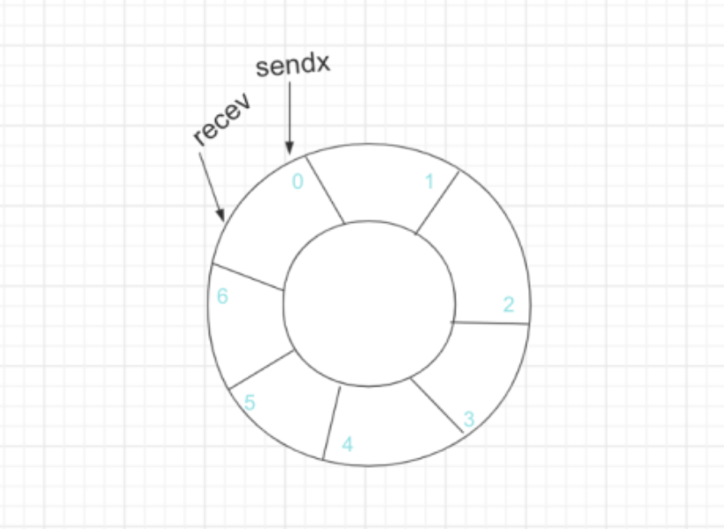
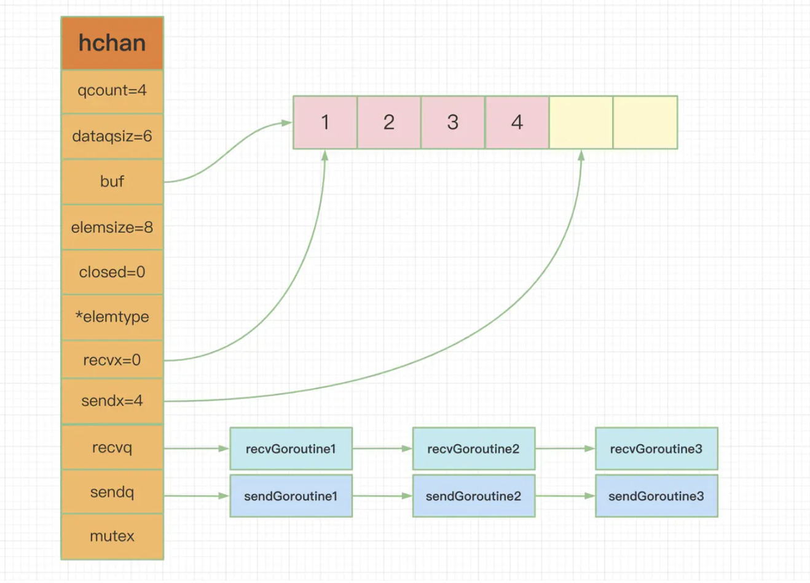

# 九股文笔记-Golang之channel

#### channel

channel是支撑Go语言高性能并发编程模型的重要结构，channel是一个用于同步和通信的有锁队列，使用互斥锁解决程序中可能存在的线程竞争问题。以下内容基于：

```
go version go1.16.2 darwin/amd64
```

#### channel的数据结构

channel其是用runtime.hchan来表示的。

```
type hchan struct {
	qcount   uint           // 缓冲区里有几个元素
	dataqsiz uint           // 缓冲区最多有几个元素 即缓冲区大小
	buf      unsafe.Pointer // 指向底层循环数组的指针
	elemsize uint16         // 元素大小
	closed   uint32        // 是否关闭
	elemtype *_type        // 元素的类型
	sendx    uint         // 已发送元素在环形数组中的索引
	recvx    uint         // 已接受元素在环形数组中的索引
	recvq    waitq        // 等待接受的goroutine队列
	sendq    waitq        // 待发送的goroutine队列
    
	lock mutex            //锁 保护数据
}
```

recvq与sendq是waitq类型的数据，分别代表接受的g队列与发送的g队列，waitq是一个双端链表。

```
type waitq struct {
	first *sudog
	last  *sudog
}
```

buf是一个指向一个环形数组的指针，sendx与recvx分别代表在这个环形数组中的发送位置与接收数据，之所以用环形数组是因为这样可以重复利用空间。



整体示意图



---

#### 创建一个channel

创建channel最终使用的是runtime.makechan\(\)这个函数。

```
func makechan(t *chantype, size int) *hchan {
    ...
    
	var c *hchan
	switch {
	case mem == 0: // =>创建无缓冲通道的channel
		c = (*hchan)(mallocgc(hchanSize, nil, true))
		c.buf = c.raceaddr()
	case elem.ptrdata == 0: // =>创建有缓冲通道但元素里不含指针的channel
		c = (*hchan)(mallocgc(hchanSize+mem, nil, true))
        //给buf分配一块连续的内存空间
		c.buf = add(unsafe.Pointer(c), hchanSize)
	default: // =>创建有缓冲通道并且元素含有指针的channel
		c = new(hchan)
        //给buf单独分配内存空间
		c.buf = mallocgc(mem, elem, true)
	}
    ...
}
```

---

#### 向channel发送数据

向channel发送数据最终调用的是runtime.chansend，其函数签名为：

```
func chansend(c *hchan, ep unsafe.Pointer, block bool, callerpc uintptr) bool {
    ...
}
```

其中，bolock参数表示遇到channel操作不能成功时是否需要阻塞。往channel发送数据操作不成功的情景：

1. 往无buffer的channel发送数据而接收者还没ready
2. 往buffer已满的channel里发送数据
3. 往nil的channel里发送数据

block为false即不阻塞的情况，如select里的channel操作：

```
func main() {
    ch := make(chan int)
    select {
        case: ch <- 0:
        default:
    }
    ...
}
```

block为true即阻塞的情况，如往无buffer的channel发送数据：

```
func main() {
    ch := make(chan int)
    ch <- 0
    ...
}

```

具体看看往一个channel里发送数据的流程。

```
func chansend(c *hchan, ep unsafe.Pointer, block bool, callerpc uintptr) bool {

        省略若干代码...
        
        //非阻塞 且 channel未关闭 且 channel已满
	if !block && c.closed == 0 && full(c) {
		return false
	}

        //操作前先上锁
	lock(&c.lock)
        
        //往已关闭的channel里发送数据会panic
	if c.closed != 0 {
		unlock(&c.lock)
		panic(plainError("send on closed channel"))
	}

         //如果能从接收者的G队列的队头取出一个G，说明已经有接收者ready，也说明了：
            //1.带缓冲的channle的buffer为空，因为如果buffer不为空的话接收者可以直接从buffer里取到数据，不会再将接收者放在接收者队列里
            //2.channel不带缓冲
	if sg := c.recvq.dequeue(); sg != nil {
                //针对上面1.2两种情况 都可以将数据传递给这个接收者 并且唤醒等待者G 
		send(c, sg, ep, func() { unlock(&c.lock) }, 3)
		return true
	}
    
        //缓冲channel的buffer未满
	if c.qcount < c.dataqsiz {
                //将数据放到缓冲buffer中即可返回
		qp := chanbuf(c, c.sendx)
		if raceenabled {
			racenotify(c, c.sendx, nil)
		}
		typedmemmove(c.elemtype, qp, ep)
		c.sendx++ //发送索引位置更新
		if c.sendx == c.dataqsiz {
			c.sendx = 0 //因为是环形的所以重新回到head
		}
		c.qcount++
		unlock(&c.lock)
		return true
	}

	if !block {
		unlock(&c.lock)
		return false
	}

        //走到这里说明往通道里发送的数据没有把法被对端接收，即
        //1.往无缓冲的channel发送数据而接收者还没ready
        //2.往有缓冲的channel发送数据但buffer已满
        
        //获取当前G
	gp := getg()
	mysg := acquireSudog()
	mysg.releasetime = 0
	if t0 != 0 {
		mysg.releasetime = -1
	}

	mysg.elem = ep
	mysg.waitlink = nil
	mysg.g = gp
	mysg.isSelect = false
	mysg.c = c
	gp.waiting = mysg
	gp.param = nil
	c.sendq.enqueue(mysg) //将当前的G入队到发送等待队列sendq
	atomic.Store8(&gp.parkingOnChan, 1)
        
        //gopar将当前的G挂起 达到阻塞当前G的效果
	gopark(chanparkcommit, unsafe.Pointer(&c.lock), waitReasonChanSend, traceEvGoBlockSend, 2)

	KeepAlive(ep)

	// 数据被接收者接收 当前G被唤醒 后面做一系列收尾工作
	if mysg != gp.waiting {
		throw("G waiting list is corrupted")
	}
	gp.waiting = nil
	gp.activeStackChans = false
	closed := !mysg.success
	gp.param = nil
	if mysg.releasetime > 0 {
		blockevent(mysg.releasetime-t0, 2)
	}
	mysg.c = nil
	releaseSudog(mysg)
	if closed {
		if c.closed == 0 {
			throw("chansend: spurious wakeup")
		}
		panic(plainError("send on closed channel"))
	}
	return true
}
```

---

#### 从channel接收数据

从channel接收数据最终调用的是runtime.chanrecv，其函数签名如下：

```
func chanrecv(c *hchan, ep unsafe.Pointer, block bool) (selected, received bool){
    ...
}
```

同样低，block参数表示在channel操作无法完成时是否需要阻塞。从channel接收数据操作不成功的情景：

1. 从无缓冲的channel里接收数据而发送者还没ready
2. 从有缓冲但buffer为空的channel里接受数据
3. 从nil的channel里读取数据

block为false即不阻塞的情况，如select里的channel操作：

```
func main() {
    ch := make(chan int)
    select {
        case: <-ch:
        default:
    }
    ...
}
```

block为true即阻塞的情况，如从无buffer的channel接收数据：

```
func main() {
    ch := make(chan int)
    data := <-ch 
    ...
}

```

具体看看从一个channel里接收数据的流程

```
func chanrecv(c *hchan, ep unsafe.Pointer, block bool) (selected, received bool) {

	// 省略若干代码... 

        // 从一个nil channel 里接收数据
	if c == nil {
		if !block {
			return //非阻塞  直接返回
		}
                //阻塞 当前G会永久阻塞
		gopark(nil, nil, waitReasonChanReceiveNilChan, traceEvGoStop, 2)
		throw("unreachable")
	}
        
        // 省略若干代码... 

	lock(&c.lock)

    // 如果通道被关闭 且 buffer里没有元素 这里可以返回了
	if c.closed != 0 && c.qcount == 0 {
		if raceenabled {
			raceacquire(c.raceaddr())
		}
		unlock(&c.lock)
		if ep != nil { 
			typedmemclr(c.elemtype, ep)
		}
		return true, false
	}

    //如果能从发送者G队列取出一个G，说明当前有发送者ready，也说明了：
    //1.带缓冲的channle的buffer已满，因为如果buffer未满的话接收者可以直接往buffer里发送数据，不会再将发送者放到发送者队列里，也就不会有ready的发送者。
    //2.channel不带缓冲
	if sg := c.sendq.dequeue(); sg != nil {
                 //1.如果是带缓冲的channel 且buffer已满，除了需要从buffer里去读数据拷贝给接收变量ep外，还需要将发送者G的数据放入buffer，调整发送位置索引， 并且唤醒这个发送者G，以保证FIFO  
                //2.如果是没有缓冲的channel的情况就直接将数据拷贝给接收变量ep
		recv(c, sg, ep, func() { unlock(&c.lock) }, 3)
		return true, true
	}

        //如果是带缓冲的channel 且buffer里任然有数据了 那么直接从buffer里拿数据即可
	if c.qcount > 0 {
                //qp 即从hcha.buf里获取channel buffer里面的数据
		qp := chanbuf(c, c.recvx)
		if raceenabled {
			racenotify(c, c.recvx, nil)
		}
                //将qp赋值接收者变量ep
		if ep != nil {
			typedmemmove(c.elemtype, ep, qp)
		}
		typedmemclr(c.elemtype, qp)
		c.recvx++ //接收索引位置更新
		if c.recvx == c.dataqsiz {
			c.recvx = 0 //接收队列是环形数组 需重新置位为0
		}
		c.qcount--
		unlock(&c.lock)
		return true, true
	}
    
    //到这说明接收者当前没办法接收数据了 即
    //1.不带缓冲channel & 没有发送者发送数据
    //2.不带缓冲channel & buffer里没有数据
    
    //不阻塞的话就返回了
	if !block {
		unlock(&c.lock)
		return false, false
	}
    
    
	// 获取当前G 封装成sodog
	gp := getg()
	mysg := acquireSudog()
	mysg.releasetime = 0
	if t0 != 0 {
		mysg.releasetime = -1
	}
	// No stack splits between assigning elem and enqueuing mysg
	// on gp.waiting where copystack can find it.
	mysg.elem = ep
	mysg.waitlink = nil
	gp.waiting = mysg
	mysg.g = gp
	mysg.isSelect = false
	mysg.c = c
	gp.param = nil
	c.recvq.enqueue(mysg) //将当前G入队

	atomic.Store8(&gp.parkingOnChan, 1)
    
    // 使用gopark阻塞当前G
	gopark(chanparkcommit, unsafe.Pointer(&c.lock), waitReasonChanReceive, traceEvGoBlockRecv, 2)

	//当前G被唤醒
	if mysg != gp.waiting {
		throw("G waiting list is corrupted")
	}
	gp.waiting = nil
	gp.activeStackChans = false
	if mysg.releasetime > 0 {
		blockevent(mysg.releasetime-t0, 2)
	}
	success := mysg.success
	gp.param = nil
	mysg.c = nil
	releaseSudog(mysg)
	return true, success
}

```

%23%23%23%23%20channel%0A%20channel%E6%98%AF%E6%94%AF%E6%92%91Go%E8%AF%AD%E8%A8%80%E9%AB%98%E6%80%A7%E8%83%BD%E5%B9%B6%E5%8F%91%E7%BC%96%E7%A8%8B%E6%A8%A1%E5%9E%8B%E7%9A%84%E9%87%8D%E8%A6%81%E7%BB%93%E6%9E%84%EF%BC%8Cchannel%E6%98%AF%E4%B8%80%E4%B8%AA%E7%94%A8%E4%BA%8E%E5%90%8C%E6%AD%A5%E5%92%8C%E9%80%9A%E4%BF%A1%E7%9A%84%E6%9C%89%E9%94%81%E9%98%9F%E5%88%97%EF%BC%8C%E4%BD%BF%E7%94%A8%E4%BA%92%E6%96%A5%E9%94%81%E8%A7%A3%E5%86%B3%E7%A8%8B%E5%BA%8F%E4%B8%AD%E5%8F%AF%E8%83%BD%E5%AD%98%E5%9C%A8%E7%9A%84%E7%BA%BF%E7%A8%8B%E7%AB%9E%E4%BA%89%E9%97%AE%E9%A2%98%E3%80%82%E4%BB%A5%E4%B8%8B%E5%86%85%E5%AE%B9%E5%9F%BA%E4%BA%8E%EF%BC%9A%0A%0A%60%60%60%0Ago%20version%20go1.16.2%20darwin%2Famd64%0A%60%60%60%0A%0A%23%23%23%23%20channel%E7%9A%84%E6%95%B0%E6%8D%AE%E7%BB%93%E6%9E%84%0Achannel%E5%85%B6%E6%98%AF%E7%94%A8runtime.hchan%E6%9D%A5%E8%A1%A8%E7%A4%BA%E7%9A%84%E3%80%82%0A%60%60%60%0Atype%20hchan%20struct%20%7B%0A%09qcount%20%20%20uint%20%20%20%20%20%20%20%20%20%20%20%2F%2F%20%E7%BC%93%E5%86%B2%E5%8C%BA%E9%87%8C%E6%9C%89%E5%87%A0%E4%B8%AA%E5%85%83%E7%B4%A0%0A%09dataqsiz%20uint%20%20%20%20%20%20%20%20%20%20%20%2F%2F%20%E7%BC%93%E5%86%B2%E5%8C%BA%E6%9C%80%E5%A4%9A%E6%9C%89%E5%87%A0%E4%B8%AA%E5%85%83%E7%B4%A0%20%E5%8D%B3%E7%BC%93%E5%86%B2%E5%8C%BA%E5%A4%A7%E5%B0%8F%0A%09buf%20%20%20%20%20%20unsafe.Pointer%20%2F%2F%20%E6%8C%87%E5%90%91%E5%BA%95%E5%B1%82%E5%BE%AA%E7%8E%AF%E6%95%B0%E7%BB%84%E7%9A%84%E6%8C%87%E9%92%88%0A%09elemsize%20uint16%20%20%20%20%20%20%20%20%20%2F%2F%20%E5%85%83%E7%B4%A0%E5%A4%A7%E5%B0%8F%0A%09closed%20%20%20uint32%20%20%20%20%20%20%20%20%2F%2F%20%E6%98%AF%E5%90%A6%E5%85%B3%E9%97%AD%0A%09elemtype%20\*\_type%20%20%20%20%20%20%20%20%2F%2F%20%E5%85%83%E7%B4%A0%E7%9A%84%E7%B1%BB%E5%9E%8B%0A%09sendx%20%20%20%20uint%20%20%20%20%20%20%20%20%20%2F%2F%20%E5%B7%B2%E5%8F%91%E9%80%81%E5%85%83%E7%B4%A0%E5%9C%A8%E7%8E%AF%E5%BD%A2%E6%95%B0%E7%BB%84%E4%B8%AD%E7%9A%84%E7%B4%A2%E5%BC%95%0A%09recvx%20%20%20%20uint%20%20%20%20%20%20%20%20%20%2F%2F%20%E5%B7%B2%E6%8E%A5%E5%8F%97%E5%85%83%E7%B4%A0%E5%9C%A8%E7%8E%AF%E5%BD%A2%E6%95%B0%E7%BB%84%E4%B8%AD%E7%9A%84%E7%B4%A2%E5%BC%95%0A%09recvq%20%20%20%20waitq%20%20%20%20%20%20%20%20%2F%2F%20%E7%AD%89%E5%BE%85%E6%8E%A5%E5%8F%97%E7%9A%84goroutine%E9%98%9F%E5%88%97%0A%09sendq%20%20%20%20waitq%20%20%20%20%20%20%20%20%2F%2F%20%E5%BE%85%E5%8F%91%E9%80%81%E7%9A%84goroutine%E9%98%9F%E5%88%97%0A%20%20%20%20%0A%09lock%20mutex%20%20%20%20%20%20%20%20%20%20%20%20%2F%2F%E9%94%81%20%E4%BF%9D%E6%8A%A4%E6%95%B0%E6%8D%AE%0A%7D%0A%60%60%60%0A%0Arecvq%E4%B8%8Esendq%E6%98%AFwaitq%E7%B1%BB%E5%9E%8B%E7%9A%84%E6%95%B0%E6%8D%AE%EF%BC%8C%E5%88%86%E5%88%AB%E4%BB%A3%E8%A1%A8%E6%8E%A5%E5%8F%97%E7%9A%84g%E9%98%9F%E5%88%97%E4%B8%8E%E5%8F%91%E9%80%81%E7%9A%84g%E9%98%9F%E5%88%97%EF%BC%8Cwaitq%E6%98%AF%E4%B8%80%E4%B8%AA%E5%8F%8C%E7%AB%AF%E9%93%BE%E8%A1%A8%E3%80%82%0A%60%60%60%0Atype%20waitq%20struct%20%7B%0A%09first%20\*sudog%0A%09last%20%20\*sudog%0A%7D%0A%60%60%60%0A%0Abuf%E6%98%AF%E4%B8%80%E4%B8%AA%E6%8C%87%E5%90%91%E4%B8%80%E4%B8%AA%E7%8E%AF%E5%BD%A2%E6%95%B0%E7%BB%84%E7%9A%84%E6%8C%87%E9%92%88%EF%BC%8Csendx%E4%B8%8Erecvx%E5%88%86%E5%88%AB%E4%BB%A3%E8%A1%A8%E5%9C%A8%E8%BF%99%E4%B8%AA%E7%8E%AF%E5%BD%A2%E6%95%B0%E7%BB%84%E4%B8%AD%E7%9A%84%E5%8F%91%E9%80%81%E4%BD%8D%E7%BD%AE%E4%B8%8E%E6%8E%A5%E6%94%B6%E6%95%B0%E6%8D%AE%EF%BC%8C%E4%B9%8B%E6%89%80%E4%BB%A5%E7%94%A8%E7%8E%AF%E5%BD%A2%E6%95%B0%E7%BB%84%E6%98%AF%E5%9B%A0%E4%B8%BA%E8%BF%99%E6%A0%B7%E5%8F%AF%E4%BB%A5%E9%87%8D%E5%A4%8D%E5%88%A9%E7%94%A8%E7%A9%BA%E9%97%B4%E3%80%82%0A%0A\!%5B34ae3951184096a940a3375b1a6ecac1.png%5D\(evernotecid%3A%2F%2F9423462E\-1591\-4A2D\-AF79\-F4FBBF0F308D%2Fappyinxiangcom%2F29941161%2FENResource%2Fp92\)%0A%0A%0A%0A%E6%95%B4%E4%BD%93%E7%A4%BA%E6%84%8F%E5%9B%BE%0A\!%5B005edda969ff08409fff155b3f84ff8c.png%5D\(evernotecid%3A%2F%2F9423462E\-1591\-4A2D\-AF79\-F4FBBF0F308D%2Fappyinxiangcom%2F29941161%2FENResource%2Fp87\)%0A%0A%0A%0A\*%20\*%20\*%0A%0A%23%23%23%23%20%E5%88%9B%E5%BB%BA%E4%B8%80%E4%B8%AAchannel%0A%E5%88%9B%E5%BB%BAchannel%E6%9C%80%E7%BB%88%E4%BD%BF%E7%94%A8%E7%9A%84%E6%98%AFruntime.makechan\(\)%E8%BF%99%E4%B8%AA%E5%87%BD%E6%95%B0%E3%80%82%0A%60%60%60%0Afunc%20makechan\(t%20\*chantype%2C%20size%20int\)%20\*hchan%20%7B%0A%20%20%20%20...%0A%20%20%20%20%0A%09var%20c%20\*hchan%0A%09switch%20%7B%0A%09case%20mem%20%3D%3D%200%3A%20%2F%2F%20%3D%3E%E5%88%9B%E5%BB%BA%E6%97%A0%E7%BC%93%E5%86%B2%E9%80%9A%E9%81%93%E7%9A%84channel%0A%09%09c%20%3D%20\(\*hchan\)\(mallocgc\(hchanSize%2C%20nil%2C%20true\)\)%0A%09%09c.buf%20%3D%20c.raceaddr\(\)%0A%09case%20elem.ptrdata%20%3D%3D%200%3A%20%2F%2F%20%3D%3E%E5%88%9B%E5%BB%BA%E6%9C%89%E7%BC%93%E5%86%B2%E9%80%9A%E9%81%93%E4%BD%86%E5%85%83%E7%B4%A0%E9%87%8C%E4%B8%8D%E5%90%AB%E6%8C%87%E9%92%88%E7%9A%84channel%0A%09%09c%20%3D%20\(\*hchan\)\(mallocgc\(hchanSize%2Bmem%2C%20nil%2C%20true\)\)%0A%20%20%20%20%20%20%20%20%2F%2F%E7%BB%99buf%E5%88%86%E9%85%8D%E4%B8%80%E5%9D%97%E8%BF%9E%E7%BB%AD%E7%9A%84%E5%86%85%E5%AD%98%E7%A9%BA%E9%97%B4%0A%09%09c.buf%20%3D%20add\(unsafe.Pointer\(c\)%2C%20hchanSize\)%0A%09default%3A%20%2F%2F%20%3D%3E%E5%88%9B%E5%BB%BA%E6%9C%89%E7%BC%93%E5%86%B2%E9%80%9A%E9%81%93%E5%B9%B6%E4%B8%94%E5%85%83%E7%B4%A0%E5%90%AB%E6%9C%89%E6%8C%87%E9%92%88%E7%9A%84channel%0A%09%09c%20%3D%20new\(hchan\)%0A%20%20%20%20%20%20%20%20%2F%2F%E7%BB%99buf%E5%8D%95%E7%8B%AC%E5%88%86%E9%85%8D%E5%86%85%E5%AD%98%E7%A9%BA%E9%97%B4%0A%09%09c.buf%20%3D%20mallocgc\(mem%2C%20elem%2C%20true\)%0A%09%7D%0A%20%20%20%20...%0A%7D%0A%60%60%60%0A%0A%0A\*%20\*%20\*%0A%23%23%23%23%20%E5%90%91channel%E5%8F%91%E9%80%81%E6%95%B0%E6%8D%AE%0A%E5%90%91channel%E5%8F%91%E9%80%81%E6%95%B0%E6%8D%AE%E6%9C%80%E7%BB%88%E8%B0%83%E7%94%A8%E7%9A%84%E6%98%AFruntime.chansend%EF%BC%8C%E5%85%B6%E5%87%BD%E6%95%B0%E7%AD%BE%E5%90%8D%E4%B8%BA%EF%BC%9A%0A%60%60%60%0Afunc%20chansend\(c%20\*hchan%2C%20ep%20unsafe.Pointer%2C%20block%20bool%2C%20callerpc%20uintptr\)%20bool%20%7B%0A%20%20%20%20...%0A%7D%0A%60%60%60%0A%E5%85%B6%E4%B8%AD%EF%BC%8Cbolock%E5%8F%82%E6%95%B0%E8%A1%A8%E7%A4%BA%E9%81%87%E5%88%B0channel%E6%93%8D%E4%BD%9C%E4%B8%8D%E8%83%BD%E6%88%90%E5%8A%9F%E6%97%B6%E6%98%AF%E5%90%A6%E9%9C%80%E8%A6%81%E9%98%BB%E5%A1%9E%E3%80%82%E5%BE%80channel%E5%8F%91%E9%80%81%E6%95%B0%E6%8D%AE%E6%93%8D%E4%BD%9C%E4%B8%8D%E6%88%90%E5%8A%9F%E7%9A%84%E6%83%85%E6%99%AF%EF%BC%9A%0A1.%20%E5%BE%80%E6%97%A0buffer%E7%9A%84channel%E5%8F%91%E9%80%81%E6%95%B0%E6%8D%AE%E8%80%8C%E6%8E%A5%E6%94%B6%E8%80%85%E8%BF%98%E6%B2%A1ready%0A2.%20%E5%BE%80buffer%E5%B7%B2%E6%BB%A1%E7%9A%84channel%E9%87%8C%E5%8F%91%E9%80%81%E6%95%B0%E6%8D%AE%0A3.%20%E5%BE%80nil%E7%9A%84channel%E9%87%8C%E5%8F%91%E9%80%81%E6%95%B0%E6%8D%AE%0A%0A%0Ablock%E4%B8%BAfalse%E5%8D%B3%E4%B8%8D%E9%98%BB%E5%A1%9E%E7%9A%84%E6%83%85%E5%86%B5%EF%BC%8C%E5%A6%82select%E9%87%8C%E7%9A%84channel%E6%93%8D%E4%BD%9C%EF%BC%9A%0A%60%60%60%0Afunc%20main\(\)%20%7B%0A%20%20%20%20ch%20%3A%3D%20make\(chan%20int\)%0A%20%20%20%20select%20%7B%0A%20%20%20%20%20%20%20%20case%3A%20ch%20%3C\-%200%3A%0A%20%20%20%20%20%20%20%20default%3A%0A%20%20%20%20%7D%0A%20%20%20%20...%0A%7D%0A%60%60%60%0A%0Ablock%E4%B8%BAtrue%E5%8D%B3%E9%98%BB%E5%A1%9E%E7%9A%84%E6%83%85%E5%86%B5%EF%BC%8C%E5%A6%82%E5%BE%80%E6%97%A0buffer%E7%9A%84channel%E5%8F%91%E9%80%81%E6%95%B0%E6%8D%AE%EF%BC%9A%0A%60%60%60%0Afunc%20main\(\)%20%7B%0A%20%20%20%20ch%20%3A%3D%20make\(chan%20int\)%0A%20%20%20%20ch%20%3C\-%200%0A%20%20%20%20...%0A%7D%0A%0A%60%60%60%0A%0A%E5%85%B7%E4%BD%93%E7%9C%8B%E7%9C%8B%E5%BE%80%E4%B8%80%E4%B8%AAchannel%E9%87%8C%E5%8F%91%E9%80%81%E6%95%B0%E6%8D%AE%E7%9A%84%E6%B5%81%E7%A8%8B%E3%80%82%0A%0A%60%60%60%0Afunc%20chansend\(c%20\*hchan%2C%20ep%20unsafe.Pointer%2C%20block%20bool%2C%20callerpc%20uintptr\)%20bool%20%7B%0A%0A%20%20%20%20%20%20%20%20%E7%9C%81%E7%95%A5%E8%8B%A5%E5%B9%B2%E4%BB%A3%E7%A0%81...%0A%20%20%20%20%20%20%20%20%0A%20%20%20%20%20%20%20%20%2F%2F%E9%9D%9E%E9%98%BB%E5%A1%9E%20%E4%B8%94%20channel%E6%9C%AA%E5%85%B3%E9%97%AD%20%E4%B8%94%20channel%E5%B7%B2%E6%BB%A1%0A%09if%20\!block%20%26%26%20c.closed%20%3D%3D%200%20%26%26%20full\(c\)%20%7B%0A%09%09return%20false%0A%09%7D%0A%0A%20%20%20%20%20%20%20%20%2F%2F%E6%93%8D%E4%BD%9C%E5%89%8D%E5%85%88%E4%B8%8A%E9%94%81%0A%09lock\(%26c.lock\)%0A%20%20%20%20%20%20%20%20%0A%20%20%20%20%20%20%20%20%2F%2F%E5%BE%80%E5%B7%B2%E5%85%B3%E9%97%AD%E7%9A%84channel%E9%87%8C%E5%8F%91%E9%80%81%E6%95%B0%E6%8D%AE%E4%BC%9Apanic%0A%09if%20c.closed%20\!%3D%200%20%7B%0A%09%09unlock\(%26c.lock\)%0A%09%09panic\(plainError\(%22send%20on%20closed%20channel%22\)\)%0A%09%7D%0A%0A%20%20%20%20%20%20%20%20%20%2F%2F%E5%A6%82%E6%9E%9C%E8%83%BD%E4%BB%8E%E6%8E%A5%E6%94%B6%E8%80%85%E7%9A%84G%E9%98%9F%E5%88%97%E7%9A%84%E9%98%9F%E5%A4%B4%E5%8F%96%E5%87%BA%E4%B8%80%E4%B8%AAG%EF%BC%8C%E8%AF%B4%E6%98%8E%E5%B7%B2%E7%BB%8F%E6%9C%89%E6%8E%A5%E6%94%B6%E8%80%85ready%EF%BC%8C%E4%B9%9F%E8%AF%B4%E6%98%8E%E4%BA%86%EF%BC%9A%0A%20%20%20%20%20%20%20%20%20%20%20%20%2F%2F1.%E5%B8%A6%E7%BC%93%E5%86%B2%E7%9A%84channle%E7%9A%84buffer%E4%B8%BA%E7%A9%BA%EF%BC%8C%E5%9B%A0%E4%B8%BA%E5%A6%82%E6%9E%9Cbuffer%E4%B8%8D%E4%B8%BA%E7%A9%BA%E7%9A%84%E8%AF%9D%E6%8E%A5%E6%94%B6%E8%80%85%E5%8F%AF%E4%BB%A5%E7%9B%B4%E6%8E%A5%E4%BB%8Ebuffer%E9%87%8C%E5%8F%96%E5%88%B0%E6%95%B0%E6%8D%AE%EF%BC%8C%E4%B8%8D%E4%BC%9A%E5%86%8D%E5%B0%86%E6%8E%A5%E6%94%B6%E8%80%85%E6%94%BE%E5%9C%A8%E6%8E%A5%E6%94%B6%E8%80%85%E9%98%9F%E5%88%97%E9%87%8C%0A%20%20%20%20%20%20%20%20%20%20%20%20%2F%2F2.channel%E4%B8%8D%E5%B8%A6%E7%BC%93%E5%86%B2%0A%09if%20sg%20%3A%3D%20c.recvq.dequeue\(\)%3B%20sg%20\!%3D%20nil%20%7B%0A%20%20%20%20%20%20%20%20%20%20%20%20%20%20%20%20%2F%2F%E9%92%88%E5%AF%B9%E4%B8%8A%E9%9D%A21.2%E4%B8%A4%E7%A7%8D%E6%83%85%E5%86%B5%20%E9%83%BD%E5%8F%AF%E4%BB%A5%E5%B0%86%E6%95%B0%E6%8D%AE%E4%BC%A0%E9%80%92%E7%BB%99%E8%BF%99%E4%B8%AA%E6%8E%A5%E6%94%B6%E8%80%85%20%E5%B9%B6%E4%B8%94%E5%94%A4%E9%86%92%E7%AD%89%E5%BE%85%E8%80%85G%20%0A%09%09send\(c%2C%20sg%2C%20ep%2C%20func\(\)%20%7B%20unlock\(%26c.lock\)%20%7D%2C%203\)%0A%09%09return%20true%0A%09%7D%0A%20%20%20%20%0A%20%20%20%20%20%20%20%20%2F%2F%E7%BC%93%E5%86%B2channel%E7%9A%84buffer%E6%9C%AA%E6%BB%A1%0A%09if%20c.qcount%20%3C%20c.dataqsiz%20%7B%0A%20%20%20%20%20%20%20%20%20%20%20%20%20%20%20%20%2F%2F%E5%B0%86%E6%95%B0%E6%8D%AE%E6%94%BE%E5%88%B0%E7%BC%93%E5%86%B2buffer%E4%B8%AD%E5%8D%B3%E5%8F%AF%E8%BF%94%E5%9B%9E%0A%09%09qp%20%3A%3D%20chanbuf\(c%2C%20c.sendx\)%0A%09%09if%20raceenabled%20%7B%0A%09%09%09racenotify\(c%2C%20c.sendx%2C%20nil\)%0A%09%09%7D%0A%09%09typedmemmove\(c.elemtype%2C%20qp%2C%20ep\)%0A%09%09c.sendx%2B%2B%20%2F%2F%E5%8F%91%E9%80%81%E7%B4%A2%E5%BC%95%E4%BD%8D%E7%BD%AE%E6%9B%B4%E6%96%B0%0A%09%09if%20c.sendx%20%3D%3D%20c.dataqsiz%20%7B%0A%09%09%09c.sendx%20%3D%200%20%2F%2F%E5%9B%A0%E4%B8%BA%E6%98%AF%E7%8E%AF%E5%BD%A2%E7%9A%84%E6%89%80%E4%BB%A5%E9%87%8D%E6%96%B0%E5%9B%9E%E5%88%B0head%0A%09%09%7D%0A%09%09c.qcount%2B%2B%0A%09%09unlock\(%26c.lock\)%0A%09%09return%20true%0A%09%7D%0A%0A%09if%20\!block%20%7B%0A%09%09unlock\(%26c.lock\)%0A%09%09return%20false%0A%09%7D%0A%0A%20%20%20%20%20%20%20%20%2F%2F%E8%B5%B0%E5%88%B0%E8%BF%99%E9%87%8C%E8%AF%B4%E6%98%8E%E5%BE%80%E9%80%9A%E9%81%93%E9%87%8C%E5%8F%91%E9%80%81%E7%9A%84%E6%95%B0%E6%8D%AE%E6%B2%A1%E6%9C%89%E6%8A%8A%E6%B3%95%E8%A2%AB%E5%AF%B9%E7%AB%AF%E6%8E%A5%E6%94%B6%EF%BC%8C%E5%8D%B3%0A%20%20%20%20%20%20%20%20%2F%2F1.%E5%BE%80%E6%97%A0%E7%BC%93%E5%86%B2%E7%9A%84channel%E5%8F%91%E9%80%81%E6%95%B0%E6%8D%AE%E8%80%8C%E6%8E%A5%E6%94%B6%E8%80%85%E8%BF%98%E6%B2%A1ready%0A%20%20%20%20%20%20%20%20%2F%2F2.%E5%BE%80%E6%9C%89%E7%BC%93%E5%86%B2%E7%9A%84channel%E5%8F%91%E9%80%81%E6%95%B0%E6%8D%AE%E4%BD%86buffer%E5%B7%B2%E6%BB%A1%0A%20%20%20%20%20%20%20%20%0A%20%20%20%20%20%20%20%20%2F%2F%E8%8E%B7%E5%8F%96%E5%BD%93%E5%89%8DG%0A%09gp%20%3A%3D%20getg\(\)%0A%09mysg%20%3A%3D%20acquireSudog\(\)%0A%09mysg.releasetime%20%3D%200%0A%09if%20t0%20\!%3D%200%20%7B%0A%09%09mysg.releasetime%20%3D%20\-1%0A%09%7D%0A%0A%09mysg.elem%20%3D%20ep%0A%09mysg.waitlink%20%3D%20nil%0A%09mysg.g%20%3D%20gp%0A%09mysg.isSelect%20%3D%20false%0A%09mysg.c%20%3D%20c%0A%09gp.waiting%20%3D%20mysg%0A%09gp.param%20%3D%20nil%0A%09c.sendq.enqueue\(mysg\)%20%2F%2F%E5%B0%86%E5%BD%93%E5%89%8D%E7%9A%84G%E5%85%A5%E9%98%9F%E5%88%B0%E5%8F%91%E9%80%81%E7%AD%89%E5%BE%85%E9%98%9F%E5%88%97sendq%0A%09atomic.Store8\(%26gp.parkingOnChan%2C%201\)%0A%20%20%20%20%20%20%20%20%0A%20%20%20%20%20%20%20%20%2F%2Fgopar%E5%B0%86%E5%BD%93%E5%89%8D%E7%9A%84G%E6%8C%82%E8%B5%B7%20%E8%BE%BE%E5%88%B0%E9%98%BB%E5%A1%9E%E5%BD%93%E5%89%8DG%E7%9A%84%E6%95%88%E6%9E%9C%0A%09gopark\(chanparkcommit%2C%20unsafe.Pointer\(%26c.lock\)%2C%20waitReasonChanSend%2C%20traceEvGoBlockSend%2C%202\)%0A%0A%09KeepAlive\(ep\)%0A%0A%09%2F%2F%20%E6%95%B0%E6%8D%AE%E8%A2%AB%E6%8E%A5%E6%94%B6%E8%80%85%E6%8E%A5%E6%94%B6%20%E5%BD%93%E5%89%8DG%E8%A2%AB%E5%94%A4%E9%86%92%20%E5%90%8E%E9%9D%A2%E5%81%9A%E4%B8%80%E7%B3%BB%E5%88%97%E6%94%B6%E5%B0%BE%E5%B7%A5%E4%BD%9C%0A%09if%20mysg%20\!%3D%20gp.waiting%20%7B%0A%09%09throw\(%22G%20waiting%20list%20is%20corrupted%22\)%0A%09%7D%0A%09gp.waiting%20%3D%20nil%0A%09gp.activeStackChans%20%3D%20false%0A%09closed%20%3A%3D%20\!mysg.success%0A%09gp.param%20%3D%20nil%0A%09if%20mysg.releasetime%20%3E%200%20%7B%0A%09%09blockevent\(mysg.releasetime\-t0%2C%202\)%0A%09%7D%0A%09mysg.c%20%3D%20nil%0A%09releaseSudog\(mysg\)%0A%09if%20closed%20%7B%0A%09%09if%20c.closed%20%3D%3D%200%20%7B%0A%09%09%09throw\(%22chansend%3A%20spurious%20wakeup%22\)%0A%09%09%7D%0A%09%09panic\(plainError\(%22send%20on%20closed%20channel%22\)\)%0A%09%7D%0A%09return%20true%0A%7D%0A%60%60%60%0A%0A%0A\*%20\*%20\*%0A%0A%23%23%23%23%20%E4%BB%8Echannel%E6%8E%A5%E6%94%B6%E6%95%B0%E6%8D%AE%0A%0A%E4%BB%8Echannel%E6%8E%A5%E6%94%B6%E6%95%B0%E6%8D%AE%E6%9C%80%E7%BB%88%E8%B0%83%E7%94%A8%E7%9A%84%E6%98%AFruntime.chanrecv%EF%BC%8C%E5%85%B6%E5%87%BD%E6%95%B0%E7%AD%BE%E5%90%8D%E5%A6%82%E4%B8%8B%EF%BC%9A%0A%60%60%60%0Afunc%20chanrecv\(c%20\*hchan%2C%20ep%20unsafe.Pointer%2C%20block%20bool\)%20\(selected%2C%20received%20bool\)%7B%0A%20%20%20%20...%0A%7D%0A%60%60%60%0A%E5%90%8C%E6%A0%B7%E4%BD%8E%EF%BC%8Cblock%E5%8F%82%E6%95%B0%E8%A1%A8%E7%A4%BA%E5%9C%A8channel%E6%93%8D%E4%BD%9C%E6%97%A0%E6%B3%95%E5%AE%8C%E6%88%90%E6%97%B6%E6%98%AF%E5%90%A6%E9%9C%80%E8%A6%81%E9%98%BB%E5%A1%9E%E3%80%82%E4%BB%8Echannel%E6%8E%A5%E6%94%B6%E6%95%B0%E6%8D%AE%E6%93%8D%E4%BD%9C%E4%B8%8D%E6%88%90%E5%8A%9F%E7%9A%84%E6%83%85%E6%99%AF%EF%BC%9A%0A1.%20%E4%BB%8E%E6%97%A0%E7%BC%93%E5%86%B2%E7%9A%84channel%E9%87%8C%E6%8E%A5%E6%94%B6%E6%95%B0%E6%8D%AE%E8%80%8C%E5%8F%91%E9%80%81%E8%80%85%E8%BF%98%E6%B2%A1ready%0A2.%20%E4%BB%8E%E6%9C%89%E7%BC%93%E5%86%B2%E4%BD%86buffer%E4%B8%BA%E7%A9%BA%E7%9A%84channel%E9%87%8C%E6%8E%A5%E5%8F%97%E6%95%B0%E6%8D%AE%0A3.%20%E4%BB%8Enil%E7%9A%84channel%E9%87%8C%E8%AF%BB%E5%8F%96%E6%95%B0%E6%8D%AE%0A%0Ablock%E4%B8%BAfalse%E5%8D%B3%E4%B8%8D%E9%98%BB%E5%A1%9E%E7%9A%84%E6%83%85%E5%86%B5%EF%BC%8C%E5%A6%82select%E9%87%8C%E7%9A%84channel%E6%93%8D%E4%BD%9C%EF%BC%9A%0A%60%60%60%0Afunc%20main\(\)%20%7B%0A%20%20%20%20ch%20%3A%3D%20make\(chan%20int\)%0A%20%20%20%20select%20%7B%0A%20%20%20%20%20%20%20%20case%3A%20%3C\-ch%3A%0A%20%20%20%20%20%20%20%20default%3A%0A%20%20%20%20%7D%0A%20%20%20%20...%0A%7D%0A%60%60%60%0A%0Ablock%E4%B8%BAtrue%E5%8D%B3%E9%98%BB%E5%A1%9E%E7%9A%84%E6%83%85%E5%86%B5%EF%BC%8C%E5%A6%82%E4%BB%8E%E6%97%A0buffer%E7%9A%84channel%E6%8E%A5%E6%94%B6%E6%95%B0%E6%8D%AE%EF%BC%9A%0A%60%60%60%0Afunc%20main\(\)%20%7B%0A%20%20%20%20ch%20%3A%3D%20make\(chan%20int\)%0A%20%20%20%20data%20%3A%3D%20%3C\-ch%20%0A%20%20%20%20...%0A%7D%0A%0A%60%60%60%0A%0A%E5%85%B7%E4%BD%93%E7%9C%8B%E7%9C%8B%E4%BB%8E%E4%B8%80%E4%B8%AAchannel%E9%87%8C%E6%8E%A5%E6%94%B6%E6%95%B0%E6%8D%AE%E7%9A%84%E6%B5%81%E7%A8%8B%0A%0A%60%60%60%0Afunc%20chanrecv\(c%20\*hchan%2C%20ep%20unsafe.Pointer%2C%20block%20bool\)%20\(selected%2C%20received%20bool\)%20%7B%0A%0A%09%2F%2F%20%E7%9C%81%E7%95%A5%E8%8B%A5%E5%B9%B2%E4%BB%A3%E7%A0%81...%20%0A%0A%20%20%20%20%20%20%20%20%2F%2F%20%E4%BB%8E%E4%B8%80%E4%B8%AAnil%20channel%20%E9%87%8C%E6%8E%A5%E6%94%B6%E6%95%B0%E6%8D%AE%0A%09if%20c%20%3D%3D%20nil%20%7B%0A%09%09if%20\!block%20%7B%0A%09%09%09return%20%2F%2F%E9%9D%9E%E9%98%BB%E5%A1%9E%20%20%E7%9B%B4%E6%8E%A5%E8%BF%94%E5%9B%9E%0A%09%09%7D%0A%20%20%20%20%20%20%20%20%20%20%20%20%20%20%20%20%2F%2F%E9%98%BB%E5%A1%9E%20%E5%BD%93%E5%89%8DG%E4%BC%9A%E6%B0%B8%E4%B9%85%E9%98%BB%E5%A1%9E%0A%09%09gopark\(nil%2C%20nil%2C%20waitReasonChanReceiveNilChan%2C%20traceEvGoStop%2C%202\)%0A%09%09throw\(%22unreachable%22\)%0A%09%7D%0A%20%20%20%20%20%20%20%20%0A%20%20%20%20%20%20%20%20%2F%2F%20%E7%9C%81%E7%95%A5%E8%8B%A5%E5%B9%B2%E4%BB%A3%E7%A0%81...%20%0A%0A%09lock\(%26c.lock\)%0A%0A%0A%20%20%20%20%2F%2F%20%E5%A6%82%E6%9E%9C%E9%80%9A%E9%81%93%E8%A2%AB%E5%85%B3%E9%97%AD%20%E4%B8%94%20buffer%E9%87%8C%E6%B2%A1%E6%9C%89%E5%85%83%E7%B4%A0%20%E8%BF%99%E9%87%8C%E5%8F%AF%E4%BB%A5%E8%BF%94%E5%9B%9E%E4%BA%86%0A%09if%20c.closed%20\!%3D%200%20%26%26%20c.qcount%20%3D%3D%200%20%7B%0A%09%09if%20raceenabled%20%7B%0A%09%09%09raceacquire\(c.raceaddr\(\)\)%0A%09%09%7D%0A%09%09unlock\(%26c.lock\)%0A%09%09if%20ep%20\!%3D%20nil%20%7B%20%0A%09%09%09typedmemclr\(c.elemtype%2C%20ep\)%0A%09%09%7D%0A%09%09return%20true%2C%20false%0A%09%7D%0A%0A%20%20%20%20%2F%2F%E5%A6%82%E6%9E%9C%E8%83%BD%E4%BB%8E%E5%8F%91%E9%80%81%E8%80%85G%E9%98%9F%E5%88%97%E5%8F%96%E5%87%BA%E4%B8%80%E4%B8%AAG%EF%BC%8C%E8%AF%B4%E6%98%8E%E5%BD%93%E5%89%8D%E6%9C%89%E5%8F%91%E9%80%81%E8%80%85ready%EF%BC%8C%E4%B9%9F%E8%AF%B4%E6%98%8E%E4%BA%86%EF%BC%9A%0A%20%20%20%20%2F%2F1.%E5%B8%A6%E7%BC%93%E5%86%B2%E7%9A%84channle%E7%9A%84buffer%E5%B7%B2%E6%BB%A1%EF%BC%8C%E5%9B%A0%E4%B8%BA%E5%A6%82%E6%9E%9Cbuffer%E6%9C%AA%E6%BB%A1%E7%9A%84%E8%AF%9D%E6%8E%A5%E6%94%B6%E8%80%85%E5%8F%AF%E4%BB%A5%E7%9B%B4%E6%8E%A5%E5%BE%80buffer%E9%87%8C%E5%8F%91%E9%80%81%E6%95%B0%E6%8D%AE%EF%BC%8C%E4%B8%8D%E4%BC%9A%E5%86%8D%E5%B0%86%E5%8F%91%E9%80%81%E8%80%85%E6%94%BE%E5%88%B0%E5%8F%91%E9%80%81%E8%80%85%E9%98%9F%E5%88%97%E9%87%8C%EF%BC%8C%E4%B9%9F%E5%B0%B1%E4%B8%8D%E4%BC%9A%E6%9C%89ready%E7%9A%84%E5%8F%91%E9%80%81%E8%80%85%E3%80%82%0A%20%20%20%20%2F%2F2.channel%E4%B8%8D%E5%B8%A6%E7%BC%93%E5%86%B2%0A%09if%20sg%20%3A%3D%20c.sendq.dequeue\(\)%3B%20sg%20\!%3D%20nil%20%7B%0A%20%20%20%20%20%20%20%20%20%20%20%20%20%20%20%20%20%2F%2F1.%E5%A6%82%E6%9E%9C%E6%98%AF%E5%B8%A6%E7%BC%93%E5%86%B2%E7%9A%84channel%20%E4%B8%94buffer%E5%B7%B2%E6%BB%A1%EF%BC%8C%E9%99%A4%E4%BA%86%E9%9C%80%E8%A6%81%E4%BB%8Ebuffer%E9%87%8C%E5%8E%BB%E8%AF%BB%E6%95%B0%E6%8D%AE%E6%8B%B7%E8%B4%9D%E7%BB%99%E6%8E%A5%E6%94%B6%E5%8F%98%E9%87%8Fep%E5%A4%96%EF%BC%8C%E8%BF%98%E9%9C%80%E8%A6%81%E5%B0%86%E5%8F%91%E9%80%81%E8%80%85G%E7%9A%84%E6%95%B0%E6%8D%AE%E6%94%BE%E5%85%A5buffer%EF%BC%8C%E8%B0%83%E6%95%B4%E5%8F%91%E9%80%81%E4%BD%8D%E7%BD%AE%E7%B4%A2%E5%BC%95%EF%BC%8C%20%E5%B9%B6%E4%B8%94%E5%94%A4%E9%86%92%E8%BF%99%E4%B8%AA%E5%8F%91%E9%80%81%E8%80%85G%EF%BC%8C%E4%BB%A5%E4%BF%9D%E8%AF%81FIFO%20%20%0A%20%20%20%20%20%20%20%20%20%20%20%20%20%20%20%20%2F%2F2.%E5%A6%82%E6%9E%9C%E6%98%AF%E6%B2%A1%E6%9C%89%E7%BC%93%E5%86%B2%E7%9A%84channel%E7%9A%84%E6%83%85%E5%86%B5%E5%B0%B1%E7%9B%B4%E6%8E%A5%E5%B0%86%E6%95%B0%E6%8D%AE%E6%8B%B7%E8%B4%9D%E7%BB%99%E6%8E%A5%E6%94%B6%E5%8F%98%E9%87%8Fep%0A%09%09recv\(c%2C%20sg%2C%20ep%2C%20func\(\)%20%7B%20unlock\(%26c.lock\)%20%7D%2C%203\)%0A%09%09return%20true%2C%20true%0A%09%7D%0A%0A%20%20%20%20%20%20%20%20%2F%2F%E5%A6%82%E6%9E%9C%E6%98%AF%E5%B8%A6%E7%BC%93%E5%86%B2%E7%9A%84channel%20%E4%B8%94buffer%E9%87%8C%E4%BB%BB%E7%84%B6%E6%9C%89%E6%95%B0%E6%8D%AE%E4%BA%86%20%E9%82%A3%E4%B9%88%E7%9B%B4%E6%8E%A5%E4%BB%8Ebuffer%E9%87%8C%E6%8B%BF%E6%95%B0%E6%8D%AE%E5%8D%B3%E5%8F%AF%0A%09if%20c.qcount%20%3E%200%20%7B%0A%20%20%20%20%20%20%20%20%20%20%20%20%20%20%20%20%2F%2Fqp%20%E5%8D%B3%E4%BB%8Ehcha.buf%E9%87%8C%E8%8E%B7%E5%8F%96channel%20buffer%E9%87%8C%E9%9D%A2%E7%9A%84%E6%95%B0%E6%8D%AE%0A%09%09qp%20%3A%3D%20chanbuf\(c%2C%20c.recvx\)%0A%09%09if%20raceenabled%20%7B%0A%09%09%09racenotify\(c%2C%20c.recvx%2C%20nil\)%0A%09%09%7D%0A%20%20%20%20%20%20%20%20%20%20%20%20%20%20%20%20%2F%2F%E5%B0%86qp%E8%B5%8B%E5%80%BC%E6%8E%A5%E6%94%B6%E8%80%85%E5%8F%98%E9%87%8Fep%0A%09%09if%20ep%20\!%3D%20nil%20%7B%0A%09%09%09typedmemmove\(c.elemtype%2C%20ep%2C%20qp\)%0A%09%09%7D%0A%09%09typedmemclr\(c.elemtype%2C%20qp\)%0A%09%09c.recvx%2B%2B%20%2F%2F%E6%8E%A5%E6%94%B6%E7%B4%A2%E5%BC%95%E4%BD%8D%E7%BD%AE%E6%9B%B4%E6%96%B0%0A%09%09if%20c.recvx%20%3D%3D%20c.dataqsiz%20%7B%0A%09%09%09c.recvx%20%3D%200%20%2F%2F%E6%8E%A5%E6%94%B6%E9%98%9F%E5%88%97%E6%98%AF%E7%8E%AF%E5%BD%A2%E6%95%B0%E7%BB%84%20%E9%9C%80%E9%87%8D%E6%96%B0%E7%BD%AE%E4%BD%8D%E4%B8%BA0%0A%09%09%7D%0A%09%09c.qcount\-\-%0A%09%09unlock\(%26c.lock\)%0A%09%09return%20true%2C%20true%0A%09%7D%0A%20%20%20%20%0A%20%20%20%20%2F%2F%E5%88%B0%E8%BF%99%E8%AF%B4%E6%98%8E%E6%8E%A5%E6%94%B6%E8%80%85%E5%BD%93%E5%89%8D%E6%B2%A1%E5%8A%9E%E6%B3%95%E6%8E%A5%E6%94%B6%E6%95%B0%E6%8D%AE%E4%BA%86%20%E5%8D%B3%0A%20%20%20%20%2F%2F1.%E4%B8%8D%E5%B8%A6%E7%BC%93%E5%86%B2channel%20%26%20%E6%B2%A1%E6%9C%89%E5%8F%91%E9%80%81%E8%80%85%E5%8F%91%E9%80%81%E6%95%B0%E6%8D%AE%0A%20%20%20%20%2F%2F2.%E4%B8%8D%E5%B8%A6%E7%BC%93%E5%86%B2channel%20%26%20buffer%E9%87%8C%E6%B2%A1%E6%9C%89%E6%95%B0%E6%8D%AE%0A%20%20%20%20%0A%20%20%20%20%2F%2F%E4%B8%8D%E9%98%BB%E5%A1%9E%E7%9A%84%E8%AF%9D%E5%B0%B1%E8%BF%94%E5%9B%9E%E4%BA%86%0A%09if%20\!block%20%7B%0A%09%09unlock\(%26c.lock\)%0A%09%09return%20false%2C%20false%0A%09%7D%0A%20%20%20%20%0A%20%20%20%20%0A%09%2F%2F%20%E8%8E%B7%E5%8F%96%E5%BD%93%E5%89%8DG%20%E5%B0%81%E8%A3%85%E6%88%90sodog%0A%09gp%20%3A%3D%20getg\(\)%0A%09mysg%20%3A%3D%20acquireSudog\(\)%0A%09mysg.releasetime%20%3D%200%0A%09if%20t0%20\!%3D%200%20%7B%0A%09%09mysg.releasetime%20%3D%20\-1%0A%09%7D%0A%09%2F%2F%20No%20stack%20splits%20between%20assigning%20elem%20and%20enqueuing%20mysg%0A%09%2F%2F%20on%20gp.waiting%20where%20copystack%20can%20find%20it.%0A%09mysg.elem%20%3D%20ep%0A%09mysg.waitlink%20%3D%20nil%0A%09gp.waiting%20%3D%20mysg%0A%09mysg.g%20%3D%20gp%0A%09mysg.isSelect%20%3D%20false%0A%09mysg.c%20%3D%20c%0A%09gp.param%20%3D%20nil%0A%09c.recvq.enqueue\(mysg\)%20%2F%2F%E5%B0%86%E5%BD%93%E5%89%8DG%E5%85%A5%E9%98%9F%0A%0A%09atomic.Store8\(%26gp.parkingOnChan%2C%201\)%0A%20%20%20%20%0A%20%20%20%20%2F%2F%20%E4%BD%BF%E7%94%A8gopark%E9%98%BB%E5%A1%9E%E5%BD%93%E5%89%8DG%0A%09gopark\(chanparkcommit%2C%20unsafe.Pointer\(%26c.lock\)%2C%20waitReasonChanReceive%2C%20traceEvGoBlockRecv%2C%202\)%0A%0A%09%2F%2F%E5%BD%93%E5%89%8DG%E8%A2%AB%E5%94%A4%E9%86%92%0A%09if%20mysg%20\!%3D%20gp.waiting%20%7B%0A%09%09throw\(%22G%20waiting%20list%20is%20corrupted%22\)%0A%09%7D%0A%09gp.waiting%20%3D%20nil%0A%09gp.activeStackChans%20%3D%20false%0A%09if%20mysg.releasetime%20%3E%200%20%7B%0A%09%09blockevent\(mysg.releasetime\-t0%2C%202\)%0A%09%7D%0A%09success%20%3A%3D%20mysg.success%0A%09gp.param%20%3D%20nil%0A%09mysg.c%20%3D%20nil%0A%09releaseSudog\(mysg\)%0A%09return%20true%2C%20success%0A%7D%0A%0A%0A%60%60%60%0A%0A%0A
