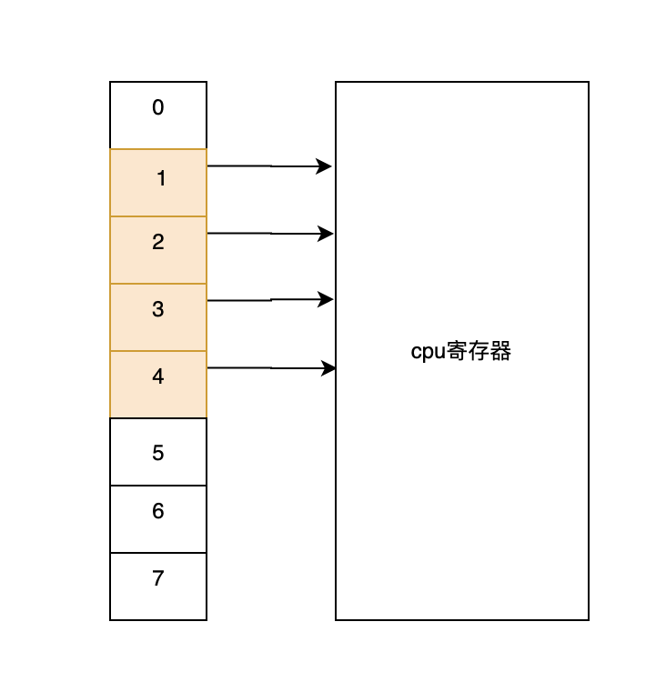

# 九股文笔记-Golang之defer

#### defer

Golang的defer会在函数返回前去执行传入的函数，它会经常被用于关闭文件描述符、关闭数据库连接以及解锁资源。

#### 常见使用场景

1.关闭文件

```
func foo1()  {
	file, err :=  os.OpenFile("your file path", os.O_RDONLY, 0755)
	if err != nil {
		return
	}
	defer file.Close()
	//use file do something
	//...

	return
}
```

2.解锁

```
func foo2(mu *sync.Mutex)  {
	mu.Lock()
	defer mu.Unlock()
	//do something
	//...

	return
}
```

#### defer数据结构

```
type _defer struct {
	siz       int32  //参数和结果的内存大小
	sp        uintptr //栈指针
	pc        uintptr //调用方的程序计数器
	fn        *funcval //defer中传入的函数
	_panic    *_panic //触发延迟调用的结构体，可能为空
	link      *_defer //指向下一个defer
}
```

#### defer调用链

当goroutine获取到一个defer，就会创建一个runtime.\_defer结构体，然后将runtime.\_defer追加到当前goroutine的defer链表的最前面。



defer 关键字的插入顺序是从后向前的，而 defer 关键字执行是从前向后的，这也是为什么后调用的 defer 会优先执行。

#### defer函数入参

defer函数创建新的延迟调用时就会立刻拷贝函数的参数，函数的参数不会等到真正执行时计算。如下面获取函数执行时间的代码，其中foo1是无效的，foo2是有效的。

```
//无效 无法计算函数执行时间
func foo()  {
	startedAt := time.Now()
	defer fmt.Println(time.Since(startedAt))
	time.Sleep(time.Second)
}

//有效 可以计算函数执行时间
func foo1()  {
	startedAt := time.Now()
	defer func() {
		fmt.Println(time.Since(startedAt))
	}()
	time.Sleep(time.Second)
}
```

%23%23%23%23%20defer%0AGolang%E7%9A%84defer%E4%BC%9A%E5%9C%A8%E5%87%BD%E6%95%B0%E8%BF%94%E5%9B%9E%E5%89%8D%E5%8E%BB%E6%89%A7%E8%A1%8C%E4%BC%A0%E5%85%A5%E7%9A%84%E5%87%BD%E6%95%B0%EF%BC%8C%E5%AE%83%E4%BC%9A%E7%BB%8F%E5%B8%B8%E8%A2%AB%E7%94%A8%E4%BA%8E%E5%85%B3%E9%97%AD%E6%96%87%E4%BB%B6%E6%8F%8F%E8%BF%B0%E7%AC%A6%E3%80%81%E5%85%B3%E9%97%AD%E6%95%B0%E6%8D%AE%E5%BA%93%E8%BF%9E%E6%8E%A5%E4%BB%A5%E5%8F%8A%E8%A7%A3%E9%94%81%E8%B5%84%E6%BA%90%E3%80%82%0A%0A%0A%0A%23%23%23%23%20%E5%B8%B8%E8%A7%81%E4%BD%BF%E7%94%A8%E5%9C%BA%E6%99%AF%0A1.%E5%85%B3%E9%97%AD%E6%96%87%E4%BB%B6%0A%60%60%60%0Afunc%20foo1\(\)%20%20%7B%0A%09file%2C%20err%20%3A%3D%20%20os.OpenFile\(%22your%20file%20path%22%2C%20os.O\_RDONLY%2C%200755\)%0A%09if%20err%20\!%3D%20nil%20%7B%0A%09%09return%0A%09%7D%0A%09defer%20file.Close\(\)%0A%09%2F%2Fuse%20file%20do%20something%0A%09%2F%2F...%0A%0A%09return%0A%7D%0A%60%60%60%0A%0A2.%E8%A7%A3%E9%94%81%0A%60%60%60%0Afunc%20foo2\(mu%20\*sync.Mutex\)%20%20%7B%0A%09mu.Lock\(\)%0A%09defer%20mu.Unlock\(\)%0A%09%2F%2Fdo%20something%0A%09%2F%2F...%0A%0A%09return%0A%7D%0A%60%60%60%0A%0A%0A%23%23%23%23%20defer%E6%95%B0%E6%8D%AE%E7%BB%93%E6%9E%84%0A%60%60%60%0Atype%20\_defer%20struct%20%7B%0A%09siz%20%20%20%20%20%20%20int32%20%20%2F%2F%E5%8F%82%E6%95%B0%E5%92%8C%E7%BB%93%E6%9E%9C%E7%9A%84%E5%86%85%E5%AD%98%E5%A4%A7%E5%B0%8F%0A%09sp%20%20%20%20%20%20%20%20uintptr%20%2F%2F%E6%A0%88%E6%8C%87%E9%92%88%0A%09pc%20%20%20%20%20%20%20%20uintptr%20%2F%2F%E8%B0%83%E7%94%A8%E6%96%B9%E7%9A%84%E7%A8%8B%E5%BA%8F%E8%AE%A1%E6%95%B0%E5%99%A8%0A%09fn%20%20%20%20%20%20%20%20\*funcval%20%2F%2Fdefer%E4%B8%AD%E4%BC%A0%E5%85%A5%E7%9A%84%E5%87%BD%E6%95%B0%0A%09\_panic%20%20%20%20\*\_panic%20%2F%2F%E8%A7%A6%E5%8F%91%E5%BB%B6%E8%BF%9F%E8%B0%83%E7%94%A8%E7%9A%84%E7%BB%93%E6%9E%84%E4%BD%93%EF%BC%8C%E5%8F%AF%E8%83%BD%E4%B8%BA%E7%A9%BA%0A%09link%20%20%20%20%20%20\*\_defer%20%2F%2F%E6%8C%87%E5%90%91%E4%B8%8B%E4%B8%80%E4%B8%AAdefer%0A%7D%0A%60%60%60%0A%0A%23%23%23%23%20defer%E8%B0%83%E7%94%A8%E9%93%BE%0A%E5%BD%93goroutine%E8%8E%B7%E5%8F%96%E5%88%B0%E4%B8%80%E4%B8%AAdefer%EF%BC%8C%E5%B0%B1%E4%BC%9A%E5%88%9B%E5%BB%BA%E4%B8%80%E4%B8%AAruntime.\_defer%E7%BB%93%E6%9E%84%E4%BD%93%EF%BC%8C%E7%84%B6%E5%90%8E%E5%B0%86runtime.\_defer%E8%BF%BD%E5%8A%A0%E5%88%B0%E5%BD%93%E5%89%8Dgoroutine%E7%9A%84defer%E9%93%BE%E8%A1%A8%E7%9A%84%E6%9C%80%E5%89%8D%E9%9D%A2%E3%80%82%0A\!%5B080a6fbc9f8751804b7fa155fd4af576.png%5D\(evernotecid%3A%2F%2F9423462E\-1591\-4A2D\-AF79\-F4FBBF0F308D%2Fappyinxiangcom%2F29941161%2FENResource%2Fp124\)%0Adefer%20%E5%85%B3%E9%94%AE%E5%AD%97%E7%9A%84%E6%8F%92%E5%85%A5%E9%A1%BA%E5%BA%8F%E6%98%AF%E4%BB%8E%E5%90%8E%E5%90%91%E5%89%8D%E7%9A%84%EF%BC%8C%E8%80%8C%20defer%20%E5%85%B3%E9%94%AE%E5%AD%97%E6%89%A7%E8%A1%8C%E6%98%AF%E4%BB%8E%E5%89%8D%E5%90%91%E5%90%8E%E7%9A%84%EF%BC%8C%E8%BF%99%E4%B9%9F%E6%98%AF%E4%B8%BA%E4%BB%80%E4%B9%88%E5%90%8E%E8%B0%83%E7%94%A8%E7%9A%84%20defer%20%E4%BC%9A%E4%BC%98%E5%85%88%E6%89%A7%E8%A1%8C%E3%80%82%0A%0A%23%23%23%23%20defer%E5%87%BD%E6%95%B0%E5%85%A5%E5%8F%82%0Adefer%E5%87%BD%E6%95%B0%E5%88%9B%E5%BB%BA%E6%96%B0%E7%9A%84%E5%BB%B6%E8%BF%9F%E8%B0%83%E7%94%A8%E6%97%B6%E5%B0%B1%E4%BC%9A%E7%AB%8B%E5%88%BB%E6%8B%B7%E8%B4%9D%E5%87%BD%E6%95%B0%E7%9A%84%E5%8F%82%E6%95%B0%EF%BC%8C%E5%87%BD%E6%95%B0%E7%9A%84%E5%8F%82%E6%95%B0%E4%B8%8D%E4%BC%9A%E7%AD%89%E5%88%B0%E7%9C%9F%E6%AD%A3%E6%89%A7%E8%A1%8C%E6%97%B6%E8%AE%A1%E7%AE%97%E3%80%82%E5%A6%82%E4%B8%8B%E9%9D%A2%E8%8E%B7%E5%8F%96%E5%87%BD%E6%95%B0%E6%89%A7%E8%A1%8C%E6%97%B6%E9%97%B4%E7%9A%84%E4%BB%A3%E7%A0%81%EF%BC%8C%E5%85%B6%E4%B8%ADfoo1%E6%98%AF%E6%97%A0%E6%95%88%E7%9A%84%EF%BC%8Cfoo2%E6%98%AF%E6%9C%89%E6%95%88%E7%9A%84%E3%80%82%0A%60%60%60%0A%2F%2F%E6%97%A0%E6%95%88%20%E6%97%A0%E6%B3%95%E8%AE%A1%E7%AE%97%E5%87%BD%E6%95%B0%E6%89%A7%E8%A1%8C%E6%97%B6%E9%97%B4%0Afunc%20foo\(\)%20%20%7B%0A%09startedAt%20%3A%3D%20time.Now\(\)%0A%09defer%20fmt.Println\(time.Since\(startedAt\)\)%0A%09time.Sleep\(time.Second\)%0A%7D%0A%0A%2F%2F%E6%9C%89%E6%95%88%20%E5%8F%AF%E4%BB%A5%E8%AE%A1%E7%AE%97%E5%87%BD%E6%95%B0%E6%89%A7%E8%A1%8C%E6%97%B6%E9%97%B4%0Afunc%20foo1\(\)%20%20%7B%0A%09startedAt%20%3A%3D%20time.Now\(\)%0A%09defer%20func\(\)%20%7B%0A%09%09fmt.Println\(time.Since\(startedAt\)\)%0A%09%7D\(\)%0A%09time.Sleep\(time.Second\)%0A%7D%0A%60%60%60
