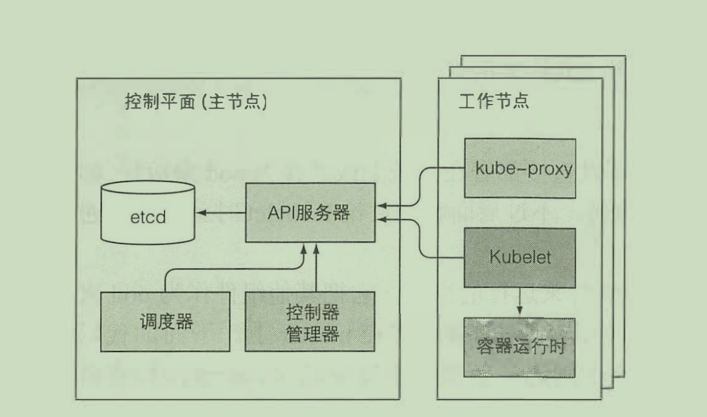
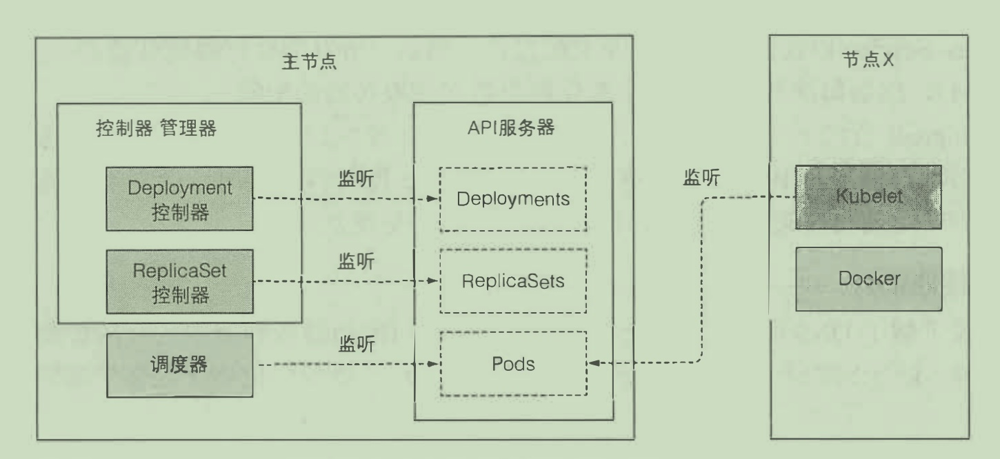
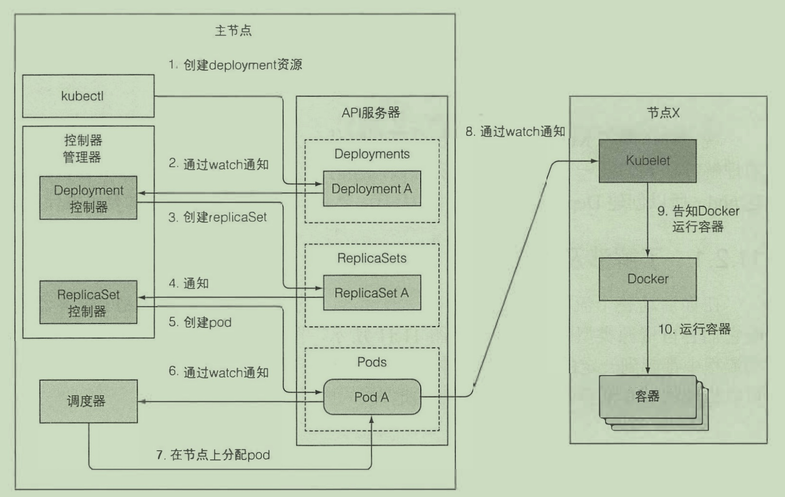

# k8s组件

------

## 1. 控制平面与工作节点

一组工作机器，称为*节点*， *节点*会运行容器化的应用程序。整个k8s集群由控制平面（master节点）与worker节点构成。

控制平面的组件用来存储、管理集群状态，其中包括：

- etcd分布式持久化存储
- API服务器
- 调度器
- 控制器管理器

而运行容器的任务依赖千每个工作节点上运行的组件：

- Kubelet
- Kubelet服务代理( kube-proxy)
- 容器运行时(Docker、rkt或者其他）

出了这些组件外，还有一些附加组件，他们共同构成了整个k8s集群。

- Kubemetes DNS服务器
- 仪表板
-  Ingress控制器
- Heapster (容器集群监控）
- 容器网络接口插件

整体构造入下图所示：



可以使用如下命令来查看当前k8s集群的组件状态：

```shell
kubect1 get componentstatuses
```

## 2. 组件分析

### 2.1 etcd

负责存储集群中各种资源对象的信息，k/v方式存储，所有的 k8s 集群数据存放在此

### 2.2 API Server

API Server 是k8s的中心组件，其他组件或者客户端（如kubectl) 都会去调用它。以RESTfulAPI的形式提供了可以查询、修改集群状态的CRUD(Create、Read、 Update、 Delete)接口。 它将状态存储到etcd中（API Server 是**唯一**可以与etcd通信的组件）。

### 2.3 scheduler

scheduler是k8s的资源调度器，我们在创建pod的时候通常不会去指定pod运行在哪个节点上，这项工作交给调度器。宏观来看， 调度器的操作比较简单。 就是利用 API 服务器的监听机制等待新创建的 pod, 然后给每个新的、 没有节点集的 pod 分配节点。

### 2.4 manager controller

API Server 只做了存储资源到 etcd 和通知客户端有变更的工作。调度器则只是给 pod 分配节点， 所以需要有活跃的组件确保系统真实状态朝 API 服务器定义的期望的状态收敛。 这个工作由控制器管理器里的控制器来实现。控制器执行一个 “ 调和 “ 循环， 将实际状态调整为期望状态（在资源 spec 部分定义）， 然后将新的实际状态写入资源的 status 部分。 控制器利用监听机制来订阅变更， 但是由于使用监听机制并不保证控制器不会漏掉时间， 所以仍然需要定期执行重列举操作来确保不会丢掉什么。

### 2.5 kubelet

Kubelet是运行在工作节点的组件，其负责所有运行在工作节点上内容的组件。它第一个任务就是在 API Server 中创建 Node 资源来注册该节点，然后需要持续监控 API Server 是否把该节点分配给 pod， 然后启动 pod 容器，具体实现方式是告知配置好的容器运行时（Docker CoreOS Rkt ，或者其他 些东西）来从特定容器镜像运行容器 Kubelet 随后持续监控运行的容器，向 API Server 报告它们的状态、事件和资源消耗。Kubelet 也是运行容器存活探针的组件，当探针报错时它会重启容器。最后一点，当pod从 API Server 删除肘， Kubelet会终止容器，并通知服务器 pod 己经被终止了。

### 2.6 kube proxy

kube proxy 是工作节点上的一个组件，其负责维护节点上的网络规则，实现了 k8s service 概念的一部分，它的作用是使发往service的流量（通过clusterIP和端口）负载均衡到正确的后端pod上。kube proxy 监听 API Server 中的service和endpoint的变化情况，并通过 userspace、iptables、ipvs 或 winuserspace 等 proxier 来为服务配置负载均衡（仅支持 TCP 和 UDP）。

.png)


## 3. 组件的通信机制

各个组件之间并不会直接进行通信，而是通过一种监听的机制来获取其他组件的状态变更，之后再根据监听到的消息做相应的控制。



下面更加具体地展示了一个通过deployment创建pod的过程。

