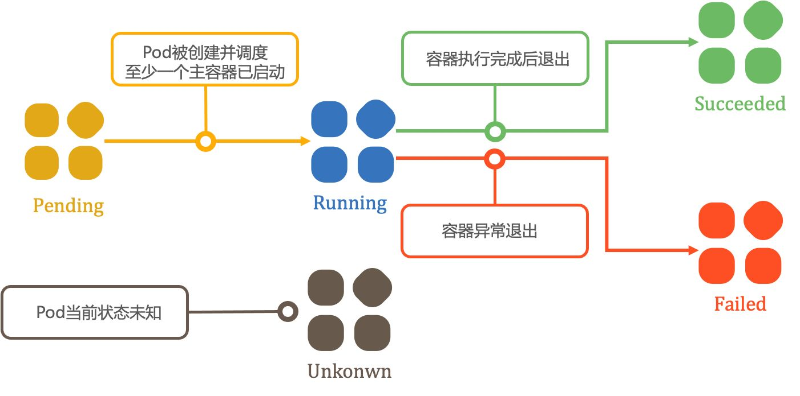
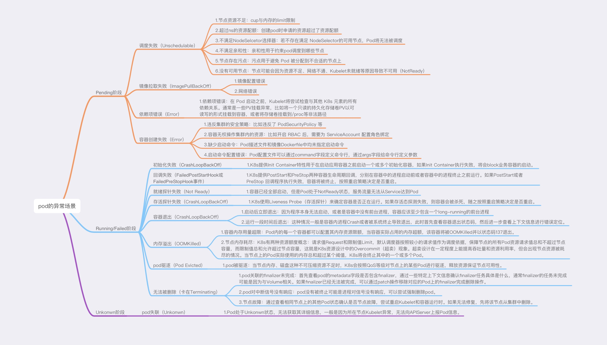

# pod状态分析

------

## 1. 一个pod的状态之旅

从宏观的角度上来看，pod的一生要经历以下5个状态：

- **Pending**：Pod被K8s创建出来后，起始于Pending阶段。在Pending阶段，Pod将经过调度，被分配至目标节点开始拉取镜像、加载依赖项、创建容器。
- **Running**：当Pod所有容器都已被创建，且至少一个容器已经在运行中，Pod将进入Running阶段。
- **Succeeded**：当Pod中的所有容器都执行完成后终止，并且不会再重启，Pod将进入Succeeded阶段。
- **Failed**：若Pod中的所有容器都已终止，并且至少有一个容器是因为失败终止，也就是说容器以非0状态异常退出或被系统终止，Pod将进入Failed阶段。
- **Unkonwn**：因为某些原因无法取得 Pod 状态，这种情况Pod将被置为Unkonwn状态。

一般来说，对于Job类型的负载，Pod在成功执行完任务之后将会以Succeeded状态为终态。而对于Deployment等负载，一般期望Pod能够持续提供服务，直到Pod因删除消失，或者因异常退出/被系统终止而进入Failed阶段。

## 2. pod的异常场景

上面从宏观角度上介绍了pod的几种状态，但pod还有一些细分的状态如：Ready/NotReady、Initialized、 PodScheduled/Unschedulable 等等。这些细分状态描述造成Pod所处阶段的具体成因是什么。比如，Pod 当前阶段是Pending，对应的细分状态是 Unschedulable，这就意味着Pod调度出现了问题。

与此同时，容器也有自己的生命周期：Waiting、Running和 Terminated，并且也有其对应的状态原因（Reason），例如ContainerCreating、Error、OOMKilled、CrashLoopBackOff、Completd等。而对于发生过重启或终止的容器，上一个状态（LastState）字段不仅包含状态原因，还包含上一次退出的状态码（Exit Code）。例如容器上一次退出状态码是137，状态原因是OOMKilled，说明容器是因为OOM被系统强行终止。在异常诊断过程中，**容器的退出状态**是至关重要的信息。

Pod在其生命周期的许多时间点可能发生不同的异常，按照Pod容器是否运行为标志点，我们将异常场景大致分为两类：

1. 在pod进行调度并创建容器的过程中发生异常，此时pod将卡在pending阶段。
2. 在pod容器运行中发生异常，此时pod按照具体的场景处于不同的阶段。

具体场景分析：

## 3. 容器退出状态码

容器在运行一段时间后退出，此时应该首先查看容器退出状态码，然后进一步查看上下文信息进行错误定位。容器退出的几种常见的状态码：

| 状态码 | 含义     |                             分析                             |
| ------ | -------- | :----------------------------------------------------------: |
| 0      | 正常退出 | 容器的启动程序不是一个long-running的程序。如果正常退出不符合预期，需要检查容器日志，对程序的执行逻辑进行调整。 |
| 137    | 外部终止 | 137 表示容器已收到来自主机操作系统的 SIGKILL 信号。该信号指示进程立即终止，没有宽限期。可能原因包含：容器运行时将容器kill，例如docker kill命令；Linux 用户向进程发送 kill -9 命令触发；K8s尝试终止容器，超过优雅下线窗口期后直接kill容器；由节点系统触发，比如遭遇了OOM。 |
| 139    | 段错误   | 139表示容器收到了来自操作系统的 SIGSEGV 信号。这表示分段错误 —— 内存违规，由容器试图访问它无权访问的内存位置引起。 |
| 143    | 优雅终止 | 143 表示容器收到来自操作系统的 SIGTERM 信号，该信号要求容器正常终止。该退出码可能的原因是：容器引擎停止容器，例如使用 docker stop 停止了容器；K8s终止了容器，比如缩容行为将Pod删除。 |

文章引用自：https://zhuanlan.zhihu.com/p/583550457