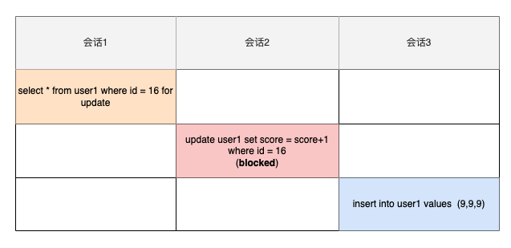
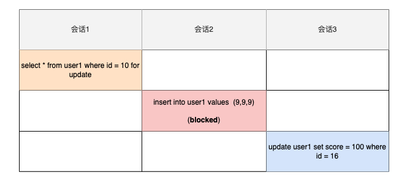
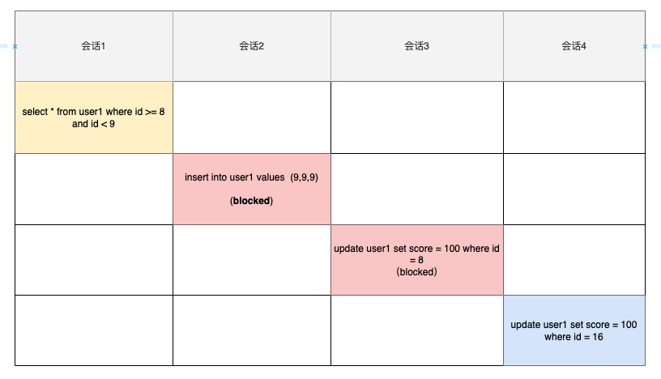
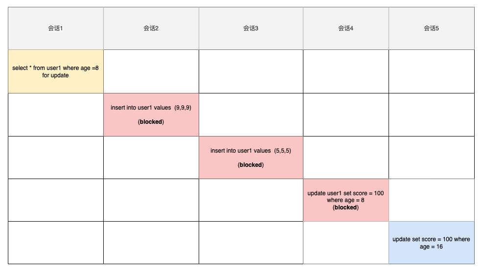
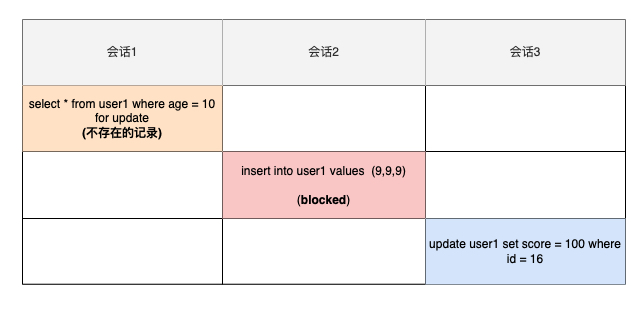
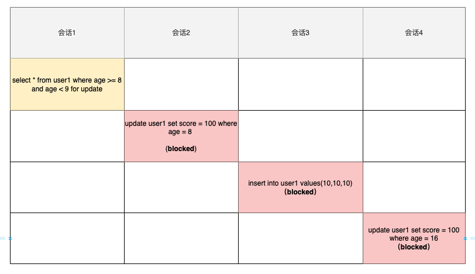
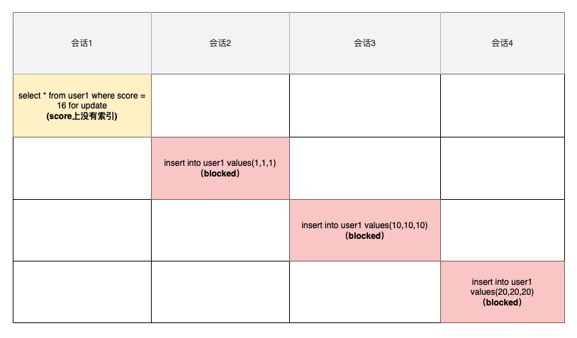

# Next-key lock

**Innodb 引擎为了解决「可重复读」隔离级别使用「当前读」而造成的幻读问题，就引出了 next-key 锁**，就是记录锁和间隙锁的组合。这里强调**「当前读」**，是因为在**「快照读」**的情况下，由mvcc来保证不会产生幻读。mvcc相关的内容具体可以参考[另一篇文章](https://github.com/chuckchann/nine-legged-essay-notes/blob/master/%E4%B9%9D%E8%82%A1%E6%96%87%E4%B9%8BMySQL/MySQL%E4%B9%8Bmvcc.md)。这里只讨论**「当前读」**的情况。以下内容全部基于**「可重复读」隔离级别**。

## 记录锁&间隙锁

- 记录锁，锁的是记录本身；
- 间隙锁，锁的就是两个值之间的空隙，以防止其他事务在这个空隙间插入新的数据，从而避免幻读现象。

## 加锁规则

对记录加锁时，**加锁的基本单位是 next-key lock**，它是由记录锁和间隙锁组合而成的，**next-key lock 是前开后闭区间，而间隙锁是前开后开区间**。但是，next-key lock 在一些场景下会退化成记录锁或间隙锁。另外，文章后面提到的**next-key lock、间隙锁、记录锁都是加在索引上的，而不是加在数据行上的**。

## 场景分析

先准备测试表，其中id为主键（<u>唯一索引</u>），age上有一个<u>普通索引</u>，name上没有索引

```sql
CREATE TABLE `user1` (
  `id` int(11) unsigned NOT NULL AUTO_INCREMENT COMMENT '主键',
  `score` int(11) DEFAULT NULL,
  `age` tinyint(3) NOT NULL DEFAULT '0' COMMENT '普通索引',
  PRIMARY KEY (`id`),
  KEY `idx_age` (`age`)
) ENGINE=InnoDB AUTO_INCREMENT=34 DEFAULT CHARSET=utf8;
```

测试数据

```sql
INSERT INTO `test`.`user1`(`id`, `score`, `age`) VALUES (0, 0, 0);
INSERT INTO `test`.`user1`(`id`, `score`, `age`) VALUES (4, 4, 4);
INSERT INTO `test`.`user1`(`id`, `score`, `age`) VALUES (8, 8, 8);
INSERT INTO `test`.`user1`(`id`, `score`, `age`) VALUES (16, 16, 16);
INSERT INTO `test`.`user1`(`id`, `score`, `age`) VALUES (32, 32, 32);
```

### 场景1 唯一索引等值查询

当利用唯一索引等值查询的时候，分为能查询到与不能查询到两种。

- *查询到记录存在，next-key锁退化为记录锁*。

  



会话1加锁流程（要注意会话1加的是**写锁**）：

1. 加锁的基本单位是next-key lock ，它是前开后闭的，所以加锁的范围是(8,16]。
2. 但由于id字段是具有唯一性的主键索引，所以next-key lock 退化为记录锁，仅仅锁住id=16这一行。

会话2操作的也是id=16这一行，所以会被**阻塞**住，而会话3的操作行没有被锁住，所以不会被阻塞。

- *查询到记录不存在，next-key锁退化为间隙锁*。



会话1加锁流程：

1. 加锁的基本单位是next-key lock ，它是前开后闭的，所以加锁的范围是(8,16]。
2. 由于id=10这一行记录不存在，所以next-key lock 退化为间隙锁，加锁的范围是(8,16)。

同理，会话2会被**阻塞**住，而会话3可以正常执行。

### 场景2 唯一索引范围查询

范围查询等值查询的加锁规则不同。下面两条查询语句查询结果相等，但加锁的范围不同。

```sql
select * from user1 where id = 8 for update
select * from user1 where id >= 8 and id < 9 for update
```



会话1加锁过程：

1. 找到id=8的这一行，使用next-key锁锁定(4,8]，因为id是主键，所以锁退化为记录锁，锁定id=8这一行。
2. 因为是**范围查找**，**所以会继续往后找**，直到遇到id=16这一行数据，这时的next-lock锁住的范围是(8,16]，这个查询语句还有一个条件id<9，但由于id=16不满足id<9，所以退化成间隙锁(8,16)。（为什么id=16不满足id<9就退化成间隙锁？因为id上的索引具有唯一性，无论如何也不会有第二条id=16的记录了，所以也没有必要锁住id=16这一行了）
3. 综合1与2，最后锁住的范围是 id=8的记录锁 + 间隙锁(8,16) = [8,16)

根据会话1锁住的范围，会话2会被锁住，会话3会被锁住，会话4可以直接执行（我的MySQL的版本是5.7，会话4是会blocked住的，这个好像是MySQL的一个bug，但后面已经修复了，具体的信息可以自己Google）。

### 场景3 非唯一索引等值查询

- *如果查询到记录存在，会在锁住id=xxx的这一行及这一行前后的间隙，即next-key锁+间隙锁。*



会话1加锁过程：

1. age=8 这一行记录存在，加一个next-key 锁，锁住的范围是(4,8]
2. 因为是非唯一索引，所以继续往下找到 age=16的记录，加一个间隙锁，锁住的范围是(8, 16)
3. 综合两个锁的范围，最终锁住的范围是 age=8的next-key锁 (4,8] + 间隙锁(8, 16) = （4,16）

会话2与会话3想插入数据，但锁住的范围是（4,16），所以会被阻塞，会话4 age=8这一行已经有写锁，所以也会阻塞，会话5可以正常执行。其实总结起来，**非唯一索引等值查询在记录存在的情况下，锁住的范围是记录那一行（age=8），加上那一行上下的间隙（4,8）和 (8,16)，总和起来就是(4,16)**。

- *如果查询到记录不存在，只要加一个间隙锁即可。*



会话1加锁过程：

1. 先对普通索引age加一个next-key lock，锁住的范围是(8, 16]。
2. age=10记录并不存在，退化为间隙锁(8, 16)。

会话2插入的age=9的记录在(8, 16)之内，所以会被锁住。会话3因为不在锁住的范围内，所以可以执行。总结起来，**非唯一索引等值查询在记录不存在的情况下，锁住的范围是age=10前后的间隙，即(8, 16)**。

### 场景4 非唯一索引范围查询



会话1加锁过程：

1. age=8这一行记录是存在的，先加一个next-key lock，锁住的范围是(4, 8]，age不是唯一索引，所以不能退化为记录锁，锁定的范围还是(4, 8]。
2. 由于是范围查找，继续往后找存在的记录，直到找到age=16这一行记录，然后再加一个next-key lock，锁住的范围是(8, 16]，age不是唯一索引，所以不能退化为间隙锁，锁的范围是(8, 16]。
3. 综合1/2步骤，最后锁定的范围是(4, 16]。

会话2/会话3/会话4涉及的age都在锁定范围(4, 16]内，所以都会阻塞。

### 场景5 没有走索引

前面的场景都是在查询语句命中索引的情况下分析的，如果查询语句没有命中索引，那又是另外一种情况了。



如图所示，因为score上并没有建立索引，所以Inno DB 在执行会话1的时候会扫描全表，**也就是说给整张表加上next-key lock，这样的话相当于全表都被锁住了**。不止select语句，update、delete语句会有同样的现象，只要是语句为能够命中索引，都将会锁住整张表。如何避免锁住全表的这种情况？

- 最保险的方法是使用explain来分析语句，确保语句能中命中索引（只在where条件里带上索引也不一定也能保证走索引，关键还得看优化器最终选择是索引扫描还是全表扫描，可以使用force_index来让数据库强制走索引）。
- 使用MySQL的安全模式： sql_safe_updates  关于安全模式的相关内容可以自己Google

## 总结

1. 唯一索引等值查询

   - 当记录存在，next-key lock退化为**记录锁，即只锁住记录那一行。**
   - 当记录不存在，next-key lock退化为**间隙锁，即锁住查询值（不存在）前后的间隙（左闭右闭）。**

2. 唯一索引范围查询，先加一个next-key lock（**可能退化为记录锁**），接着继续往后面找，直到遇到下一条记录，然后在这次查找范围内加一个**间隙锁**。

3. 非唯一索引等值查询

   - 当记录存在，因为不具有唯一性，**next-key lock + 间隙锁，即锁住记录那一行及这一行前后的间隙（左闭右闭）。**
   - 当记录不存在，只加next-key lock，然后退化成间隙锁，**即只锁住查询值（不存在）的前后的间隙（左闭右闭）。**

4. 非唯一索引范围查询，先加一个next-key lock，接着继续往后找，直到遇到下一个条记录，然后在这次查找范围内加一个**间隙锁**。

5. sql语句没有走索引，**相当于给全表加了一个next-key lock，会锁住全表**，可以通过force_index或者sql_safe_updates来临时解决，当然最好还是确保你的sql语句能够命中索引（通过explain可以分析是否有走索引）。

   