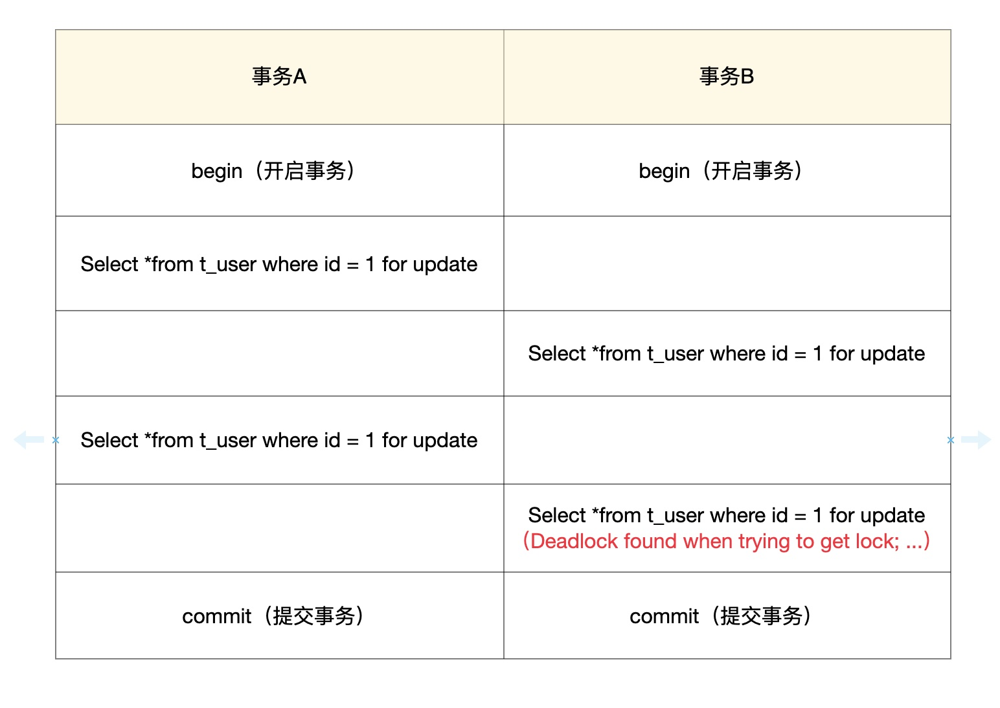

# 死锁

## 概念

死锁是并发系统中常见的问题，同样也会出现在数据库MySQL的并发读写请求场景中。当两个及以上的事务，双方都在等待对方释放已经持有的锁或因为加锁顺序不一致造成循环等待锁资源，就会出现“死锁”。常见的报错信息为 `Deadlock found when trying to get lock...`。

## 检测语句

可以使用下面这条命令来查看MySQL最近的一次死锁日志：

```sql
show engine innodb status
```

查看当前执行的事务：

```sql
select * from information_schema.innodb_trx
```

查看当正在等锁的事务：

```sql
select * from information_schema.innodb_lock_waits
```

## 场景分析

sql准备：

```sql
CREATE TABLE `t_user` (
  `id` int(11) unsigned NOT NULL AUTO_INCREMENT COMMENT '自增ID',
  `age` tinyint(3) NOT NULL DEFAULT '0',
  `name` varchar(100) NOT NULL,
  PRIMARY KEY (`id`),
  KEY `idx_age` (`age`)
) ENGINE=InnoDB AUTO_INCREMENT=1 DEFAULT CHARSET=utf8;

## 写入两条数据
INSERT INTO `t_user`(`id`, `age`, `name`) VALUES (1, 20, '张三');
INSERT INTO `t_user`(`id`, `age`, `name`) VALUES (2, 20, '李四');
```

### 1. 同一张表下的死锁



### 2. 间隙锁下的死锁

间隙锁需要再可重复读的隔离级别下才会产生。


事务A执行 <u>SELECT * FROM t_user WHERE id = 5 FOR UPDATE</u> 这一条语句的时候，会生成两个锁，分别是

- x型的插入意向锁
- x型的间隙锁

在RR隔离级别下，事务A申请将id=5的这一行数据加上排他锁，当id=5这一行数据存在时，MySQL会在这一行加上记录锁，即单独锁住id=5的这一行。但id=5的这一行数据并不存在，所以这个记录锁退化为间隙锁，锁住的范围是(2, +∞)。同理，事务B要锁住的id=6这一行也不存在，间隙锁锁住的范围同样是(2, +∞)。锁住相同范围的间隙锁之间是不会冲突的（因为两者的目的都是保护间隙之间不会插入数据），但插入意向锁于间隙锁会冲突，锁所以这里会互相等待而导致死锁。

## MySQL如何检测死锁

### 1. innodb_lock_wait_timeout 等待锁超时回滚事务

直观方法是在两个事务相互等待时，当一个等待时间超过设置的某一阀值时，对其中一个事务进行回滚，另一个事务就能继续执行。

### 1. 2. wait-for graph算法来主动进行死锁检测

每当加锁请求无法立即满足需要并进入等待时，wait-for graph算法都会被触发。wait-for graph要求数据库保存以下两种信息：

- 锁的信息链表
- 事务等待链表

通过上述链表可以构造出一张图，而在这个图中若存在回路，就代表存在死锁，因此资源间相互发生等待。在wait-for graph中，事务为图中的节点。而在图中，事务T1指向T2边的定义为：

## 如何避免

1. 以固定的顺序访问表和行。
2. 大事务拆小。大事务更倾向于死锁，如果业务允许，将大事务拆小。
3. 在同一个事务中，尽可能做到一次锁定所需要的所有资源，减少死锁概率。
4. 降低隔离级别。如果业务允许，将隔离级别调低也是较好的选择，比如将隔离级别从RR调整为RC，可以避免掉很多因为gap锁造成的死锁。
5. 为表添加合理的索引。可以看到如果不走索引将会为表的每一行记录添加上锁，死锁的概率大大增大。
