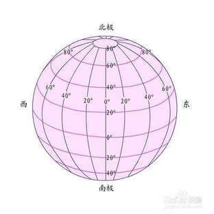
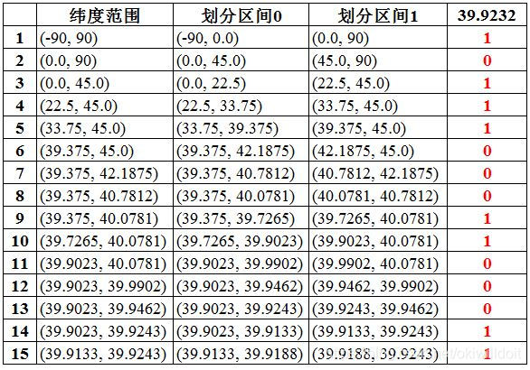
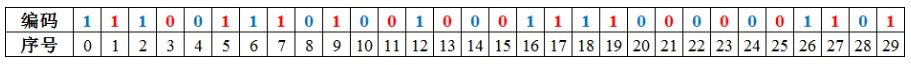
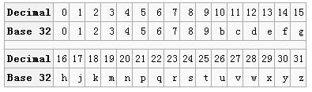
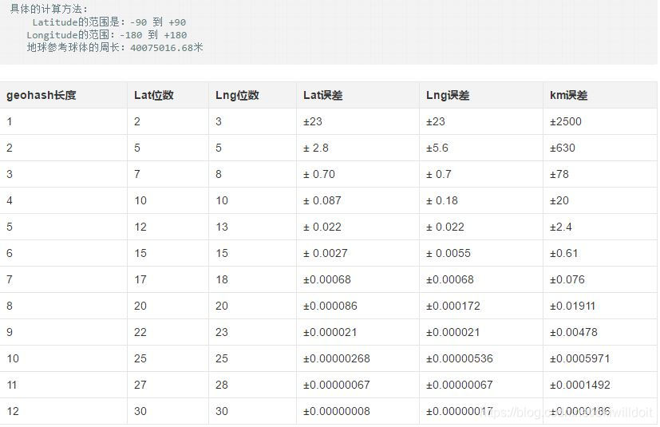

# GeoHash

## 背景

经纬度是经度与纬度的合称组成一个坐标系统，称为地理坐标系统，它是一种利用三度空间的球面来定义地球上的空间的球面坐标系统，能够标示地球上的任何一个位置。

## GeoHash

GeoHash是空间索引的一种方式，其基本原理是将地球理解为一个二维平面，通过把二维的空间经纬度数据编码为一个字符串，可以把平面递归分解成更小的子块，每个子块在一定经纬度范围内拥有相同的编码。简单地说就是**将二维的坐标转换成一维坐标，从而提高对位置数据的检索效率。**

### 编码规则

先将纬度范围(-90, 90)平分成两个区间(-90, 0)和(0, 90)，如果目标维度位于前一个区间，则编码为0，否则编码为1，然后根据目标纬度所落的区间再平均分成两个区间进行编码，以此类推，直到精度满足要求，经度也用同样的算法，对(-180, 180)依次细分，然后合并经度和纬度的编码，奇数位放纬度，偶数位放经度，组成一串新的二进制编码，按照Base32进行编码。

### 编码示例

以经纬度值：（116.389550， 39.928167）进行算法说明，对纬度39.928167进行逼近编码 (地球纬度区间是[-90,90]）

1. 区间[-90,90]进行二分为[-90,0),[0,90]，称为左右区间，可以确定39.928167属于右区间[0,90]，给标记为1
2. 接着将区间[0,90]进行二分为 [0,45),[45,90]，可以确定39.928167属于左区间 [0,45)，给标记为0
3. 递归上述过程39.928167总是属于某个区间[a,b]。随着每次迭代区间[a,b]总在缩小，并越来越逼近39.928167
4. 如果给定的纬度x（39.928167）属于左区间，则记录0，如果属于右区间则记录1，序列的长度跟给定的区间划分次数有关，如下图

同理，地球经度区间是[-180,180]，可以对经度116.389550进行编码。通过上述计算，纬度产生的编码为1 1 0 1 0 0 1 0 1 1 0 0 0 1 0，经度产生的编码为1 0 1 1 1 0 0 0 1 1 0 0 0 1 1

接着对经纬度的编码进行合并：偶数位放经度，奇数位放纬度，把2串编码组合生成新串如下图：

将11100 11101 00100 01111 0000 01101转成十进制，对应着28、29、4、15，0，13 十进制对应的base32编码就是wx4g0e,如下

同理，将编码转换为经纬度的解码算法就是上述算法的反过程。

### GeoHash的特点

- GeoHash用一个字符串表示经度和纬度两个坐标。在数据库中可以实现在一列上应用索引（某些情况下无法在两列上同时应用索引）
- GeoHash表示的并不是一个点，而是一个矩形区域。
- GeoHash编码的前缀可以表示更大的区域。例如wx4g0ec1，它的前缀wx4g0e表示包含编码wx4g0ec1在内的更大范围。 这个特性可以用于附近地点搜索。
- 编码越长，表示的范围越小，位置也越精确。因此我们就可以通过比较GeoHash匹配的位数来判断两个点之间的大概距离。下表编码长度的误差：

