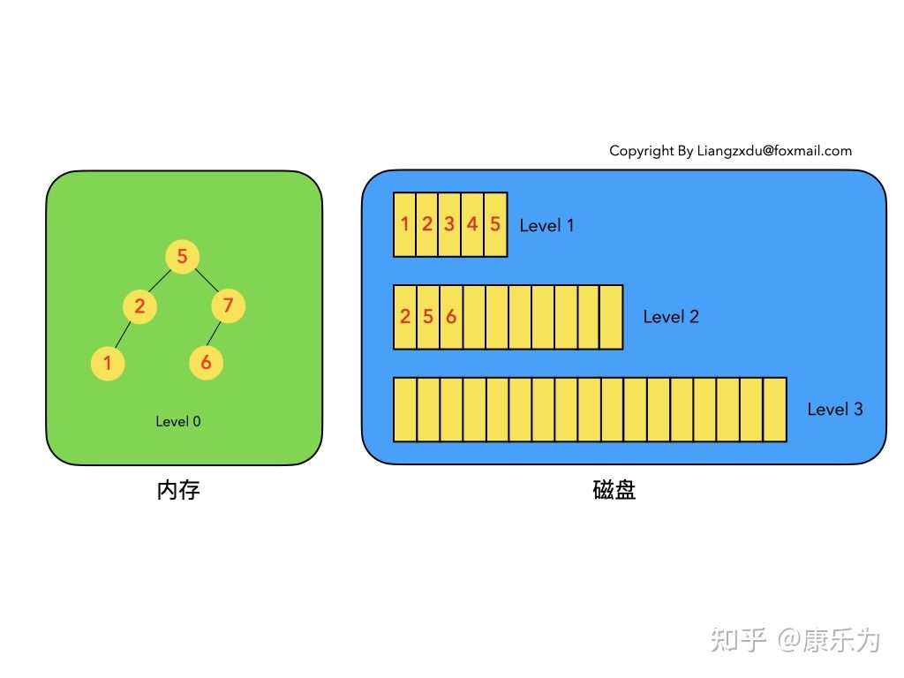

# LSM树

## 简介

LSM树，即日志结构合并树(Log-Structured Merge-Tree)。其实它并不属于一个具体的数据结构，它更多是一种数据结构的设计思想。大多NoSQL数据库核心思想都是基于LSM来做的，只是具体的实现不同。传统关系型数据库使用btree或一些变体作为存储结构，能高效进行查找。但保存在磁盘中时它也有一个明显的缺陷，那就是逻辑上相离很近但物理却可能相隔很远，这就可能造成大量的磁盘随机读写。随机读写比顺序读写慢很多，为了提升IO性能，**我们需要一种能将随机操作变为顺序操作的机制**，于是便有了LSM树。LSM树能让我们进行顺序写磁盘，从而大幅提升写操作，**作为代价的是牺牲了一些读性能**。

## 定义

1. LSM树是一个横跨内存和磁盘的，包含多颗"子树"的一个森林。
2. LSM树分为Level 0，Level 1，Level 2 ... Level n 多颗子树，其中只有Level 0在内存中，其余Level 1-n在磁盘中。
3. 内存中的Level 0子树一般采用排序树（红黑树/AVL树）、跳表或者TreeMap等这类有序的数据结构，方便后续顺序写磁盘。
4. 磁盘中的Level 1-n子树，本质是数据排好序后顺序写到磁盘上的文件，只是叫做树而已。
5. 每一层的子树都有一个阈值大小，达到阈值后会进行合并，合并结果写入下一层。
6. 每一层的子树都有一个阈值大小，达到阈值后会进行合并，合并结果写入下一层。

## LSM树的增删改查

### 1.  增加

插入比较简单，直接在level 0 树插入即可，因为level 0 树是有序的，并且level 0 树是在内存中，所以插入的速度快，时间复杂度为o(logn)，如果插入的key已经存在，那么直接转换为更新操作。

### 2.  删除

LSM树的删除操作不直接删除数据，而是通过一种叫“墓碑标记”的特殊数据来标识数据的删除。

#####  *a.  删除的数据在内存中*

即要删除的数据在level 0 树中，那么直接将level 0 树中对应的数据用墓碑标记将其覆盖，等后面与其他level的树合并的时候再进行删除。

#####  *b.  删除的数据在磁盘中*

如果要删除的数据在磁盘中，那么我们并不直接修改磁盘中的数据，而是向内存中的level 0 树插入墓碑标记。

##### *c.  数据根本不存在*

等同于b，直接向level 0 树插入墓碑标记。

从上面集中情况分析可以得知，删除操作只涉及内存中有序数据的修改，时间复杂度都为o(logn)，并且是在纯内存中操作，操作块且代价小。

### 3.  修改

LSM树的修改操作与删除操作类似。

##### *a.  修改的数据在内存中*

直接在内存里的level 0 树中修改即可，时间复杂度为o(logn)。

##### *b.  修改的数据在磁盘中*

同理，并不会直接去修改磁盘中的数据，而是会在level 0 树中创建一个新的数据。

##### *c.  修改的数据在不存在*

等同于b，直接在level 0 树中创建一个新的数据。

从上面的分析可以看出，LSM树的增删改的时间复杂度都是o(logn)，并且都是在内存中操作的，完全不涉及磁盘，所以写的速度快，吞吐量高。

### 4.  查询

LSM树的查询操作会按顺序查找Level 0、Level 1、Level 2 ... Level n 每一颗树，一旦匹配便返回目标数据，不再继续查询。可以发现，LSM树的查询操作相对来说代价比较高，需要从Level 0到Level n一直顺序查下去。极端情况是LSM树中不存在该数据，则需要把整个库从Level 0到Level n给扫了一遍，然后返回查无此人（可以通过 布隆过滤器 + 建立稀疏索引 来优化查询操作）。代价大于以B/B+树为基本数据结构的传统RDB存储引擎。

## LSM树的合并

上面说了LSM树的增删改查操作都是在内存中操作，但内存中的level 0 树不是无限增长的，当它达到一个阈值的时候，就需要将内存中的数据归并到磁盘中。合并分为两个步骤：

1. 对内存中的Level 0树进行中序遍历，将数据顺序写入磁盘的Level 1层即可，我们可以看到因为Level 0树是已经排好序的，所以写入的Level 1中的新块也是有序的（有序性保证了查询和归并操作的高效）。此时磁盘的Level 1层有两个Block块。
2. 当磁盘中的level 1树中的数据量也超过阈值时，对其包含的两个Block块进行归并，并将归并结果写入level 2。

## LSM树的优缺点

- 优点：可以看到LSM树将增、删、改这三种操作都转化为内存insert + 磁盘顺序写(当Level 0满的时候)，通过这种方式得到了无与伦比的写吞吐量。
- 缺点：LSM树的查询能力则相对被弱化，相比于B+树的最多3~4次磁盘IO，LSM树则要从Level 0一路查询Level n，极端情况下等于做了全表扫描。（即便做了稀疏索引，也是lg(N0)+lg(N1)+...+lg(Nn)的复杂度，大于B+树的lg(N0+N1+...+Nn)的时间复杂度）。

## 总结

如果说B/B+树的读写性能基本平衡的话，LSM树的设计原则通过舍弃部分读性能，换取了无与伦比的写性能。**该数据结构适合用于写吞吐量远远大于读吞吐量的场景**，得到了NoSQL届的喜爱和好评。

--摘抄自https://zhuanlan.zhihu.com/p/415799237

