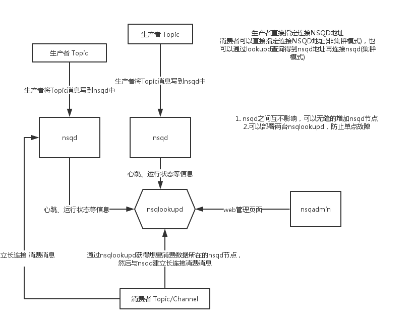

# nsq

NSQ是实时的分布式消息处理平台，其设计的目的是用来大规模地处理每天数以十亿计级别 的消息。NSQ具有分布式和去中心化拓扑结构，该结构具有无单点故障、故障容错、高可用性以及能够保证消息的可靠传递的特征，是一个成熟的、已在大规模生成环境下应用的产品。

------

## 组成

NSQ由三个守护进程够成：

- nsqd：用于接收保存和传送消息到客户端的守护进程。
- nsqlookupd：是管理拓扑信息，维护着所有的nsqd的状态，并提供最终一致发现服务的守护进程。
- nsqadmin：一个 Web UI 来实时监控集群和执行各种管理任务。 

## 概念

- topic：生产者将消息写入topic中，一个topic下可以有多个channel，每个channel都是topic完整的副本。
- channel：消费者从channel处订阅消息，如果有多个消费者订阅同一个channel，那么channel中的消息会被随机传递到其中的一个消费者上。

