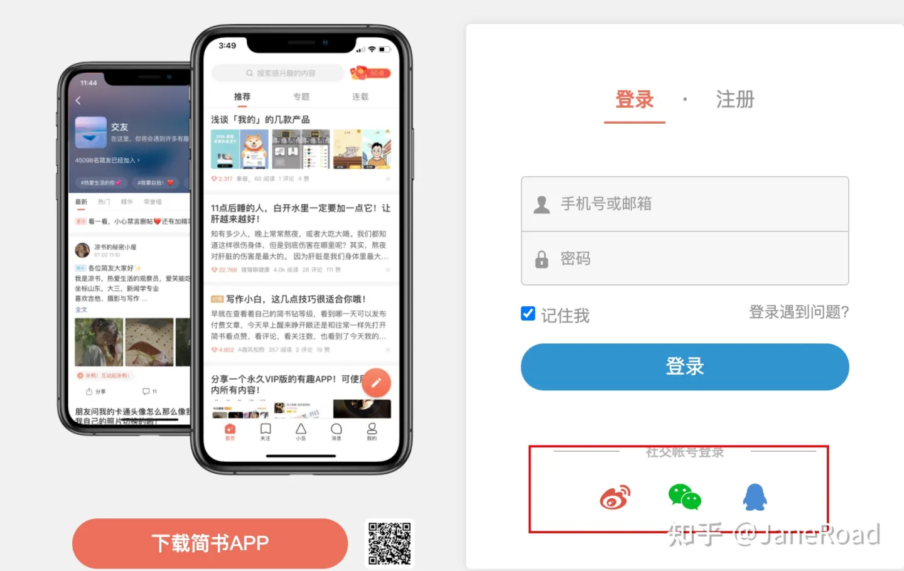
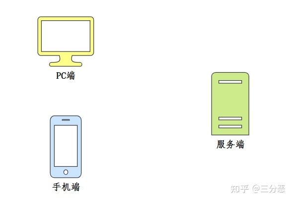
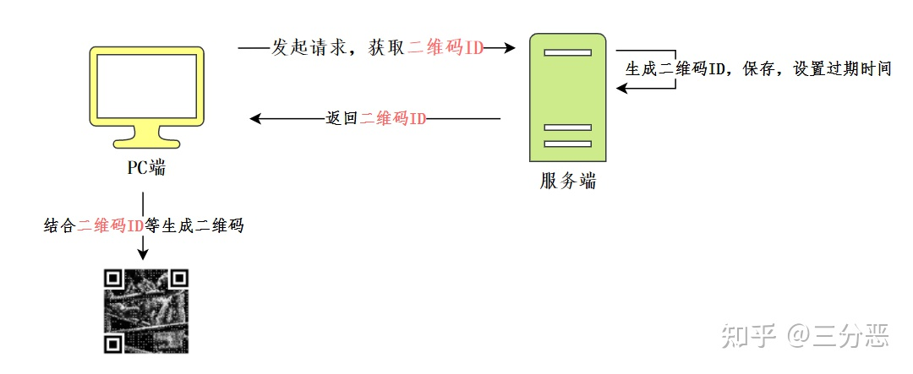
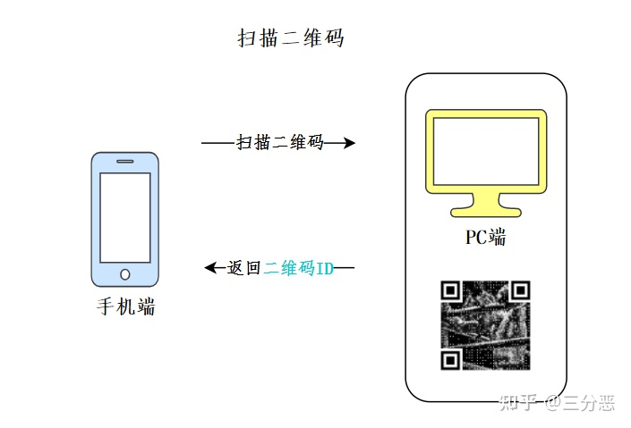
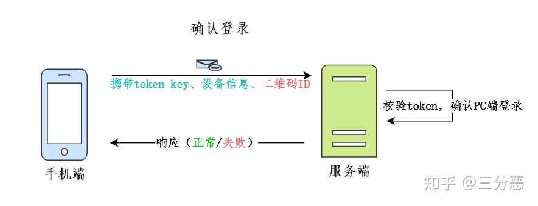
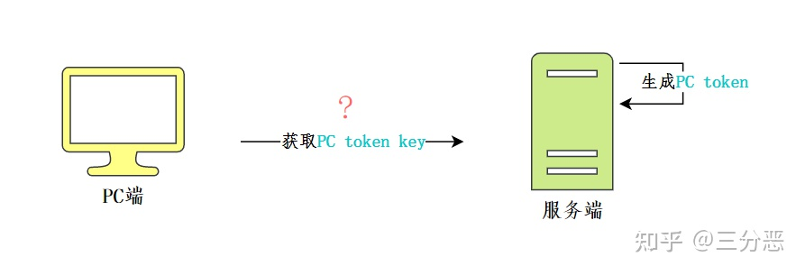
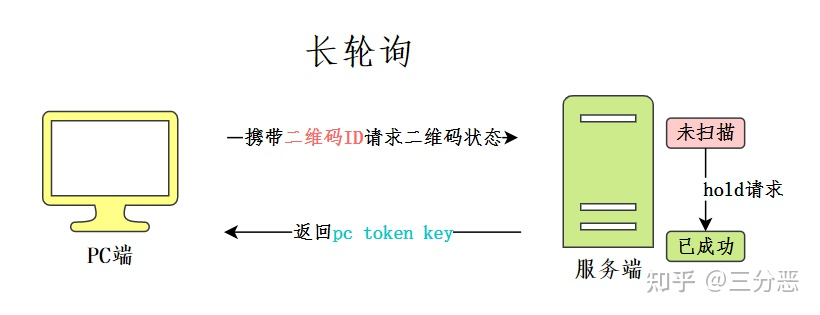
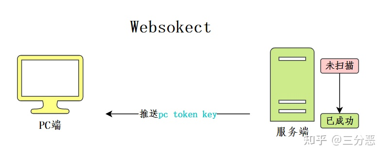
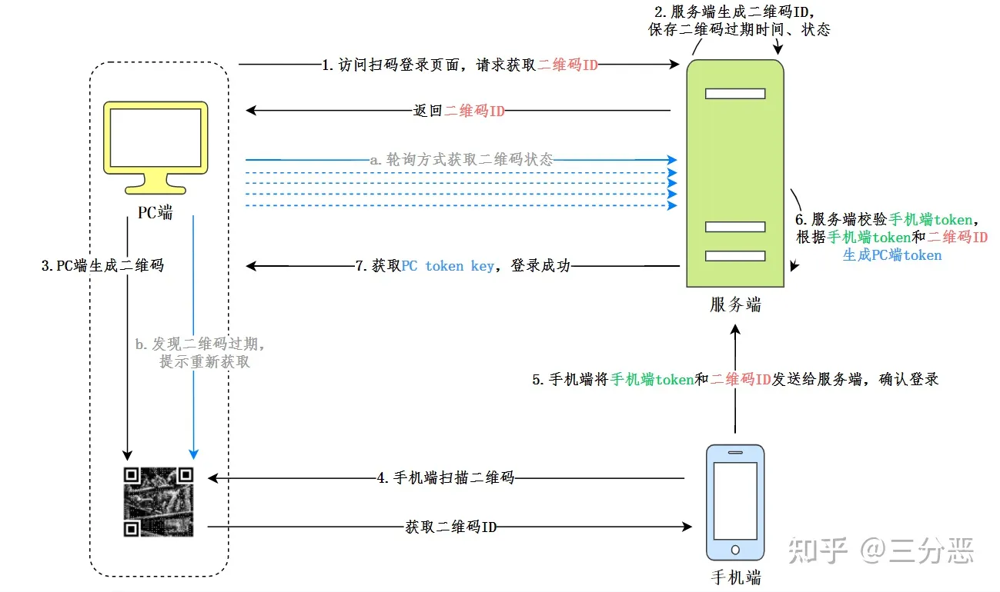

# Oauth2.0

## 简介

OAuth2.0协议是一个开放标准，允许用户授权第三方程序访问他们存储在另外的服务提供者上的信息，而不需要将用户和密码提供给第三方应用或分享他们数据的所有内容。

## 运用场景

几乎每个人在使用一个APP或网页应用的时候都看过他们支持第三方登录比如微信登录、 QQ 登录、微博登录、 Google 账号登录、github 授权登录等等。这些都是典型的 OAuth2 使用场景。

## 授权流程

这里以网页应用微信授权登录为例。

### 准备工作

 在进行微信OAuth2.0授权登录接入之前，在微信开放平台注册开发者帐号，并拥有一个已审核通过的网站应用，并获得相应的 AppID 和AppSecret，申请微信登录且通过审核后，可开始接入流程。

### 流程说明

微信OAuth2.0授权登录让微信用户使用微信身份安全登录第三方应用或网站，在微信用户授权登录已接入微信OAuth2.0的第三方应用后，第三方可以获取到用户的接口调用凭证（access_token），通过access_token可以进行微信开放平台授权关系接口调用，从而可实现获取微信用户基本开放信息和帮助用户实现基础开放功能等。 微信OAuth2.0授权登录目前支持authorization_code模式，适用于拥有 server 端的应用授权。该模式整体流程为：

1. 第三方发起微信授权登录请求，微信用户允许第三方应用后，微信会拉起应用或者重定向到第三方网站，并且带上授权的临时票据code参数
2. 通过code参数加上AppID与AppSecret，通过API获取access_token
3. 通过access_token进行接口调用，获取用户基本数据资源或者帮助用户实现基本操作

## 扫码登录

扫码登录当中涉及到的三种角色：`PC端`、`手机端`、`服务端`

### 1. PC端生成二维码

首先，二维码是展示在我们的PC端，所以生成这个操作应该由PC端去请求服务端，获取相应的数据，再由PC端生成这个二维码。二维码在我们这个场景里面是一个重要的媒介，服务端必须给这个数据生成惟一的标识作为二维码ID，同时还应该设置过期的时间。PC端根据二维码ID等数据生成二维码。同时，服务端也应该保存二维码的一些状态：`未扫描`、`已成功`、`已失效`。

### 2. 手机端认证

手机端主要做了两件事：

- `扫描二维码`：识别PC端展示的二维码，获取二维码ID

  

  - `确认登陆`：机端通过带认证信息(token key、设备信息)、二维码信息（二维码ID）请求服务端，完成认证过程，确认PC端的登录。

    

### 3. PC端完成登录

PC端通过token来标识登录状态，当我们的手机端扫码确认后，我们的服务端就应该给PC端生成相应的token。那么PC端又如何获取它所需的token key，来完成登录呢？

PC端可以通过获取二维码的状态来进行相应的响应：

- 二维码`未扫描`：无操作
- 二维码`已失效`：提示刷新二维码
- 二维码`已成功`：从服务端获取PC token

### ***<u>轮询</u>***

轮询方式是指客户端会每隔一段时间就主动给服务端发送一次二维码状态的查询请求。

### ***<u>长轮询</u>***

长轮询是指客户端主动给服务端发送二维码状态的查询请求，服务端会按情况对请求进行阻塞，直至二维码信息更新或超时。当[客户端](https://www.zhihu.com/search?q=客户端&search_source=Entity&hybrid_search_source=Entity&hybrid_search_extra={"sourceType"%3A"answer"%2C"sourceId"%3A2228788676})接收到返回结果后，若二维码仍未被扫描，则会继续发送查询请求，直至状态变化（已失效或已成功）。

### ***<u>Websocket</u>***

Websocket是指前端在生成二维码后，会与后端建立连接，一旦后端发现二维码状态变化，可直接通过建立的连接主动推送信息给前端。

## 总结

1. 访问PC端二维码生成页面，PC端请求服务端获取`二维码ID`
2. 服务端生成相应的`二维码ID`，设置二维码的过期时间，状态等。
3. PC获取`二维码ID`，生成相应的二维码。
4. 手机端扫描二维码，获取二维码ID。
5. 手机端将手机端token与二维码ID一起发给服务端，确认登陆。
6. 服务端校验手机端token，根据手机端token与二维码ID生成PC端token。
7. PC端通过轮询的方式，通过二维码ID获取二维码状态，如果已成功，返回PC端 token，登录成功。
