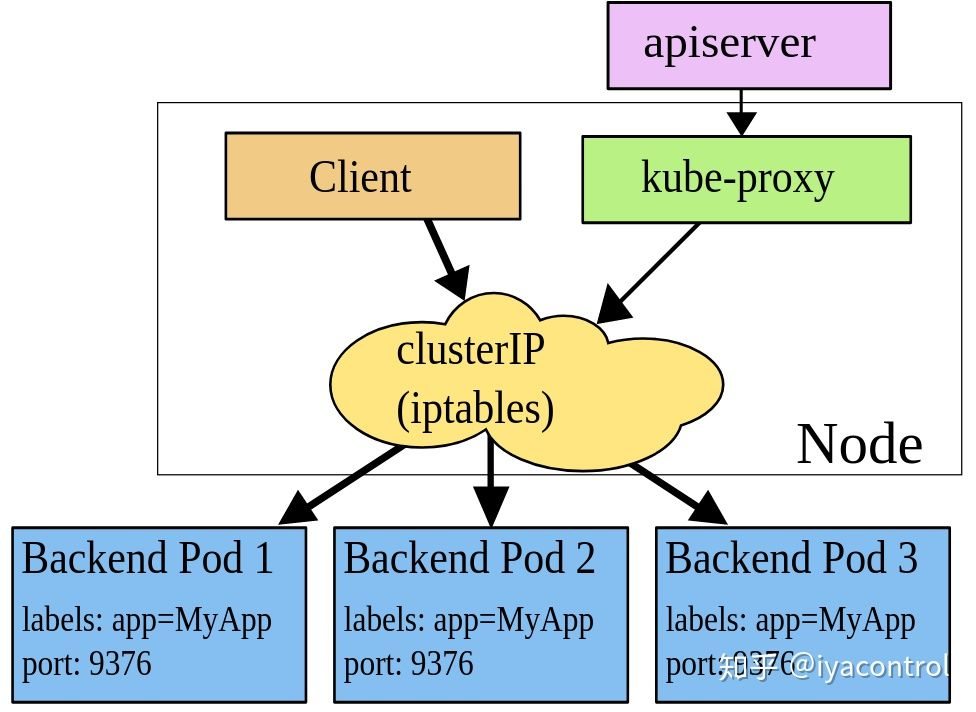
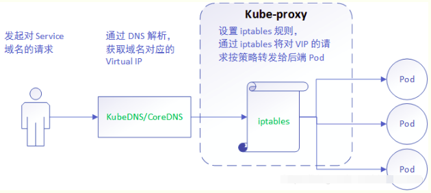

# K8S之服务发现

------

## Serivce

### 概念

Pod存在生命周期，有销毁，有重建，无法提供一个固定的访问接口给客户端。并且为了同类的Pod都能够实现工作负载的价值，由此Service资源出现了，可以为一类Pod资源对象提供一个固定的访问接口和负载均衡。当Pod宕机后重新生成时，其IP等状态信息可能会变动，Service会根据Pod的Label对这些状态信息进行监控和变更，保证上游服务不受Pod的变动而影响。

### 类型

Service一共有四种类型，分别是ClusterIP、NodePort、LoadBalancer、ExternaName。

#### *1.ClusterIP*

默认类型，自动分配一个仅Cluster内部可以访问的虚拟IP。

#### *2.NodePort*

在ClusterIP基础上为Service在每台机器上绑定一个端口，这样就可以通过: NodePort来访问该服务。

#### *3.LoadBalancer*

在NodePort的基础上，借助Cloud Provider创建一个外部负载均衡器，并将请求转发到NodePort。

#### *4.ExternaName*

把集群外部的服务引入到集群内部来，在集群内部直接使用。没有任何类型代理被创建，这只有 Kubernetes 1.7或更高版本的kube-dns才支持。

## Service的实现

在 Kubernetes集群中，每个 Node运行一个kube-proxy进程。kube-proxy负责为Service实现了一种虚拟IP（Cluster IP）的形式，它在Service创建后保持不变，且能够被同一集群中的Pod资源所访问。Service端口用于接受客户端请求，并将请求转发至后端的Pod应用的相应端口，这样的代理机制，也称为端口代理，它是基于TCP/IP 协议栈的传输层。

#### CoreDns

客户端可以直接通过Service的Cluster IP访问到Service的资源，但是Cluster IP是点分十进制格式的，对客户端来说并不友好。所以K8S还提供了更方便的DNS访问，客户端可以直接通过Service名称访问Service的资源，而无需再用Cluster IP。k8s的DNS服务发现机制是由**Co reDns**来实现的。

#### Service的实现

不像 Pod 的 IP 地址，它实际路由到一个固定的目的地，Service 的 Cluster IP 实际上不能通过单个主机来进行应答。我们需要一个网络代理组件**kube-proxy**来实现将客户端发往Service的流量（通过Cluster IP和端口）负载均衡到正确的Pod上。每个Node上都会部署一个kube-proxy组件，如下图所示。

kube-proxy 监听 API server 中资源对象的变化情况，然后根据监听资源变化操作代理后端来为服务配置负载均衡。资源包括以下三种：

- service
- endpoint/endpointslices
- node

Kube-proxy工作流程。

## 代理模式

kube-proxy的支持iptables、ipvs这两种代理模式（userspace也是基于iptables）。

#### iptables

iptables是一种Linux内核功能，旨在成为一种高效的防火墙，具有足够的灵活性来处理各种常见的数据包操作和过滤需求。它允许将灵活的规则序列附加到内核的数据包处理管道中的各种钩子上。在iptables模式下，kube-proxy将规则附加到“ NAT预路由”钩子上，以实现其NAT和负载均衡功能。这种方法很简单，使用成熟的内核功能，并且可以与通过iptables实现网络策略的组件“完美配合”。但是，kube-proxy对iptables规则进行编程的方式是一种O(n)复杂度的算法，其中n与集群大小（或更确切地说，服务的数量和每个服务背后的后端Pod的数量成比例地增长）。可以使用iptables提供的Random Balancing（随机，可以带权重）或者 Round Robin（轮询）来实现对Pod的负载均衡。

在iptables模式下大致工作流程如下：

#### ipvs

在 v1.8以上的版本中，kube-proxy组件增加了 ipvs 代理模式。ipvs是专门用于负载均衡的Linux内核功能，iptables与ipvs都是基于**netfilter**实现的，但因为定位不同，两者有着本质的差别。iptables是为防火墙而设计的，ipvs则专门用于高性能负载均衡，并使用更高效的数据结构（Hash表），允许几乎无限的规模扩张。与iptables相比，IPVS拥有以下明显优势：

- 为大型集群提供了更好的可扩展性和性能。
- 支持比iptables更复杂的复制均衡算法（最小负载、最少连接、加权、原地址/目标地址哈希）。
- 支持服务器健康检查和连接重试等功能。
- 可以动态修改ipset的集合，即使iptables的规则正在使用这个集合。

在ipvs模式下大致工作流程如下：

## Service负载均衡

负载均衡可以分为<u>四层负载均衡</u>与<u>七层负载均衡</u>。

- <u>四层负载均衡</u>：四层负载均衡工作在 OSI 七层模型的第四层（传输层），指的是负载均衡设备通过报文中的目标IP地址、端口和负载均衡算法，选择到达的目标内部服务器，*四层负载均衡对数据包只起一个数据转发的作用，无法修改或判断所请求资源的具体类型，也不会干预客户端与服务器之间应用层的通信（如三次握手等）*。但在某些部署情况下，为保证服务器回包可以正确返回给负载均衡设备，在转发报文的同时可能会对报文原来的源地址进行修改。
- <u>七层负载均衡</u>：七层负载均衡工作在 OSI 模型的第七层（应用层），指的是负载均衡设备通过请求报文中的应用层信息(如URL、HTTP头部、资源类型等信息)和负载均衡算法，选择到达的目标内部服务器。七层负载均衡的功能更加丰富灵活，*另外七层负载均衡两端（面向用户端和服务器端）的连接都是独立的*，在一定程度上也提升了后端系统的安全性，因为像网络常见的DoS攻击，在七层负载均衡的环境下通常在负载均衡设备上就截止了，不会影响到后台服务器的正常运行。比如常见 Nginx 就是运行在七层的负载均衡软件。

Service只能做到四层的负载均衡，如果需要七层负载均衡，需要使用Ingress。