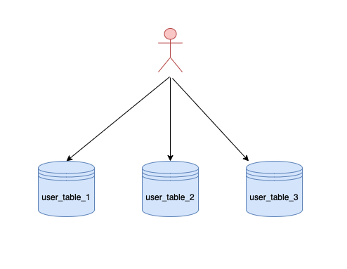
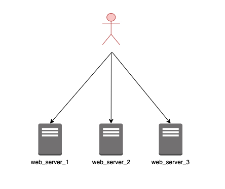
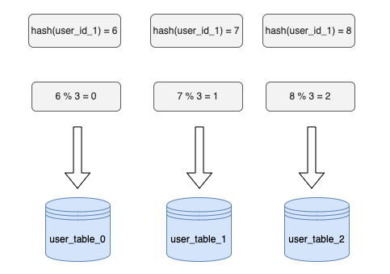
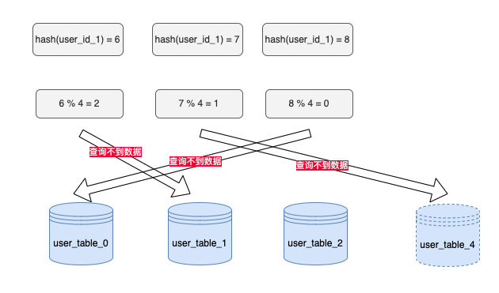
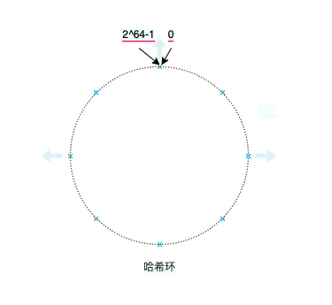
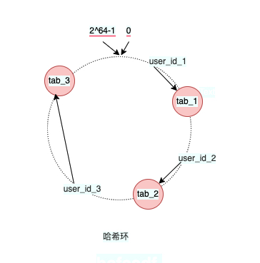
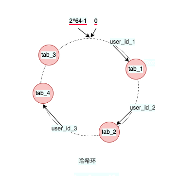
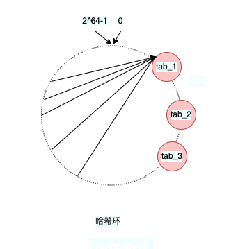
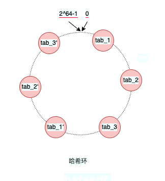

# 一致性hash

------

## 如何分配请求

当数据库的量太大时，可能会考虑分库分表，当分库分表之后，那就需要考虑对应的数据如何存储的问题。这里以用户库分表为例。当一个获取用户信息的请求过来，如何根据user_id去对应的表找对应的用户信息？



其实不仅是分库分表，在一些负载均衡中间件里，也有同样的问题（比如利用用户ip来决定请求流量往哪个服务器走）。



## 普通哈希

很容易想到，解决请求如何分配的一个解决方法就是将sharding_key哈希，得到hash值后对节点数进行取模运算。获取节点的公式即为：

```
hash(key) % num_of_nodes
```

还是以用户表为例子，假设有将用户表分成三个表，分别是user_table_1，user_table_2，user_table_3。具体计算流程如图所示。



普通哈希的方法根据user_id定位到具体的表，这样看似是解决了问题，但是如果用户量突然增长，需要再加一张表时，原先的表数量将由3变成4，sharding的计算方式也变hash(user_id)%4，并且需要进行大量的数据迁移。



要解决这个问题，需要对user表的数据重新按照节点4进行迁移，**坏情况下所有数据都需要迁移，所以它的数据迁移规模是 O(M)**，这样数据的迁移成本太高了。

## 一致性哈希

一致性哈希可以解决我们当节点变化时数据迁移量太大的问题。**一致性哈希的也是用取模的方法，但它不是对节点数取模，而是对2^64-1取模。**一致性哈希将哈希值对2^64-1所有的结果组织成一个圆环，称为哈希环。



1. 一致性哈希需要先将节点映射到哈希环上，具体的操作是 hash(node_key) % (2^64-1)，节点的key可以使用节点所在server的mac地址或者自定义（比如节点是数据库，那hash的key可以直接命名为"db1"、"db2"）。
2. 第一步一般来说都是预先完成的，当有请求过来的时候，就将请求的sharding_key映射到哈希环上，具体的操作是 hash(sharding_key) % (2^64-1)，这样就找到了哈希环的位置，**接着再在这个位置顺时针在哈希环上找到第一个节点**，这个节点就是操作这个请求数据的具体节点。



当使用一致性哈希后，增加/删减节点后，数据如何迁移？这里已增加节点为例，比如增加一个tab_4，那么受到到影响的只有user_id_3，user_id_1与user_id_2都不会受到影响。**在一致哈希算法中，如果增加或者移除一个节点，仅影响该节点在哈希环上顺时针相邻的后继节点，其它数据也不会受到影响**。



## 一致性哈希节点均衡问题

从上面的user数据的hash环中可以看出，几个节点分布的还是比较均匀的，即所有数据都能均匀得分布在不同的节点上。但如果节点分布不是均匀的呢？



如图所示，绝大部份请求都会落到tab_1上，而tab_2与tab_3只会承担少量的请求，这样会导致请求没法负载均衡，tab_1的压力过大。如果哈希环上的节点足够多，那么就可以避免节点分布不均匀的问题。但实际中中我们并没有那么多节点，那么怎么办呢？**我们可以使用虚拟节点，也就是将一个真实节点生成多个副本。**

- tab_1生成一个虚拟节点tab_1'
- tab_2生成一个虚拟节点tab_2'
- tab_3生成一个虚拟节点tab_3'

每个真实节点生成 一个虚拟节点副本，这里只是以生成一个虚拟节点为例子，实际中生成的虚拟节点数要远大于1。



当sharing_key在找到哈希环的位置后，如果找到的节点是tab_1'，那么可用通过这个虚拟节点找到对应的真实节点的信息，最后在真实节点处理请求。

## 总结

利用一致性哈希+虚拟节点，可以解决普通哈希下节点迁移数量过大的问题。此外，虚拟节点的加入进一步提高了系统的稳定性与均衡性。并且，当有了虚拟节点后，还可以为硬件配置增加更多的虚拟节点以节点增加权重。


