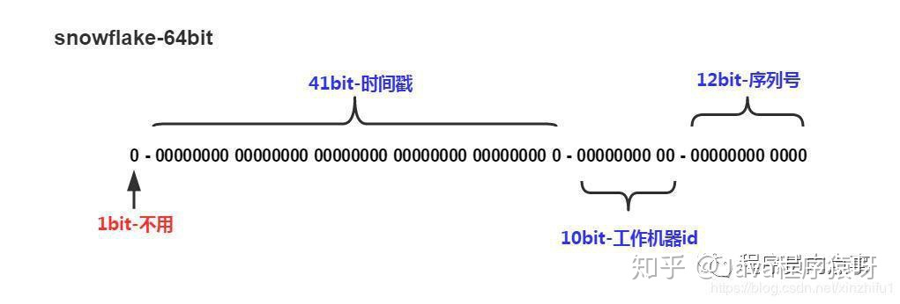

# 分布式ID

------

## 1. 什么是分布式ID

在我们业务数据量不大的时候，单库单表完全可以支撑现有业务，数据再大一点搞个MySQL主从同步读写分离也能对付。但随着数据日渐增长，主从同步也扛不住了，就需要对数据库进行分库分表，但分库分表后需要有一个唯一ID来标识一条数据，数据库的自增ID显然不能满足需求。特别一点的如订单、优惠券也都需要有`唯一ID`做标识。此时一个能够生成`全局唯一ID`的系统是非常必要的。那么这个`全局唯一ID`就叫`分布式ID`。

分布式ID需要满足哪些条件？

- 全局唯一：必须保证ID是全局性唯一的，基本要求
- 高性能：高可用低延时，ID生成响应要块，否则反倒会成为业务瓶颈
- 高可用：100%的可用性是骗人的，但是也要无限接近于100%的可用性
- 好接入：要秉着拿来即用的设计原则，在系统设计和实现上要尽可能的简单
- 趋势递增：最好趋势递增（防止索引数据页频繁发生页分裂），这个要求就得看具体业务场景了，一般不严格要求

## 2. 如何生成分布式ID

### a. *<u>uuid</u>*

想要得到一个具有唯一性的ID，首先被想到可能就是UUID，毕竟它有着全球唯一的特性。那么UUID可以做分布式ID吗？答案是可以的，但是并不推荐。

**优点：**

- 生成足够简单，本地生成无网络消耗，具有唯一性

**缺点：**

- 生成字符串长度太长，无序的字符串，不具备趋势自增特性
- 没有具体的业务含义

### b. *<u>数据库自增ID</u>*

基于数据库的`auto_increment`自增ID完全可以充当`分布式ID`，实现方式是需要一张单独的MySQL实例来生成ID。当我们需要一个ID的时候，向表中插入一条记录返回`主键ID`，但这种方式有一个比较致命的缺点，就是当访问量激增的时候，MySQL可能会扛不住。

**优点：**

- 实现简单，ID单调自增，数值类型查询速度快

**缺点：**

- DB单点存在宕机风险，无法扛住高并发场景

### c. *<u>数据库集群</u>*

前面说了单节点的数据库方案有缺陷，那就对上边的方式做一些高可用的优化，使用集群数据库，避免单点故障，也能均摊请求。（数据库集群方案需要对每个节点设置不同的起始值与步长，已避免生成重复的ID，而且需要提前定好节点数，如果中途需要增减节点的话，需要手动修改其他节点的起始值与步长）

**优点：**

- 解决DB单点问题

**缺点：**

- 不利于后续扩容，而且实际上单个数据库自身压力还是大，依旧无法满足高并发场景。

### d. *<u>数据库的号段模式</u>*

号段模式是当下分布式ID生成器的主流实现方式之一，号段模式可以理解为从数据库批量的获取自增ID，每次从数据库取出一个号段范围，例如 (1,1000] 代表1000个ID，具体的业务服务将本号段，生成1~1000的自增ID并加载到内存。表结构如下：

```sql
CREATE TABLE id_generator (
  id int(10) NOT NULL,
  max_id bigint(20) NOT NULL COMMENT '当前最大id',
  step int(20) NOT NULL COMMENT '号段的布长',
  biz_type    int(20) NOT NULL COMMENT '业务类型',
  version int(20) NOT NULL COMMENT '版本号，乐观锁 每次都更新version，保证并发时数据的正确性',  
  PRIMARY KEY (`id`)
) 
```

等这批号段ID用完，再次向数据库申请新号段，对`max_id`字段做一次`update`操作，`update max_id= max_id + step`，update成功则说明新号段获取成功，新的号段范围是`(max_id ,max_id +step]`。

```sql
update id_generator set max_id = #{max_id+step}, version = version + 1 where version = # {version} and biz_type = XXX
```

由于多业务端可能同时操作，所以采用版本号`version`乐观锁方式更新，这种`分布式ID`生成方式不强依赖于数据库，不会频繁的访问数据库，对数据库的压力小很多。

### e. *<u>reids模式</u>*

`Redis`也同样可以实现，原理就是利用`redis`的 `incr`命令实现ID的原子性自增。

**优点：**

- 实现简单，ID单调自增，操作快。

**缺点：**

- 可能会因为没有持久化数据而导致重启后ID重复

### e. *<u>**雪花算法（Snowflake）模式**</u>*

雪花算法（Snowflake）是twitter公司内部分布式项目采用的ID生成算法，开源后广受国内大厂的好评，在该算法影响下各大公司相继开发出各具特色的分布式生成器。



`Snowflake`生成的是64位的整形数据，其组成结构如下：

- 第1位：默认为0，不使用
- 时间戳部分（41Bit）：，用来存储毫秒级别的时间戳，建议存当前时间戳，而是用（当前时间戳 - 固定开始时间戳）的差值，可以使产生的ID从更小的值开始；41位的时间戳可以使用69年，(1L << 41) / (1000L * 60 * 60 * 24 * 365) = 69年
- 工作机器部分（10Bit）：也被叫做`workId`，这个可以灵活配置，机房或者机器号组合都可以。
- 序列号部分（12Bit），自增值支持同一毫秒内同一个节点可以生成4096个ID

### e. *<u>**其他开源库**</u>*

目前市面上开源的库基本都是基于Snowflake算法实现的，这些库通常可以支持自定义时间戳、工作机器ID、序列号等。

1. **百度（uid-generator）**：https://github.com/baidu/uid-generator
2. **美团（Leaf）**：[https://github.com/Meituan-Dianping/Leaf](https://link.zhihu.com/?target=https%3A//links.jianshu.com/go%3Fto%3Dhttps%3A%2F%2Fgithub.com%2FMeituan-Dianping%2FLeaf)
3. **滴滴（Tinyid）**：[https://github.com/didi/tinyid](https://link.zhihu.com/?target=https%3A//links.jianshu.com/go%3Fto%3Dhttps%3A%2F%2Fgithub.com%2Fdidi%2Ftinyid)

