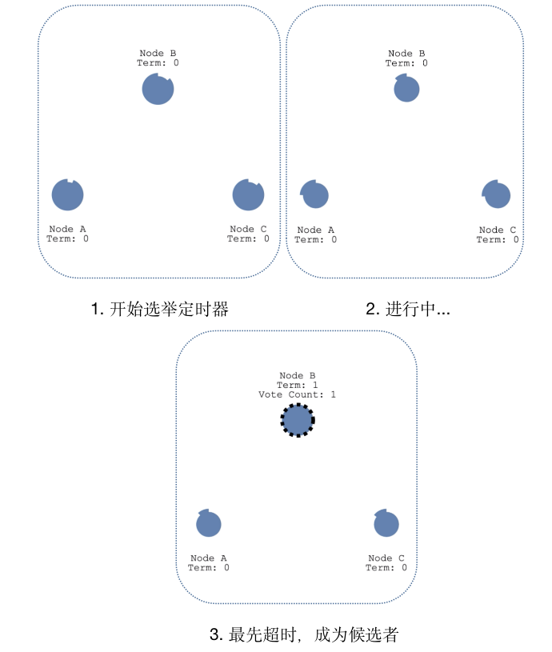
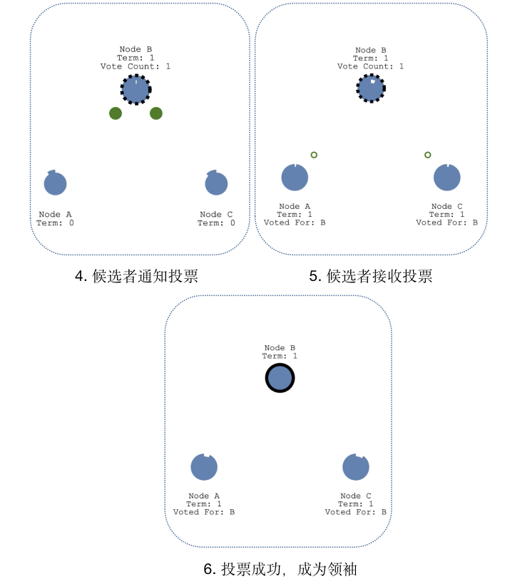
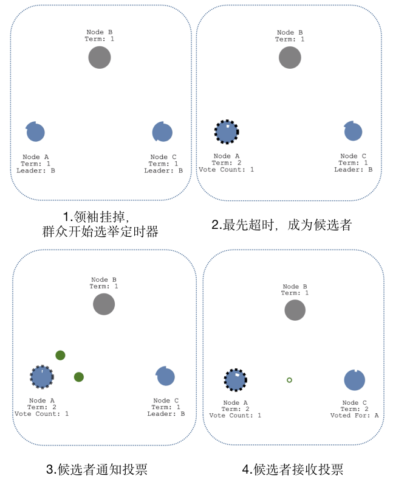
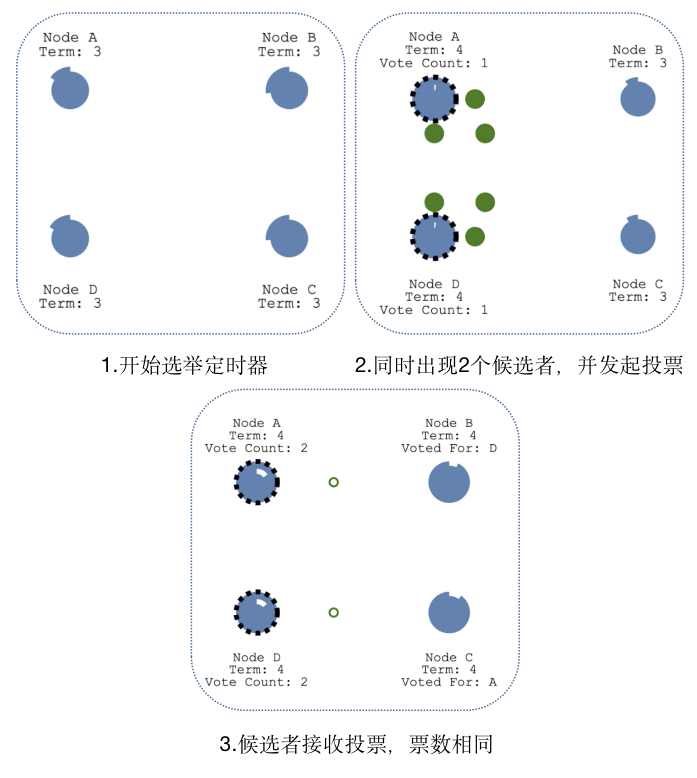
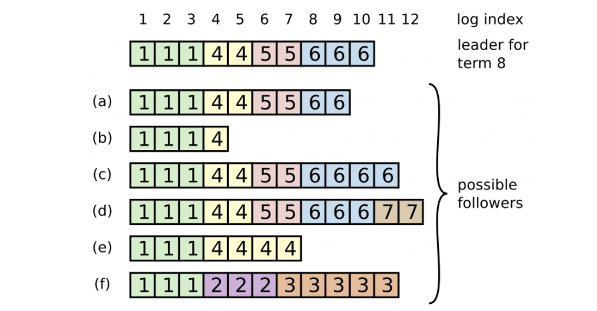

# 分布式理论

## CAP理论

- C：Consistency，即一致性。所有节点都访问同一份数据节点。
- A：Availability，即可用性。每次请求都能获取到非错的响应，但不保证获取的数据为最新的数据。
- P：Partition tolerence，即分区容错性。在某个节点或者网络分区故障的时候，仍然能够对外提供一致性和可用性服务，也就是说部分故障不影响整体的使用。

根据定理，**分布式系统只能满足三项中的两项而不可能满足全部三项**。理解CAP理论的最简单方式是想像两个节点分处分区两侧。允许至少一个节点更新状态会导致数据不一致，即丧失了C性质。如果为了保证数据一致性，将分区一侧的节点设置为不可用，那么又丧失了A性质。除非两个节点可以互相通信，才能既保证C又保证A，这又会导致丧失P性质。

## BASE理论

BASE是对CAP中一致性和可用性权衡的结果，其来源于对大规模互联网分布式系统实践的总结，是基于CAP定律逐步演化而来。其核心思想是**即使无法做到强一致性，但每个应用都可以根据自身业务特点，才用适当的方式来使系统打到最终一致性**。

- BA：Basically Available，即基本可用。假设系统某个模块出现了不可预知的故障，但其他模块依然可用。如双十一活动时，评论模块出现故障，但不会影响交易、商品等核心模块的使用。
- S：Soft Status，即软状态。指允许系统中出现中间状态，并认为该状态不影响系统的整体可用性，即允许系统在多个不同节点的数据副本存在数据延时。
- E：Eventually Consistent，即最终一致。上面讲到的软状态不可能一直是软状态，必须有时间期限。在期限过后，应当保证所有副本保持数据一致性，从而达到数据的最终一致性，因此所有客户端对系统的数据访问最终都能够获取到最新的值，而这个时间期限取决于网络延时，系统负载，数据复制方案等因素。

总的来说，BASE 理论面向的是大型高可用可扩展的分布式系统，和传统事务的 ACID 是相反的，它完全不同于 ACID 的强一致性模型，而是通过**牺牲强一致性来获得可用性，并允许数据在一段时间是不一致的**。

## Raft协议

分布式存统通常通过维护多个副本来进行容错，提高系统的可用性。要实现此目标，就必须要解决分布式系统的最核心问题：维护多个副本的一致性。Raft协议将一致性协议的核心内容分拆成为几个关键阶段，以简化流程，提高协议的可理解性。

### 1. Leader选举

Raft协议的每个副本都会处于这三种状态之一：Leader、Follower、Candidate

- **Leader**：即领袖，Leader接受client的更新请求，本地处理后再同步至其他副本。
- **Follower**：即请求的被动更新者，从Leader接受更新请求，然后写入本地日志文件。
- **Candidate**：即选举人，如果Follower在一段时间内没有收到Leader的心跳，则判断Leader可能已经故障，此时启动选主过程，此时副本会变成Candidate状态，直到选主结束。

在选举过程中有几个重要的的概念：

- **Leader Election**：简称选举，就是从候选人中选出领袖。
- **Term**：即任期，它其实是个单独递增的连续数字，每一次任期就会发起一次Leader选举。
- **Election Timeout**：超时时间，当群众超时未收到Leader心跳时，会重新进行选举。

#### 情况1: Leader选举

每个节点都有自己的“超时时间”，当一个节点到超时时间没有收到心跳，这个节点就会升级为候选人，开始选举。这个超时时间是随机的（150ms-300ms），也就避免了同一时间同时出现多个选举者。

节点B最先到超时时间，然后它将自己的任期加1，发起投票。当候选人B收到大部分选票后，B当选为Leader。

B当选成功后，会立刻向其他Follower发起心跳，当FollowerA和C收到Leader的心跳后，A和C的超时时间将被重置。如果B在选举的时候收到了其他Leader的心跳，并且这个Leader的term_id大于等于B的term_id，就说明有其他节点已经比B早完成选举，B这时重新退回成为Follower。这里要注意的是心跳发送周期必须要小于超时时间，否责会频繁地发生选举。

#### 情况2: Leader挂掉

当Leader节点B挂掉了之后，当作为Follower的A与C的定时器发生超时，假如A先超时，那么流程与情况1一样，A将成为Leader，并将这一消息广播给其他节点。

#### 情况3: 多个候选者

当出现多个Candidate时，如A与D，两个Candidate会同时发起投票，如果票数不同，那么票数多的成为Leader。如果票数相同，则重新发起新一轮的投票。

### 2. 日志复制

经过前面的步骤Leader选举出来后，就可以开始接受客户端发送的请求了。Leader会把客户端的请求作为一个日志条目追加到日志中，然后给其他Follower发送同样的请求。当Leader确保大部分（半数以上）Follower都将改命令写入日志中，那么就返回给客户端提交成功。例如，图中的9号条目在其中4节点（一共7个节点）上具有复制，所以9号条目是可被提交的；但10号条目只在其中3个节点上有复制，因此10号条目不是可被提交的。

