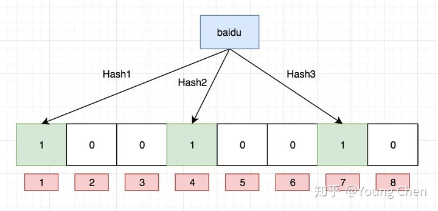
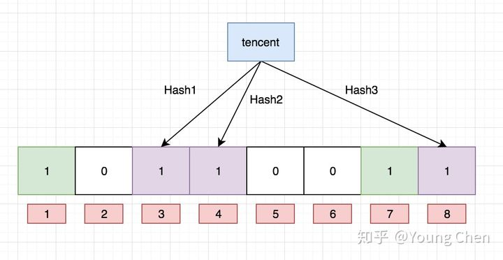

# 布隆过滤器

## 简介

本质上布隆过滤器是一种数据结构，比较巧妙的概率型数据结构（probabilistic data structure），特点是高效地插入和查询，可以用来告诉你 **“某样东西一定不存在或者可能存在”**。相比于传统的 List、Set、Map 等数据结构，**它更高效、占用空间更少**，但是缺点是其返回的**结果是概率性的，而不是确切的**。

## HashMap

在讲布隆过滤器之前，我们先想有一下，判断某个元素是否存在用什么数据结构？HashMap是一个好选择，HashMap能在o(1)的时间复杂度内判断一个元素在不在，效率极高。如果数据量很小，那么HashMap确实是一个最佳选择，但是如果HashMap里存储的是上亿的key，那么他就有点力不从心了。存储上亿key的HashMap需要占用大量的空间内存，并且如果HashMap触发rehash，对那么多的key进行迁移必然会导致内存抖动。所以，HashMap并不适合存放亿级别的key。

## Bloom Filter

前面说了HashMap不合适存放数量过多的key，那么有什么可以存放大数量的key且不会占用大量的内存？可以使用bit数组，也叫bitmap，布隆过滤器就是用bitmap来存储数据的。

如果我们要讲一个数据添加到布隆过滤器中，我们需要多个hash函数生成多个哈希值，再将这些hash值映射到对应的bit数组对的bit上，将这个bit置为1。例如针对值 “baidu” 和三个不同的哈希函数分别生成了哈希值 1、4、7，则上图转变为：

再存一个值 “tencent”，如果哈希函数返回 3、4、8 的话，图继续变为：

如果我们想查询“dianping”这个值存不存在，先将“dianping”给hash函数处理，返回1、5、8 三个位置，5的位置上为0，**那么可以判断“dianping”肯定不存在**。

这里需要注意，“tencent”这个key的hash函数对应的4位置将“baidu”对应的4位置给覆盖了，如果key越加越多，那么这个覆盖的现象就越来越严重，这会造成**误判**的现象。例如，有一个key为“zijie”，它的hash函数返回值分别是3，4，7，虽然这三个位置都为1，但可以保证这个key存在么？并不能保证，因为3，4，7完全可能是由其他的key设为1的，**所以说布隆过滤器可能会出现一定误判，并且随着key的不断增加，这个误判率会越来越高，其根本原因是哈希冲突无法完全避免**。另外，布隆过滤器是无法删除元素的。

