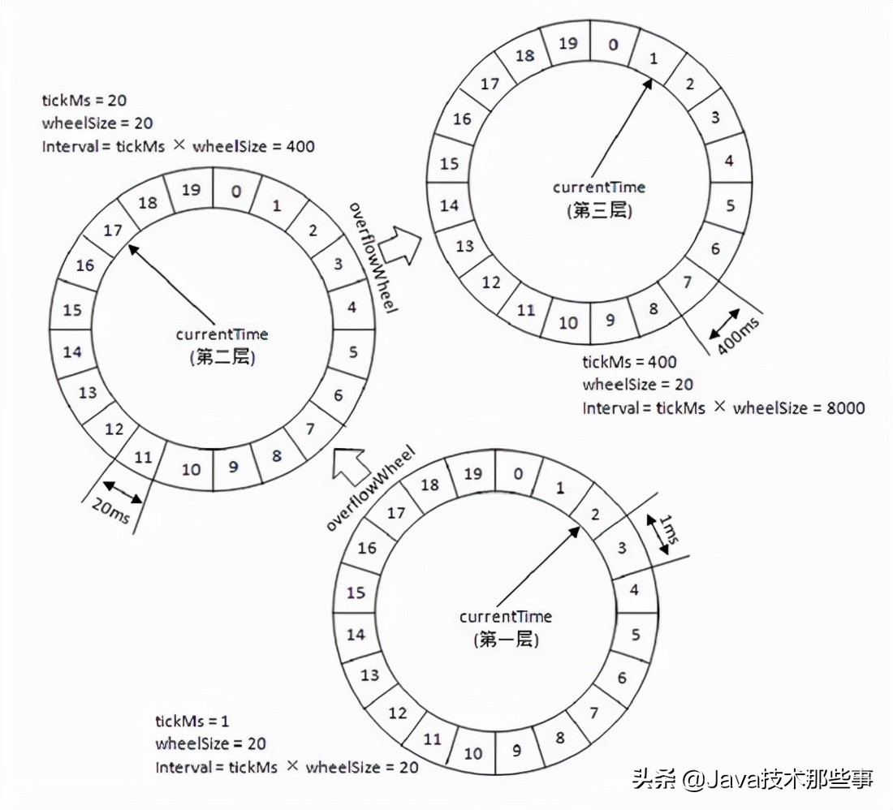

# 延迟队列

------

## 定义

队列是一种FIFO的数据结构，即先进队的数据先出队。延时队列相对于普通队列的来说，最大的区别在于他的延迟属性。延迟队列在入队的时候会指定一个延迟时间，表示其希望在经过改指定时间后处理这个任务。从某种意义上来讲，延迟队列的结构并不像一个队列，而更像一种以时间为权重的有序堆结构。

## 应用场景

1. 在淘宝、京东等购物平台上下单，15分钟内未付款，订单会自动取消。
2. 打车的时候，在规定时间没有车主接单，平台会取消你的单并提醒你暂时没有车主接单。
3. 点外卖的时候，如果商家在10分钟还没接单，就会自动取消订单。
4. 收快递的时候，如果我们没有点确认收货，在一段时间后程序会自动完成订单。
5. 在平台完成订单后，如果我们没有在规定时间评论商品，会自动默认买家不评论。

## 如何实现

如果是数据量较小且时实时性不高的场景，可以使用轮询的方式，比如每秒轮询数据库的所有数据，然后处理到期的任务。轮询的方式只能处理数据量较小且实时性不高的数据，如果像处理淘宝订单15分钟内未付款自动取消订单这种任务，就需要更加高效的处理方式了。

### *Redis的Zset*

Redis中有一种有序集合的数据结构zset，zset中每一个元素都有对应的score，zset中所有的数据都是按照score来排序的。

1. 入队操作：使用zadd key timestamp命令，将任务需要延时处理的时间戳作为score，Redis的zset基于跳表实现，插入的复杂度为O(logn)。
2. 每隔一段时间通过zrangebyscore命令查询zset中最小的元素（zrangebyscore key -inf +inf 0 1 withscore）。如果查询出的分数小于当前时间戳，那么说明这个任务需要执行了。如果查询到的分数大于当前时间戳，说明还没到执行时间，然后继续等待下一次执行zrangebuscore。同理，zrangebyscore的时间复杂度也是对数级别的。

下图是一种基于Redis + zookeeper + mq 实现的延迟队列，其具有高稳定性、高扩展性、高稳定性。

.png)

### *消息队列*

有些消息队列本身就拥有延时推送的功能，下述代码以NSQ为例。

```go
func main()  {
	addr := "127.0.0.1:4151"
	config := nsq.NewConfig()
	p, err := nsq.NewProducer(addr, config)
	if err != nil {
		panic(err.Error())

	}

	err = p.Ping()
	if nil != err {
		panic(err.Error())
	}

	//
	err = p.DeferredPublish("your_topic", time.Second * 10, []byte("hello world"))
	if err != nil {
		fmt.Println("publish err: ", err)
		return
	}
}
```

### *时间轮*

TimeWheel时间轮算法，是一种实现延迟队列的巧妙且高效的算法，被应用在 Netty，Zookeeper，Kafka 等各种框架中。

#### 数据结构

.png)

时间轮的数据结构如图所示，其本质上是一个存储延迟消息的环形队列（**底层采用数组实现**），可以实现高效的循环遍历。其中环形队列里的每个元素对应一个双向环形链表，链表中的每一项都代表着一个需要执行的延迟任务。时间轮里有一个表盘指针，表示时间轮当前指向的指针，随着时间推移，指针会不断前进，并处理指针指向的延迟任务列表。

#### 添加任务

如下图，当前表盘指针指向的当前时间为2，如果我们需要添加一个延迟3秒的任务，可以快速计算出延迟任务执行时间在时间轮对应的位置为5，再将任务添加到5的任务列表尾部即可。前面说过时间轮底层由数组实现，那么找到任务的对应位置的时间复杂度为O(1)，将任务添加到任务列表尾部时间复杂度也为O(1)，所以添加任务还是非常高效的。

.png)

#### 多层时间轮

上面的时间轮大小是固定的，只有12秒。如果我想添加一个需要延迟200s的任务，那该如何处理？直接扩容整个时间轮的大小？这样子显然不可取，因为这样做的话需要在内存中维护一个非常大非常大的时间轮，而且底层数组变大后寻址效率也会降低。为此，可以借鉴Ka faka的多层时间轮的概念。多层时间轮的概念和我们的机械表上时针、分针、秒针的概念非常类似，当仅使用秒针无法表示当前时间时，就使用分针结合秒针一起表示。同样的，当任务的到期时间超过了当前时间轮所表示的时间范围时，就会尝试添加到上层时间轮中，如下图所示：



第一层时间轮整个时间轮所表示时间范围是 0-12 秒，第二层时间轮每格能表示的时间范围是整个第一层时间轮所表示的范围也就是 12 秒，所以整个第二层时间轮能表示的时间范围即 12*12=144 秒，依次类推第三层时间轮能表示的范围是 1728 秒，第四层为 20736 秒等等。

比如现在我们需要添加一个延时为 200 秒的延迟消息，我们发现其已经超过了第一层时间轮能表示的时间范围，我们就需要继续往上层时间轮看，将其添加在第二层时间轮 200/12 = 17 的位置，然后我们发现 17 也超过了第二次时间轮的表示范围，那么我们就需要继续往上层看，将其添加在第三层时间轮的 17/12 = 2 的位置。

#### 如何推进表盘指针前进?

1. 通过一个设定好时间间隔的Ticker，每隔一段时间Ticker去推动表盘指针前进。但是如果长时间没有到期任务，这种方案会带来推进的问题，从而造成一定的性能损耗。
2. Kafka 则是通过 DelayQueue 来推进，是一种空间换时间的思想。DelayQueue 中保存着所有的延时任务对象，根据时间来排序，这样延时越小的任务排在越前面。

