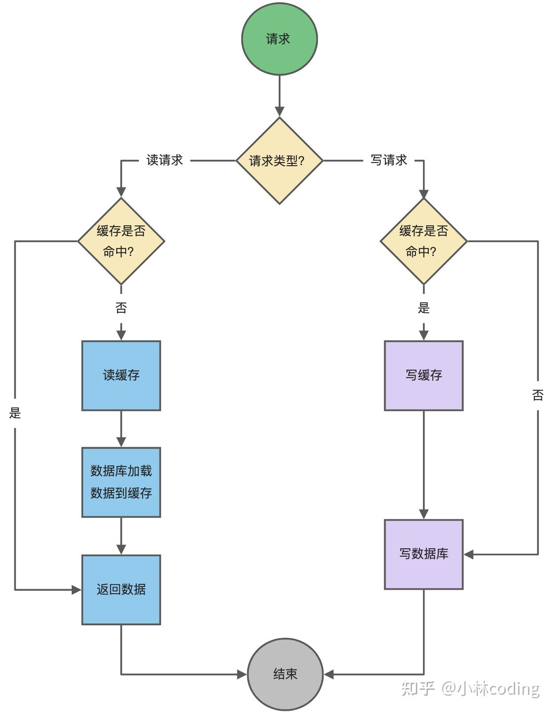

# 缓存策略

## <u>1. 双写策略</u>

双写即当数据修改时，即要更新数据库也要更新缓存。下面看看具体的双写的两种场景。

### *a. 先更新数据库，再更新缓存*


- 请求A先更数据库为1
- 请求B更新数据库为2
- 请求B先更新缓存为2
- 请求A更新缓存为1

<u>先更新数据库，再更新缓存</u>这种策略会导致数据库与缓存不一致

### *b. 先更新缓存，再更新数据库*


- 请求A先更新缓存为1
- 请求B更新缓存为2
- 请求B先更新数据库为2
- 请求A更新数据库为1

与<u>先更新数据库，再更新缓存</u>这种策略一样，<u>先更新缓存，再更新数据库</u>会因为并发原因导致数据库与缓存数据不一致。

## 2. Cache Aside策略

Cache Aside 即 旁路缓存策略，这种策略已数据库的数据为准，缓存中的数据是按需加载的。旁路缓存又分读策略与写策略。

- 读策略：从缓存中读取数据，如果缓存命中，则直接返回数据。如果缓存不命中，则从数据库中查询数据，查询到数据后，将数据写入到缓存中，并且返回给用户。
- 写策略：更新数据库中的数据，删除对应的缓存数据。


在写数据的时候，又可以有 <u>*先修改数据库再删除缓存*</u> 与 <u>*先删除缓存再修改数据库*</u> 这两种策略

### *a. 先更删除缓存，再更新数据库*


- 请求A（**写请求**）先删除缓存数据
- 请求B（**读请求**）查询缓存，此时缓存为空
- 请求B（**读请求**）查询数据库，这时数据库的数据仍然为旧值
- 请求B（**读请求**）将旧值设到缓存上
- 请求A（**写请求**）将新值设到数据库中

可见，最后缓存中的是旧值，而数据库中的是新值，<u>先更删除缓存再更新数据库</u>的策略在并发下一样会产生数据不一致的问题。而且如果删除完缓存后，服务宕机了，导致没有将新的值更新到数据库，那么等缓存过期后，这个更新值就完全消失不见了。

### *b. 先更数据库，再更删除缓存*


- 请求A（读请求）读取缓存，发现缓存中没有
- 请求A（读请求）从数据库读取旧值
- 请求B（写请求）更新数据库为新值
- 请求B（写请求）删除缓存
- 请求A（读请求）将旧值写回缓存

从上面的分析可知，最终数据仍然可能不一致，但是这个在实际中出现的概率并不高，因为缓存的写入通常要远远快于数据库的写入。所以在实际中很难出现请求B已经更新了并且删除了缓存，请求A才更新完缓存的情况。但为了万无一失，还必须给缓存设定一个过期时间来，如果真的出现了上面这种不一致的情况，仍然有过期时间来兜底，这样也能达到最终一致。

### *c. 延迟双删*

在 *先更删除缓存，再更新数据库* 的方案中，针对并发读写而导致缓存数据不一致的解决办法是延迟双删。其流程如下：

```go
//1.删除缓存
cache.Delete(key)
//2.更新数据库
db.Update(key)
//3.睡眠N秒
time.Sleep(time.Second * N)
//4.再删缓存
cache.Delete(key)
```

为什么要加一个延迟时间？回到 *先更删除缓存，再更新数据库* 的图中，当请求B读取到数据库里的旧值20，并将旧值20放入缓存，延时时间就是为了等待请求B的 读数据库(旧值) + 写缓存(旧值) 操作完成。当延时结束后，再删掉缓存(旧值)。 所以这确保延时时间大于 请求B的 读数据库(旧值) + 写缓存(旧值) 操作 的时间。但具体延迟多少时间不好定，所以这个方案也只是尽可能保持一致性，极端情况下，依然也会出现缓存不一致的现象。

## 3. Cache Through策略

Cash Through包括了Read/Write Through（读穿 / 写穿）策略，它的原则是应用程序只和缓存交互，不再和数据库交互，而是由缓存和数据库交互，相当于更新数据库的操作由缓存自己代理了。

### *a. 读策略*

先查询缓存中是否存在数据，如果存在直接返回，如果不存在，**则由缓存组件负责从数据库查询数据**，并将结果写入到缓存组件，最后缓存组件将数据返回给应用。

### *b. 写策略*

当有数据更新的时候，先查询要写入的数据在缓存中是否已经存在:

- 如果要修改的数据已经存在缓存中，那么更新缓存中的数据，**并由缓存组件同步更新到数据库中**，然后缓存组件告知应用程序更新完成。
- 如果缓存中不存在数据，这种情况就为""write miss"写失效，对于这种情况，又有两种处理方式：
  - 一个是“write allocate”（按写分配），做法是写入缓存相应位置，再由缓存组件同步更新到数据库中
  - 一个是“no-write allocate”（不按写分配），做法是不写入缓存中，而是直接更新到数据库中，一般情况下都选这种方式，因为无论哪种情况都要将数据写进数据库中，而“no-write allocate”方式比“write allocate”还减少了一次缓存的写入，能够提升写入的性能



Read Through/Write Through 策略的特点是由缓存节点而非应用程序来和数据库打交道，在我们开发过程中相比 Cache Aside 策略要少见一些，原因是我们经常使用的分布式缓存组件，无论是 Memcached 还是 Redis 都不提供写入数据库和自动加载数据库中的数据的功能。**而我们在使用本地缓存的时候可以考虑使用这种策略**。而且Write Through策略中写数据库是同步的，这对于性能来说会有比较大的影响，因为相比于写缓存，同步写数据库的延迟要高多了。那么我们是否可以异步的更新数据库？这就是“Write Back”策略

## 4. Write Back策略

Write Back（写回）策略在更新数据的时候，**只更新缓存，同时将缓存数据设置为脏的，然后立马返回，并不会更新数据库**。**而脏块只有被再次使用时才会将其写入数据库**。（这种策略下一般来说缓存容量有限，所以缓存满时通常需要一定的淘汰策略来释放缓存）

### *a. 读策略*

先查看数据是否在缓存中：

- 在缓存中，直接返回数据
- 不在缓存中，寻找可用的缓存块，再判断缓存块是否为脏块：
  - 是脏块，先将缓存块的脏数据写入数据库，再将从数据库读取对应的数据，写入缓存中，设置缓存块为非脏
  - 不是脏块，从数据库读取对应的数据，写入缓存块中

### *b. 写策略*

同样，先查看数据是否在缓存中：

- 在缓存中，修改缓存中的数据为新数据，并将这个缓存块置为脏块
- 不在缓存中，寻找可用的缓存块，再判断这个缓存块是否为脏块：
  - 是脏块，先将缓存块中的脏数据写入数据库，再将对应的数据从数据库读取缓存中，再根据你的请求修改缓存块（修改完仍然是脏块）
  - 不是脏块，将对应的数据从数据库读取到缓存块中，再根据你的请求修改缓存块，最后将这个缓存块标记成脏块

实际上，Write Back（写回）策略也不能应用到我们常用的数据库和缓存的场景中，因为 Redis 并没有异步更新数据库的功能。**Write Back 是计算机体系结构中的设计，比如 CPU 的缓存、操作系统中文件系统的缓存都采用了 Write Back（写回）策略**。**Write Back 策略特别适合写多的场景**，因为发生写操作的时候， 只需要更新缓存，就立马返回了。比如，写文件的时候，实际上是写入到文件系统的缓存 Page Cache 就返回了，并不会写磁盘。**但是带来的问题是，数据不是强一致性的，而且会有数据丢失的风险**，因为缓存一般使用内存，而内存是非持久化的，所以一旦缓存机器掉电，就会造成原本缓存中的脏数据丢失。所以你会发现系统在掉电之后，之前写入的文件会有部分丢失，就是因为 Page Cache 还没有来得及刷盘造成的。
