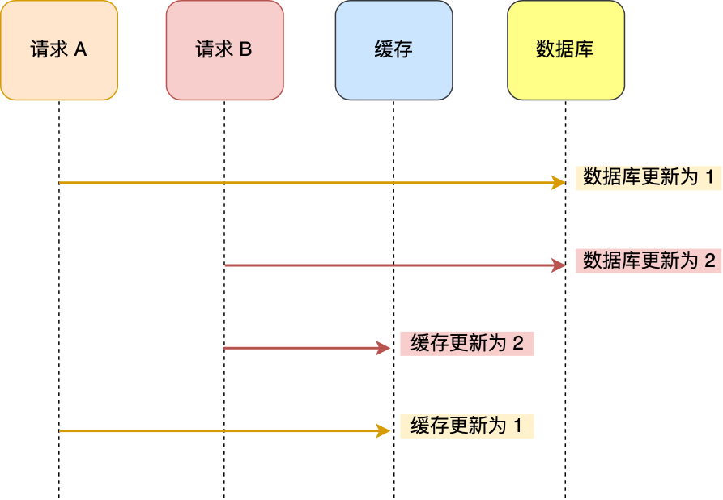
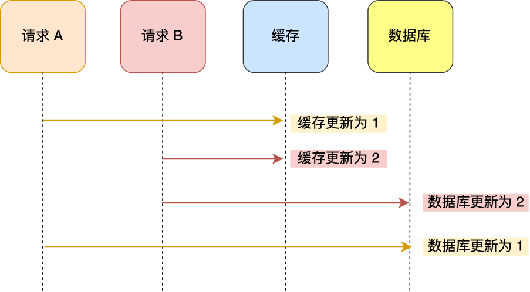
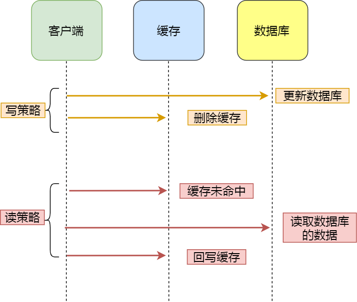

# 缓存策略

## <u>1. 双写策略</u>

双写即当数据修改时，即要更新数据库也要更新缓存。下面看看具体的双写的两种场景。

### *a. 先更新数据库，再更新缓存*

- 请求A先更数据库为1
- 请求B更新数据库为2
- 请求B先更新缓存为2
- 请求A更新缓存为1

<u>先更新数据库，再更新缓存</u>这种策略会导致数据库与缓存不一致

### *b. 先更新缓存，再更新数据库*

- 请求A先更新缓存为1
- 请求B更新缓存为2
- 请求B先更新数据库为2
- 请求A更新数据库为1

与<u>先更新数据库，再更新缓存</u>这种策略一样，<u>先更新缓存，再更新数据库</u>会因为并发原因导致数据库与缓存数据不一致。

## <u>2. Cash Aside策略</u>

Cash Aside 即 旁路缓存策略，这种策略已数据库的数据为准，缓存中的数据是按需加载的。旁路缓存又分读策略与写策略。

- 读策略：从缓存中读取数据，如果缓存命中，则直接返回数据。如果缓存不命中，则从数据库中查询数据，查询到数据后，将数据写入到缓存中，并且返回给用户。
- 写策略：更新数据库中的数据，删除对应的缓存数据。

在写数据的时候，又可以有 <u>先修改数据库再删除缓存</u> 与 <u>先删除缓存再修改数据库</u> 这两种策略

### *a. 先更删除缓存，再更新数据库*

- 请求A（**写请求**）先删除缓存数据
- 请求B（**读请求**）查询缓存，此时缓存为空
- 请求B（**读请求**）查询数据库，这时数据库的数据仍然为旧值
- 请求B（**读请求**）将旧值设到缓存上
- 请求A（**写请求**）将新值设到数据库中

可见，最后缓存中的是旧值，而数据库中的是新值，<u>先更删除缓存再更新数据库</u>的策略在并发下一样会产生数据不一致的问题。而且如果删除完缓存后，服务宕机了，导致没有将新的值更新到数据库，那么等缓存过期后，这个更新值就完全没有了。

### *a. 先更数据库，再更删除缓存*

- 请求A（读请求）读取缓存，发现缓存中没有
- 请求A（读请求）从数据库读取旧值
- 请求B（写请求）更新数据库为新值
- 请求B（写请求）删除缓存
- 请求A（读请求）将旧值写回缓存

从上面的分析可知，最终数据仍然可能不一致，但是这个在实际中出现的概率并不高
